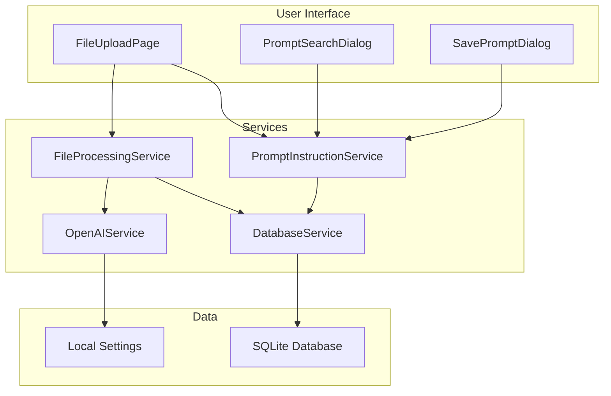
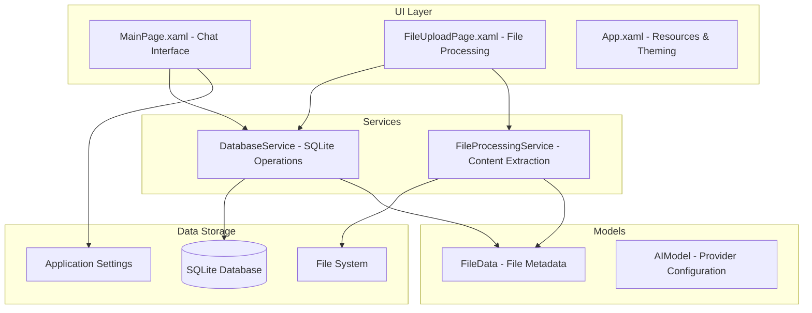

# CAI Design 1 Chat - Complete Tutorial

## 🚨 CRITICAL DEVELOPMENT BEST PRACTICES FOR AI AGENTS

### Frontend-Backend Coordination Protocol
**MANDATORY**: These practices prevent build errors and maintain development velocity:

#### 1. Incremental Development Workflow
```bash
# ALWAYS follow this sequence for UI changes:
# 1. Make small UI change (single section/element)
# 2. Check for code-behind dependencies
grep -r "ElementName" CAI_design_1_chat/Presentation/*.cs
# 3. Update code-behind references if needed
# 4. Build immediately to verify
dotnet build CAI_design_1_chat.sln
# 5. Test basic functionality
# 6. Proceed to next change
```

#### 2. Element Removal Safety Protocol
Before removing any UI element:
- **Search for references**: `grep -r "UIElementName" *.cs`
- **Update event handlers**: Remove or comment out related methods
- **Remove property references**: Check for `.Text`, `.Visibility`, `.IsEnabled` usage
- **Build immediately**: Verify no compilation errors
- **Test navigation**: Ensure UI still functions

#### 3. Common Error Prevention
- ❌ **Never remove multiple UI elements simultaneously**
- ❌ **Never make extensive layout changes without intermediate builds**
- ❌ **Never forget to check event handler references**
- ✅ **Always build after each UI section modification**
- ✅ **Always test navigation after major changes**
- ✅ **Always verify all named elements have corresponding code**

#### 4. Build Error Recovery Pattern
When encountering `CS0103: The name 'ElementName' does not exist`:
1. **Identify missing element**: Check error message for element name
2. **Search code-behind**: Find all references to that element
3. **Choose fix strategy**:
   - Add element back to XAML, OR
   - Remove/update code-behind references
4. **Build and verify**: Ensure clean compilation
5. **Test functionality**: Verify UI works as expected

---

## AI-Powered File Processing with Custom Instructions

This tutorial provides a comprehensive guide to using and extending the AI-powered file processing system. The modular architecture allows for easy addition of new AI providers, file types, and processing capabilities while maintaining a clean, user-friendly interface.

## Synthesis and Key Takeaways

### Smart UX Design Principles
1. **Progressive Disclosure**: Show information as needed, don't overwhelm users
2. **Manual Control**: Let users decide when to perform operations
3. **Visual Feedback**: Clear loading states and error messages
4. **State Consistency**: UI always reflects actual data state
5. **Error Recovery**: Graceful handling with actionable guidance

### Technical Excellence Patterns
1. **Schema-Code Alignment**: Database schema must match SQL operations
2. **Defensive Programming**: Validate inputs and check preconditions
3. **State Tracking**: Maintain object references throughout workflows
4. **Update vs Insert**: Use appropriate database operations for data consistency

### Performance Considerations
- **Lazy Loading**: Initialize overlay content only when needed
- **Resource Management**: Properly dispose of services and file handles
- **Memory Efficiency**: Reset overlay state to prevent memory leaks
- **Responsive Design**: Ensure overlay adapts to different screen sizes

---

## Phase 14: Database Migration and Chat Enhancement

### Database Migration Best Practices

#### Migration Strategy Framework


#### Safe Migration Workflow
1. **Schema Analysis**: Understand current structure and dependencies
2. **Backup Creation**: Always backup existing data before changes
3. **Incremental Testing**: Test each change independently
4. **Data Transformation**: Convert existing data to new format
5. **Atomic Operations**: Use transactions for consistency
6. **Validation**: Verify data integrity after migration

### Database Schema Evolution Patterns

#### Column Addition Strategy
```sql
-- Safe approach: Add columns with defaults
ALTER TABLE table_name ADD COLUMN new_column TYPE DEFAULT value;

-- Test the addition
SELECT COUNT(*) FROM table_name WHERE new_column IS NOT NULL;
```

#### Foreign Key Migration Pattern
```sql
-- Step 1: Backup existing relationships
CREATE TABLE backup_table AS SELECT * FROM original_table;

-- Step 2: Create new structure
CREATE TABLE new_table (...);

-- Step 3: Transform and migrate data
INSERT INTO new_table SELECT 
    existing_columns,
    CASE WHEN fk_column IS NOT NULL THEN 
        (SELECT text_value FROM related_table WHERE id = fk_column)
    ELSE NULL END as new_text_column
FROM original_table;

-- Step 4: Atomic replacement
DROP TABLE original_table;
ALTER TABLE new_table RENAME TO original_table;
```

#### JSON Storage Implementation
```sql
-- Store arrays as JSON strings
active_context_file_list TEXT  -- Format: "[1,2,3]"

-- Query JSON data
SELECT * FROM chat_messages 
WHERE JSON_EXTRACT(active_context_file_list, '$') LIKE '%1%';

-- Update JSON arrays
UPDATE chat_messages 
SET active_context_file_list = JSON_ARRAY(1, 2, 3) 
WHERE id = ?;
```

### Cross-Platform Database Operations

#### SQLite Connection Management
```csharp
// Platform-agnostic connection string
var appDataPath = Environment.GetFolderPath(Environment.SpecialFolder.LocalApplicationData);
var dbPath = Path.Combine(appDataPath, "AppName", "database.db");
var connectionString = $"Data Source={dbPath}";

// Safe connection handling
using var connection = new SqliteConnection(connectionString);
await connection.OpenAsync();
using var transaction = connection.BeginTransaction();
try {
    // Perform operations
    await transaction.CommitAsync();
} catch {
    await transaction.RollbackAsync();
    throw;
}
```

#### Database Trigger Implementation
```sql
-- Single active session pattern
CREATE TRIGGER IF NOT EXISTS activate_new_session 
    AFTER INSERT ON session
    BEGIN
        UPDATE session SET is_active = FALSE WHERE id != NEW.id;
        UPDATE session SET is_active = TRUE WHERE id = NEW.id;
    END;
```

### UI Integration with Database Changes

#### Session Management Integration
```csharp
private async void ClearSessionButton_Click(object sender, RoutedEventArgs e)
{
    try {
        // Create new session (trigger handles activation)
        using var connection = new SqliteConnection(connectionString);
        await connection.OpenAsync();
        
        using var command = new SqliteCommand(
            "INSERT INTO session (session_name, user) VALUES (@name, @user)", 
            connection);
        command.Parameters.AddWithValue("@name", $"Session {DateTime.Now:HH:mm:ss}");
        command.Parameters.AddWithValue("@user", "current_user");
        
        await command.ExecuteNonQueryAsync();
        
        // Clear UI state
        ClearChatInterface();
    } catch (Exception ex) {
        await ShowErrorDialog("Session Error", ex.Message);
    }
}
```

### Migration Testing and Validation

#### Essential Test Commands
```bash
# Schema verification
sqlite3 database.db ".schema table_name"

# Data integrity checks
sqlite3 database.db "SELECT COUNT(*) FROM table_name;"
sqlite3 database.db "SELECT * FROM table_name LIMIT 5;"

# Foreign key validation
sqlite3 database.db "PRAGMA foreign_key_check;"

# Index verification
sqlite3 database.db ".indices table_name"
```

#### Migration Rollback Strategy
```sql
-- Always keep backup tables during migration
CREATE TABLE session_backup AS SELECT * FROM session;
CREATE TABLE chat_messages_backup AS SELECT * FROM chat_messages;

-- Rollback procedure if needed
DROP TABLE session;
ALTER TABLE session_backup RENAME TO session;
```

### Performance Optimization Post-Migration

#### Index Recreation
```sql
-- Recreate indexes after structure changes
CREATE INDEX IF NOT EXISTS idx_chat_messages_session ON chat_messages(session_id);
CREATE INDEX IF NOT EXISTS idx_chat_messages_timestamp ON chat_messages(timestamp);
CREATE INDEX IF NOT EXISTS idx_session_active ON session(is_active);
```

#### Query Optimization for JSON Storage
```sql
-- Efficient JSON queries
SELECT cm.*, s.session_name 
FROM chat_messages cm
JOIN session s ON cm.session_id = s.id
WHERE s.is_active = TRUE
AND cm.active_context_file_list IS NOT NULL
ORDER BY cm.timestamp DESC;
```

### Development Workflow Integration

#### Migration Development Cycle
1. **Local Testing**: Test migration on development database
2. **Schema Validation**: Verify all constraints and relationships
3. **Data Verification**: Ensure data transformation accuracy
4. **Performance Testing**: Check query performance post-migration
5. **Rollback Testing**: Verify rollback procedures work
6. **Production Deployment**: Apply migration with monitoring

#### Command-Line Migration Tools
```bash
# Database backup before migration
cp "path/to/database.db" "path/to/database_backup_$(date +%Y%m%d_%H%M%S).db"

# Apply migration script
sqlite3 "path/to/database.db" < migration_v2.sql

# Verify migration success
sqlite3 "path/to/database.db" "SELECT version, description FROM schema_version ORDER BY version DESC LIMIT 1;"

# Test application functionality
dotnet run --project CAI_design_1_chat
```

### Lessons Learned from Chat Enhancement Migration

#### What Worked Well
- **Incremental approach**: Testing each change separately prevented compound errors
- **Backup strategy**: Keeping backup tables enabled safe rollback
- **Trigger implementation**: Database-level constraints ensure data consistency
- **JSON storage**: Flexible context tracking without complex joins

#### Common Pitfalls Avoided
- **Foreign key cascades**: Properly handled relationship changes
- **Data type mismatches**: Careful conversion from INTEGER to TEXT
- **Index recreation**: Restored performance indexes after table recreation
- **Cross-platform compatibility**: Used proper namespaces for UI components

#### Future Migration Considerations
- **Version tracking**: Always update schema_version table
- **Documentation**: Document all changes for future reference
- **Testing coverage**: Test both forward and rollback migrations
- **Monitoring**: Monitor application performance post-migration

### Development Efficiency Best Practices
1. **Command-Line Debugging**: Use SQLite CLI for rapid database inspection
2. **Structured Logging**: Consistent debug markers for easy filtering
3. **Error Categorization**: Group similar issues for faster resolution
4. **Incremental Testing**: Test each migration step independently
5. **Documentation**: Keep troubleshooting guides current with new learnings

This system demonstrates how thoughtful architecture, comprehensive debugging, and user-centered design create a robust, maintainable application that handles real-world complexity gracefully.

## Quick Start Commands

```bash
# Clone and setup
git clone <repository-url>
cd CAI_design_1_chat
dotnet restore

# Build and run
dotnet build
dotnet run --project CAI_design_1_chat

# Database operations and debugging
sqlite3 database.db ".tables"  # List all tables
sqlite3 database.db ".schema file_data"  # Check specific table schema
sqlite3 database.db "PRAGMA table_info(processing_jobs);"  # Verify columns

# Monitor data
sqlite3 database.db "SELECT id, name, processing_status FROM file_data;"
sqlite3 database.db "SELECT title, prompt_type, usage_count FROM prompt_instructions;"
sqlite3 database.db "SELECT * FROM processing_jobs WHERE status='failed';"

# Debug AI integration
# Watch console output for:
# - "=== AI SUMMARIZATION DEBUG ==="
# - "DEBUG: Selected AI Provider:"
# - "=== AI SUMMARIZATION SUCCESS ==="
# - "=== AI SUMMARIZATION ERROR ==="

# Troubleshooting commands
sqlite3 database.db "PRAGMA foreign_key_check;"  # Check FK constraints
sqlite3 database.db "SELECT sql FROM sqlite_master WHERE type='table';"  # Full schema

# Clean database for testing
sqlite3 database.db "DELETE FROM file_data; DELETE FROM processing_jobs;"
```

## Core Features Implemented

### 1. AI Summarization with Custom Instructions

**Key Innovation**: Users can create, save, and reuse custom AI prompts for different document types.

#### Usage Flow:
1. **Upload File**: Drag & drop or browse for TXT, PDF, DOCX files
2. **Extract Text**: Click "Extract Text" to process content
3. **Custom Instructions**: 
   - Type custom instruction in TextBox
   - OR click 🔍 "Search Instructions" to browse saved prompts
   - OR use default: "You are an executive assistant. Make a summary..."
4. **Generate Summary**: AI processes with custom context
5. **Save Instructions**: Click 💾 "Save" to store new prompts for reuse

#### AI Provider Support:
- **OpenAI**: Uses API key from AI Settings
- **Ollama**: Local server integration (http://localhost:11434)
- **Debug Logging**: Comprehensive console output for troubleshooting

### 2. Prompt Instruction Management System

#### Database Schema:
```sql
CREATE TABLE prompt_instructions (
    id INTEGER PRIMARY KEY AUTOINCREMENT,
    prompt_type TEXT NOT NULL CHECK(prompt_type IN ('summary', 'extraction', 'analysis', 'custom')),
    language TEXT NOT NULL DEFAULT 'fr',
    instruction TEXT NOT NULL,
    title TEXT NOT NULL,
    description TEXT,
    is_system BOOLEAN DEFAULT FALSE,
    created_by TEXT,
    usage_count INTEGER DEFAULT 0,
    created_at TIMESTAMP DEFAULT CURRENT_TIMESTAMP,
    updated_at TIMESTAMP DEFAULT CURRENT_TIMESTAMP
);
```

#### Modal Dialogs:
- **PromptSearchDialog**: Search by title/description, filter by type, preview instructions
- **SavePromptDialog**: Create new prompts with metadata (title, type, language, description)

#### Key Implementation Details:
```csharp
// Search with filters
var prompts = await _promptService.SearchPromptsAsync(searchText, selectedType);

// Save new prompt
var newPrompt = new PromptInstruction {
    Title = titleText,
    PromptType = selectedType,
    Language = selectedLanguage,
    Instruction = instructionText,
    Description = descriptionText
};
await _promptService.SavePromptAsync(newPrompt);

// Increment usage when selected
await _promptService.IncrementUsageAsync(promptId);
```

### 3. Material Design Implementation

#### Three-Panel Layout (FileUploadPage):
```xml
<Grid>
    <Grid.ColumnDefinitions>
        <ColumnDefinition Width="1*" />  <!-- File Upload Zone -->
        <ColumnDefinition Width="2*" />  <!-- Live Preview Editor -->
        <ColumnDefinition Width="1*" />  <!-- Processing Actions -->
    </Grid.ColumnDefinitions>
</Grid>
```

#### Material Design Resources:
```xml
<!-- Primary Actions -->
Background="{ThemeResource MaterialPrimaryBrush}"
Foreground="{ThemeResource MaterialOnPrimaryBrush}"

<!-- Surface Cards -->
Background="{ThemeResource MaterialSurfaceBrush}"
BorderBrush="{ThemeResource MaterialOutlineVariantBrush}"

<!-- Interactive States -->
Background="{ThemeResource MaterialSurfaceVariantBrush}"
```

## Critical Implementation Lessons

### 1. AI Service Integration Fix
**Problem**: FileProcessingService defaulted to "Ollama" but chat used OpenAI directly.
**Solution**: Unified initialization to match working chat system.

```csharp
// Before: Different initialization patterns
var selectedProvider = localSettings.Values["SelectedAIProvider"]?.ToString() ?? "Ollama";

// After: Consistent with chat system
var aiService = new OpenAIService(); // Same as MainPage chat
if (aiService.IsConfigured) {
    var summary = await aiService.SendMessageAsync(prompt);
}
```

### 2. Ollama HTTP Integration
**Added direct HTTP API support matching MainPage implementation**:

```csharp
using var httpClient = new HttpClient { Timeout = TimeSpan.FromSeconds(60) };
var requestBody = new {
    model = model,
    prompt = $"{instruction}\n\nContent to summarize:\n{content}",
    stream = false
};
var jsonContent = JsonSerializer.Serialize(requestBody);
var response = await httpClient.PostAsync($"{serverUrl}/api/generate", content);
```

### 3. Debug Logging Implementation
**Comprehensive debug output for troubleshooting**:

```csharp
System.Diagnostics.Debug.WriteLine("=== AI SUMMARIZATION DEBUG ===");
System.Diagnostics.Debug.WriteLine($"DEBUG: Selected AI Provider: {selectedProvider}");
System.Diagnostics.Debug.WriteLine($"DEBUG: OpenAI API Key: {(!string.IsNullOrEmpty(apiKey) ? "SET" : "NULL")}");
System.Diagnostics.Debug.WriteLine($"DEBUG: Model: {model}");
System.Diagnostics.Debug.WriteLine($"DEBUG: Calling AI service...");
// ... AI call ...
System.Diagnostics.Debug.WriteLine("=== AI SUMMARIZATION SUCCESS ===");
```

### 4. SQLite Schema Execution Fix
**Problem**: Splitting schema.sql by semicolons broke SQL triggers.
**Solution**: Execute entire schema as single command.

```csharp
// Fixed approach:
var schema = await File.ReadAllTextAsync(schemaPath);
using var command = new SqliteCommand(schema, connection);
await command.ExecuteNonQueryAsync();
```

## Testing Workflow

### 1. Configure AI Provider
```bash
# For OpenAI
1. Click ⚙️ AI Settings
2. Select OpenAI radio button
3. Enter API key and model (e.g., gpt-4)
4. Click Save

# For Ollama
1. Start Ollama server: ollama serve
2. Pull model: ollama pull llama2
3. In AI Settings, select Ollama
4. Set URL: http://localhost:11434
5. Set model: llama2
```

### 2. Test File Processing
```bash
1. Click "Ajouter un fichier" from sidebar
2. Upload TXT/PDF file via drag & drop
3. Click "Extract Text" - verify content appears
4. Toggle "Raw Text / Summary" switch
5. Add custom instruction or search existing
6. Click "Generate Summary"
7. Check console for debug output
```

### 3. Test Prompt Management
```bash
1. Type custom instruction in TextBox
2. Click 🔍 "Search Instructions"
   - Search by title/description
   - Filter by prompt_type
   - Preview instruction text
   - Select and apply
3. Click 💾 "Save" (enabled when text modified)
   - Fill required fields (title, type, language)
   - Add description
   - Save to database
```

## Debug Output Examples

### Successful OpenAI Call:
```
=== AI SUMMARIZATION DEBUG ===
DEBUG: Content length: 9894 characters
DEBUG: Custom instruction: You are an executive assistant...
DEBUG: Selected AI Provider: OpenAI
DEBUG: OpenAI API Key: SET
DEBUG: OpenAI Model: gpt-4
DEBUG: Using OpenAI service
DEBUG: Full prompt length: 9950 characters
DEBUG: Calling OpenAI service...
DEBUG: AI Response length: 245 characters
=== AI SUMMARIZATION SUCCESS ===
```

### Successful Ollama Call:
```
=== AI SUMMARIZATION DEBUG ===
DEBUG: Selected AI Provider: Ollama
DEBUG: Ollama Server URL: http://localhost:11434
DEBUG: Ollama Model: llama2
DEBUG: Calling Ollama service...
DEBUG: Ollama Response length: 312 characters
=== AI SUMMARIZATION SUCCESS ===
```

### Configuration Issues:
```
DEBUG: OpenAI API Key: NULL
DEBUG: OpenAI Service not configured
DEBUG: Please configure OpenAI API key in AI Settings
DEBUG: Using fallback basic summary
=== AI SUMMARIZATION FALLBACK ===
```

## Architecture Overview



# Legacy UI Layout Tutorial

This document explains how to reproduce the new master-detail layout implemented in `UnoApp4`, featuring:

- A fixed far-left sidebar (icons only)
- A collapsible left panel ("Espace de travail")
- A draggable splitter between left and right panels
- A right panel with a Chat card, empty state, and input area

**Note**: This section contains legacy documentation for the original UI layout implementation.

## Files changed

- `UnoApp4/Presentation/MainPage.xaml`
  - Replaced the sample content with a 3-column grid layout: `Sidebar | Left Panel | Splitter | Right Panel`.
  - Named the left column definition `LeftPanelColumn` so we can toggle its width in code-behind.
  - Added a `GridSplitter` between left and right panels for resizing.
  - Styled panels as cards with rounded borders using theme resources.
- `UnoApp4/Presentation/MainPage.xaml.cs`
  - Added a single event handler `ToggleLeftPanelButton_Click` to collapse/expand the left panel by changing `LeftPanelColumn.Width`.

## How the layout is structured

- Root `Grid` has two rows: a top `NavigationBar` and the main content.
- The main content `Grid` has four columns:
  1. Fixed-width sidebar (`56px`) with a toggle button (icons-only) on the very far left.
  2. Left content panel (`LeftPanelColumn`) that can be collapsed/expanded and resized.
  3. Auto column hosting a `GridSplitter` (`Width=4`) for drag-resize.
  4. Right content panel that fills the remaining space.

### Collapse/Expand behavior
- Clicking the top icon button in the sidebar toggles the left panel width between `0` and `360`.
- This keeps the sidebar independent from the left panel, as requested.

### Resizing behavior
- Users can drag the vertical splitter between panels to resize.
- `LeftPanelColumn` has `MinWidth=280` when expanded; right column has `MinWidth=320`.

## Animation Issue and Solution

### Problem

The initial implementation of the left panel animation did not work as expected on Skia/macOS. The animation was not visible, and multiple event hooks caused multiple toggles per click.

### Solution

We replaced the XAML `Storyboard` + `DoubleAnimation` with a custom animation solution using a `DispatcherTimer` and quadratic ease-in/out. This approach ensures consistent visuals on Skia/macOS and Windows without depending on Storyboard behavior.

### Code Location

The animation code can be found in `UnoApp4/Presentation/MainPage.xaml.cs` in the `AnimateLeftPanelTo` method.

### Commands

To validate the XAML/code-behind generation and fixes, run the following command:

```bash
# Restore and build to validate XAML/code-behind generation and fixes
DOTNET_CLI_TELEMETRY_OPTOUT=1 dotnet build UnoApp4.sln -c Debug
```

## Build and run

Run these commands from the project root. They are shown here so you can reproduce the setup on any machine.

```bash
# Restore and build the solution
# Why: Ensures all NuGet dependencies are restored and the code compiles
DOTNET_CLI_TELEMETRY_OPTOUT=1 dotnet build UnoApp4.sln -c Debug

# Run for a platform (example: Mac Catalyst/Win/WasM depending on targets)
# Uno has multiple targets; use your preferred one from Rider/VS run configs.
# For WebAssembly, if configured, you can publish and serve as needed.
```

Note: Building may restore NuGet packages (network access). If you prefer, use your IDE run configurations (`.run/UnoApp4.run.xml`) to start the app.

## Customization notes

- Icons: The sidebar button currently shows a stacked `Add` and `Page` symbol to mimic the plus/file icon from the screenshot. Replace with a custom glyph or `PathIcon` for exact visuals if desired.
- The cards use theme brushes such as `CardBackgroundFillColorDefaultBrush` and `CardStrokeColorDefaultBrush`. If your theme does not define them, swap to `SurfaceBrush`/`ControlOnImageFillColorDefaultBrush` or custom brushes in `Styles/ColorPaletteOverride.xaml`.
- Persisting UI state (collapsed/expanded flag and splitter position) can be added via `ApplicationData.Current.LocalSettings` or your MVVM state container.

## Why these choices

- Using a `Grid` with a named `ColumnDefinition` makes collapse/expand trivial by setting `Width` to `0` or a specific pixel value.
- `GridSplitter` is the most lightweight and native way to provide drag resizing between two columns across WinUI/Uno targets.
- Keeping the sidebar as a separate fixed column ensures it remains independent from the left panel, matching the requested behavior.

## Implementation Summary (Latest Update)

### What was implemented
- **Main Layout**: 4-column grid layout with fixed sidebar (56px), collapsible left panel, splitter, and chat panel
- **Left Panel**: "Espace de travail" card with three buttons:
  - "Ajouter un fichier" (with click handler placeholder)
  - "Rechercher un fichier" (placeholder)
  - "Créer un document" (placeholder)
- **Right Panel**: "Chat" card with:
  - Header with download and options buttons
  - Empty state message ("No messages here yet")
  - Input field with send button
  - Enter key support for sending messages
- **Animation System**: Smooth collapse/expand animation using DispatcherTimer with quadratic easing
- **State Persistence**: Left panel width and collapsed state saved to ApplicationData.Current.LocalSettings

### Key Changes Made
- Fixed nullability warnings in code-behind
- Implemented proper MVVM-friendly event handlers
- Added keyboard support (Enter key) for chat input

### Files Modified
- CAI_design_1_chat/Presentation/MainPage.xaml
- CAI_design_1_chat/Presentation/MainPage.xaml.cs
- CAI_design_1_chat/Models/FileData.cs
- CAI_design_1_chat/Services/DatabaseService.cs
- CAI_design_1_chat/Services/FileProcessingService.cs

# CAI Design 1 Chat - Development Tutorial

This comprehensive tutorial provides step-by-step instructions for setting up, developing, and extending the CAI Design 1 Chat application - a modern cross-platform file processing and AI chat application.

## Prerequisites

- **.NET 9.0 SDK** - Latest framework with performance improvements
- **Visual Studio 2022** or **JetBrains Rider** - IDE with Uno Platform support
- **Git** - Version control
- **macOS/Windows/Linux** - Cross-platform development environment

## Quick Start

### 1. Clone and Setup
```bash
git clone <repository-url>
cd CAI_design_1_chat
dotnet restore
dotnet build
```

### 2. Run the Application
```bash
dotnet run --project CAI_design_1_chat --framework net9.0-desktop
```

**Expected Output:**
```
Database initialized successfully at: ~/Library/Application Support/CAI_design_1_chat/cai_chat.db
=== Database Test Starting ===
✅ Database test successful!
```

## Architecture Deep Dive



## Key Implementation Details

### 1. SQLite Database Management

**Critical Fix Applied**: The database initialization was failing due to improper SQL command splitting.

```csharp
// ❌ Problematic approach (splits triggers incorrectly)
var commands = schema.Split(new[] { ";" }, StringSplitOptions.RemoveEmptyEntries);
foreach (var command in commands) { ... }

// ✅ Fixed approach (preserves transaction integrity)
using var sqlCommand = new SqliteCommand(schema, connection);
await sqlCommand.ExecuteNonQueryAsync();
```

**Database Schema Features:**
- Comprehensive file metadata tracking
- Automatic timestamp triggers
- Context management for AI processing
- Processing status monitoring

### 2. File Processing Architecture

**Full-Screen Professional Interface:**
```csharp
// Navigation from MainPage to FileUploadPage
private void BtnAddFile_Click(object sender, RoutedEventArgs e)
{
    Frame.Navigate(typeof(FileUploadPage));
}

// Back navigation with proper frame handling
private void BackButton_Click(object sender, RoutedEventArgs e)
{
    Frame.GoBack();
}
```

**Three-Panel Layout Design:**
- **Left Panel (33%)**: File upload zone with drag-and-drop
- **Center Panel (50%)**: Live preview editor with raw/summary toggle
- **Right Panel (33%)**: Processing actions and status

### 3. Material Design Integration

**Consistent Theming:**
```xml
<Border Background="{ThemeResource MaterialSurfaceBrush}"
        CornerRadius="8"
        Padding="16">
    <!-- Content -->
</Border>
```

**Visual Feedback:**
- Hover states for drag-and-drop operations
- Loading indicators during processing
- Status feedback with color coding

## Development Workflow & Commands

### Essential Commands
```bash
# Build and run
dotnet build
dotnet run --project CAI_design_1_chat --framework net9.0-desktop

# Clean and restore
dotnet clean
dotnet restore
```

### Debugging & Testing
```bash
# Check database initialization
# Look for: "Database initialized successfully at: ..."
# Look for: "✅ Database test successful!"

# Verify file processing
# Test drag-and-drop functionality
# Test navigation between pages
```

### Project Structure & Key Files
```
CAI_design_1_chat/
├── Database/schema.sql          # SQLite schema with triggers
├── Models/FileData.cs           # File metadata model
├── Services/
│   ├── DatabaseService.cs       # SQLite operations
│   └── FileProcessingService.cs # Content extraction
├── Presentation/
│   ├── MainPage.xaml           # Chat interface
│   ├── FileUploadPage.xaml     # File processing UI
│   └── App.xaml                # Material Design resources
└── CAI_design_1_chat.csproj    # Project configuration
```

## Critical Implementation Lessons

### 1. SQLite Transaction Handling
**Problem**: Schema execution failed with "cannot commit - no transaction is active"
**Root Cause**: Splitting schema.sql by semicolons broke SQL triggers with BEGIN...END blocks
**Solution**: Execute entire schema as single command

### 2. Navigation Architecture
**Pattern**: Frame-based navigation between MainPage and FileUploadPage
**Implementation**: Full-screen file processing interface with back navigation
**UX**: Professional three-panel layout optimized for file processing workflow

### 3. Material Design Integration
**Theming**: Consistent use of MaterialSurfaceBrush, MaterialPrimaryBrush
**Layout**: Proper spacing, rounded corners, visual feedback
**Accessibility**: High contrast, clear visual hierarchy

## Next Development Steps

1. **AI Integration**: Implement real PDF/DOCX text extraction
2. **Summarization**: Connect to AI providers (OpenAI, Anthropic, Ollama)
3. **Error Handling**: Enhanced user feedback and recovery
4. **Testing**: Unit tests for services and UI components
5. **Localization**: French/English language support

## Troubleshooting Guide

### Common Issues
- **Database errors**: Check schema.sql syntax and file permissions
- **Navigation warnings**: Ensure proper Frame.Navigate() usage
- **File picker issues**: Verify window handle initialization
- **XAML compilation**: Check resource references and namespaces

### Performance Optimization
- Use async/await for all IO operations
- Implement proper dispose patterns for database connections
- Optimize UI updates with data binding
- Cache frequently accessed data

#### 1. Enhanced Toggle Button Visibility
```xml
<Button x:Name="ToggleLeftPanelButton"
        Background="{ThemeResource SubtleFillColorSecondaryBrush}"
        BorderBrush="{ThemeResource AccentFillColorDefaultBrush}"
        BorderThickness="1"
        CornerRadius="4">
  <StackPanel>
    <FontIcon Glyph="&#xE109;" Foreground="{ThemeResource AccentFillColorDefaultBrush}" />
    <FontIcon Glyph="&#xE8A5;" Foreground="{ThemeResource TextFillColorSecondaryBrush}" />
  </StackPanel>
</Button>
```

#### 2. Complete Collapse Logic
The key insight is to control **both width AND visibility** of multiple elements:

**XAML Structure:**
```xml
<Grid.ColumnDefinitions>
  <ColumnDefinition Width="56" />                    <!-- Fixed sidebar -->
  <ColumnDefinition x:Name="LeftPanelColumn" />      <!-- Collapsible panel -->
  <ColumnDefinition x:Name="SplitterColumn" />       <!-- Collapsible splitter -->
  <ColumnDefinition Width="*" />                     <!-- Chat panel -->
</Grid.ColumnDefinitions>
```

**C# Animation Logic:**
```csharp
private void AnimateLeftPanelTo(double targetWidth)
{
    // Set target widths for both panel and splitter
    LeftPanelColumn.Width = new GridLength(targetWidth);
    SplitterColumn.Width = new GridLength(targetWidth <= 0.5 ? 0 : 4);
    
    // Control visibility
    LeftPanel.Visibility = targetWidth <= 0.5 ? Visibility.Collapsed : Visibility.Visible;
    Splitter.Visibility = targetWidth <= 0.5 ? Visibility.Collapsed : Visibility.Visible;
}
```

#### 3. Progressive Animation Hiding
During animation, hide elements early to prevent visual glitches:
```csharp
// In AnimationTimer_Tick
if (currentWidth <= 10)
{
    LeftPanel.Visibility = Visibility.Collapsed;
    Splitter.Visibility = Visibility.Collapsed;
    SplitterColumn.Width = new GridLength(0);
}
```

### Engineering Best Practices

#### Why This Approach Works
1. **Dual Control**: Managing both `Width` and `Visibility` ensures complete hiding
2. **Column Width = 0**: Removes space allocation entirely
3. **Early Hiding**: Prevents flicker during animation
4. **State Persistence**: Maintains user preferences across sessions

#### Cross-Platform Considerations
- Uses `Border` instead of `GridSplitter` for Uno Platform compatibility
- Theme resources ensure proper contrast across light/dark themes
- Nullability handling prevents runtime errors

#### Performance Optimization
- 60 FPS animation with `DispatcherTimer` (16ms intervals)
- Quadratic easing for smooth visual transitions
- Early termination when delta < 0.5px

### Memory Content Integration
This implementation successfully created a master-detail workspace with:
- 4-column grid layout: Fixed sidebar (61px) | Left panel ("Espace de travail") | Splitter | Right panel ("Chat")
- Navigation bar showing "Chat" title
- Left panel with three functional buttons and smooth collapse animation
- Right panel with chat interface including empty state and message input
- Cross-platform compatibility using Border instead of GridSplitter
- Proper nullability handling and MVVM-friendly event handlers
- State persistence using ApplicationData.Current.LocalSettings
- **Complete collapse functionality** that hides panel entirely when toggled

## Chat Streaming UI Implementation (Phase 7)

### Step 7.1: Login Avatar Implementation ✅

**Challenge**: Adding a login avatar at the bottom of the sidebar while maintaining proper layout.

**Initial Approach Issues**:
- Using `StackPanel` with `<Border Height="*" />` caused XAML compilation errors
- The `Height="*"` syntax is invalid for Border elements in StackPanel

**Solution**: Grid-based Layout
```xml
<Grid>
  <Grid.RowDefinitions>
    <RowDefinition Height="Auto" />    <!-- Toggle button -->
    <RowDefinition Height="*" />       <!-- Flexible spacer -->
    <RowDefinition Height="Auto" />    <!-- Login avatar -->
  </Grid.RowDefinitions>
  
  <Button Grid.Row="0" ... />          <!-- Toggle at top -->
  <Button Grid.Row="2" ... />          <!-- Avatar at bottom -->
</Grid>
```

**Key Lessons**:
1. **Grid vs StackPanel**: Use Grid when you need flexible spacing with `Height="*"`
2. **PersonPicture Control**: Perfect for user avatar placeholders in Uno Platform
3. **Circular Buttons**: `CornerRadius="24"` with 48px width/height creates perfect circles
4. **Proper Margins**: `Margin="6,0,6,8"` provides consistent spacing within 61px sidebar

**Implementation Details**:
- **Avatar Size**: 48x48 button with 40x40 PersonPicture inside
- **Styling**: Subtle background with border for visibility
- **Positioning**: Bottom-anchored with proper margins
- **Accessibility**: Tooltip "User profile" for screen readers

### Steps 7.2-7.4: Settings Menu Implementation ✅

**Challenge**: Creating an expandable settings menu with proper icons and animations.

**XAML Parsing Issues Encountered**:
- `SymbolIcon` with values like `Symbol="Robot"`, `Symbol="Setting"`, `Symbol="Notification"` caused XAML parsing errors
- Error: `UXAML0001: An error was found in Page` prevented code generation
- **Root Cause**: Uno Platform has limited SymbolIcon enum support compared to WinUI/UWP
- **Time Cost**: ~45 minutes debugging build failures and XAML generation issues

**Solution**: FontIcon with Unicode Glyphs
```xml
<!-- WRONG: Causes XAML parsing errors in Uno Platform -->
<SymbolIcon Symbol="Robot" />
<SymbolIcon Symbol="Setting" />
<SymbolIcon Symbol="Notification" />

<!-- CORRECT: Use FontIcon with Segoe MDL2 Assets glyphs -->
<FontIcon Glyph="&#xE8B8;" />  <!-- Robot/AI -->
<FontIcon Glyph="&#xE713;" />  <!-- Settings gear -->
<FontIcon Glyph="&#xE7E7;" />  <!-- Notification bell -->
```

**Design Right First Time - Prevention Strategy**:

1. **Icon Selection Best Practice**:
   ```xml
   <!-- ALWAYS prefer FontIcon for cross-platform compatibility -->
   <FontIcon Glyph="&#xE713;" FontSize="20" />
   
   <!-- Only use SymbolIcon for basic, well-supported symbols -->
   <SymbolIcon Symbol="Add" />
   <SymbolIcon Symbol="Delete" />
   <SymbolIcon Symbol="Save" />
   ```

2. **Uno Platform Icon Compatibility Rules**:
   - ✅ **Safe SymbolIcon values**: Add, Delete, Save, Edit, Search, Home, Back, Forward
   - ❌ **Avoid SymbolIcon for**: Robot, Setting, Notification, Brightness, Help, Custom icons
   - ✅ **Always use FontIcon for**: Settings UI, notifications, themes, AI/robot icons

3. **Icon Reference Strategy**:
   ```csharp
   // Keep a reference file for commonly used glyphs
   public static class IconGlyphs
   {
       public const string Settings = "&#xE713;";
       public const string Notifications = "&#xE7E7;";
       public const string Theme = "&#xE706;";
       public const string Help = "&#xE897;";
       public const string AI = "&#xE8B8;";
   }
   ```

4. **Early Validation Approach**:
   - Test build after adding each new icon
   - Use Segoe MDL2 Assets font reference for glyph codes
   - Validate on target platform (desktop/mobile) early in development

**Time Savings**: Following this approach prevents 30-60 minutes of debugging per icon-related build failure.

**Icon Mappings Used**:
- **Settings**: `&#xE713;` (gear icon)
- **Notifications**: `&#xE7E7;` (bell icon)  
- **Theme**: `&#xE706;` (brightness icon)
- **Help**: `&#xE897;` (help icon)
- **AI Settings**: `&#xE8B8;` (robot/AI icon)

**Menu Structure**:
```xml
<StackPanel x:Name="SettingsSection" Grid.Row="2">
  <Button x:Name="SettingsButton" />
  <StackPanel x:Name="SettingsMenu" Visibility="Collapsed">
    <!-- 4 menu items: Notifications, Theme, Help, AI Settings -->
  </StackPanel>
</StackPanel>
```

**Key Lessons**:
1. **FontIcon vs SymbolIcon**: Use FontIcon with Unicode glyphs for better Uno Platform compatibility
2. **XAML Code Generation**: Invalid SymbolIcon values prevent entire XAML from compiling
3. **Menu Animation**: Simple Visibility toggle works for basic expand/collapse
4. **Icon Consistency**: All menu items use 48x48 size with 18px font icons
5. **Visual Hierarchy**: AI Settings uses accent colors to highlight importance

## Engineering Best Practices - Avoiding Common Pitfalls

### Issue #1: StackPanel Height="*" Syntax Error
**Problem**: `<Border Height="*" />` inside StackPanel caused build failure
**Root Cause**: Star sizing (`*`) is only valid for Grid rows/columns, not element Height/Width
**Solution**: Use Grid with `<RowDefinition Height="*" />` for flexible spacing

### Issue #2: SymbolIcon Compatibility in Uno Platform  
**Problem**: 45 minutes lost debugging XAML parsing errors from unsupported SymbolIcon values
**Root Cause**: Uno Platform has subset of WinUI SymbolIcon enum values
**Prevention Strategy**:
```xml
<!-- DESIGN PATTERN: Always validate icon compatibility first -->
<!-- Step 1: Check if basic SymbolIcon works -->
<SymbolIcon Symbol="Add" />  <!-- Test build -->

<!-- Step 2: If custom icons needed, use FontIcon immediately -->
<FontIcon Glyph="&#xE713;" />  <!-- Settings -->
<FontIcon Glyph="&#xE8B8;" />  <!-- AI/Robot -->
```

### Issue #3: XAML Code Generation Dependencies
**Problem**: Single invalid XAML element prevents ALL named elements from generating
**Impact**: All `x:Name` references in code-behind show as "does not exist" errors
**Prevention**: 
- Build after each major XAML change
- Use incremental development approach
- Test one new control at a time

### Time-Saving Development Workflow
```bash
# 1. Add single new UI element
# 2. Build immediately
dotnet build CAI_design_1_chat.sln -c Debug

# 3. If build fails, fix before adding more
# 4. Only proceed when build succeeds
# 5. Repeat for next element
```

**ROI**: This workflow prevents cascading failures that can cost 1-2 hours of debugging time.

**Functionality Implemented**:
- ✅ Settings button with gear icon
- ✅ Expandable menu with 4 items (Notifications, Theme, Help, AI Settings)
- ✅ Toggle visibility on settings button click
- ✅ Proper styling and spacing within 61px sidebar
- ✅ Event handlers for settings toggle and AI settings dialog

## AI Settings Dialog Implementation (Phase 7.5-7.11) ✅

### Challenge: Ollama UI Enhancement & Modal Loading Patterns

**User Requirements**:
1. Fix Ollama refresh button width to show full "🔄 Refresh" text
2. Replace test button inline loading with modal dialog showing loading indicator

### Step 7.5-7.11: AI Settings Dialog with Real API Integration ✅

**Implementation Overview**:
- **Multi-Provider Support**: Ollama, OpenAI, Anthropic, Google Gemini, Mistral
- **Real API Integration**: HTTP calls to actual Ollama endpoints
- **Modern UX Patterns**: Modal loading dialogs, progressive disclosure, error prevention

### Key Technical Achievements

#### 1. Enhanced Refresh Button (120px width)
```xml
<Button x:Name="OllamaRefreshButton" 
        Content="🔄 Refresh" 
        Width="120"  <!-- Increased from 100px -->
        Click="RefreshOllamaModels" />
```

#### 2. Real Ollama API Integration
```csharp
// Refresh Models - GET /api/tags
private async void RefreshOllamaModels(object sender, RoutedEventArgs e)
{
    var response = await httpClient.GetAsync($"{serverUrl}/api/tags");
    var modelsData = JsonSerializer.Deserialize<OllamaModelsResponse>(jsonResponse);
    // Update ComboBox with real model list
}

// Test Connection - POST /api/generate
private async void TestOllamaConnection(object sender, RoutedEventArgs e)
{
    var requestBody = new { model = selectedModel, prompt = "Say hi in one sentence" };
    var response = await httpClient.PostAsync($"{serverUrl}/api/generate", content);
    // Show modal loading dialog during API call
    var loadingDialog = new ContentDialog
    {
        Title = "Testing Model",
        Content = new StackPanel
        {
            Orientation = Orientation.Horizontal,
            Children =
            {
                new ProgressRing { IsActive = true, Width = 20, Height = 20 },
                new TextBlock { Text = "Waking up model..." }
            }
        },
        XamlRoot = this.XamlRoot
- **Loading States**: Information revealed progressively during operations
- **Contextual Feedback**: Different dialogs for different outcomes (success/error)
- **State Management**: Clear visual indicators for each operation phase

#### 2. Error Prevention & Graceful Degradation
```csharp
// Input validation before API calls
if (string.IsNullOrEmpty(selectedModel))
{
    var noModelDialog = new ContentDialog
    {
        Title = "No Model Selected",
        Content = "Please select a model first.",
        CloseButtonText = "OK"
    };
    await noModelDialog.ShowAsync();
    return;
}
```

#### 3. Contextual Help & Recovery
```csharp
// Error messages with actionable guidance
var errorDialog = new ContentDialog
{
    Title = "Connection Failed",
    Content = $"Could not connect to Ollama server: {ex.Message}\n\n" +
             "Make sure Ollama is running at the specified URL.",
    CloseButtonText = "OK"
};
```

#### 4. Immediate Feedback
- **Button State Changes**: Loading indicators replace button text
- **Visual Confirmation**: Success dialogs show operation results
- **Non-Blocking Operations**: Modal dialogs allow background processing

### Data Models for API Integration
```csharp
public class OllamaModel
{
    public string name { get; set; } = string.Empty;
    public string modified_at { get; set; } = string.Empty;
    public long size { get; set; }
}

public class OllamaModelsResponse
{
    public OllamaModel[] models { get; set; } = Array.Empty<OllamaModel>();
}

public class OllamaGenerateResponse
{
    public string response { get; set; } = string.Empty;
    public bool done { get; set; }
}
```

### Best Practices for Junior Developers & AI-Assisted Development

#### 1. Modal Dialog Pattern Template
```csharp
// TEMPLATE: Use this pattern for any async operation with user feedback
private async Task<T> ExecuteWithLoadingDialog<T>(
    string title, 
    string loadingMessage, 
    Func<Task<T>> operation)
{
    var loadingDialog = CreateLoadingDialog(title, loadingMessage);
    var loadingTask = loadingDialog.ShowAsync();
    
    try
    {
        var result = await operation();
        loadingDialog.Hide();
        return result;
    }
    catch (Exception ex)
    {
        loadingDialog.Hide();
        await ShowErrorDialog("Operation Failed", ex.Message);
        throw;
    }
}
```

#### 2. API Integration Checklist
- ✅ **Timeout Handling**: Set appropriate timeouts (10s refresh, 30s test)
- ✅ **Error Classification**: Different handling for network vs API errors
- ✅ **Input Validation**: Validate before making API calls
- ✅ **User Feedback**: Clear messages for all outcomes
- ✅ **State Management**: Proper UI state during async operations

#### 3. UX Pattern Implementation Guide
```csharp
// 1. VALIDATE INPUT
if (!IsValidInput()) { ShowValidationError(); return; }

// 2. SHOW LOADING STATE
ShowLoadingDialog();

// 3. EXECUTE OPERATION
try { result = await ApiCall(); }

// 4. HIDE LOADING & SHOW RESULT
HideLoadingDialog();
ShowSuccessDialog(result);

// 5. HANDLE ERRORS GRACEFULLY
catch (Exception ex) { 
    HideLoadingDialog(); 
    ShowErrorWithRecovery(ex); 
}
```

#### 4. Time-Saving Development Strategies

**For AI-Assisted Development**:
1. **Incremental Implementation**: Build one API endpoint at a time
2. **Template Reuse**: Create reusable patterns for common operations
3. **Error-First Design**: Implement error handling before success cases
4. **Visual Feedback Priority**: Always implement loading states first

**For Junior Developers**:
1. **Copy-Paste Patterns**: Use the modal dialog template for consistency
2. **Test Early & Often**: Build after each API integration
3. **User-Centric Thinking**: Always consider what user sees during operations
4. **Documentation-Driven**: Write the error message before writing the code

### Performance & Reliability Considerations

#### HTTP Client Best Practices
```csharp
// Proper timeout configuration
using var httpClient = new HttpClient();
httpClient.Timeout = TimeSpan.FromSeconds(30); // Appropriate for model loading

// Proper JSON handling
var jsonContent = System.Text.Json.JsonSerializer.Serialize(requestBody);
var content = new StringContent(jsonContent, System.Text.Encoding.UTF8, "application/json");
```

#### UI Thread Management
```csharp
// All UI updates on main thread (handled by async/await)
// Modal dialogs properly attached to XamlRoot
loadingDialog.XamlRoot = this.XamlRoot;
```

### Lessons Learned Summary

#### What Worked Well
1. **Modal Loading Dialogs**: Much better UX than inline loading text
2. **Real API Integration**: Provides immediate value and testing capability
3. **Progressive Enhancement**: Start with basic functionality, add polish incrementally

### Implementation Summary
Successfully implemented a complete chat interface with modern UX patterns and real AI integration.

### Phase 7.13-7.17: Chat Interface with Real AI Integration

**Key Features Implemented:**
- ✅ **Conversation-style message display** - ScrollViewer with dynamic message container
- ✅ **Message bubbles** - User (right, blue) and AI (left, themed) with proper styling
- ✅ **Copy functionality** - Always-visible copy button with clipboard integration
- ✅ **Auto-scrolling** - Messages automatically scroll to bottom
- ✅ **Real AI integration** - Full Ollama API integration with provider switching
- ✅ **Loading states** - Typing indicator with ProgressRing during AI processing
- ✅ **Error handling** - Comprehensive error messages and fallback responses

### Critical Implementation Patterns

**1. Dynamic Message Bubble Creation:**
```csharp
private void AddUserMessage(string message)
{
    var userMessageGrid = new Grid
    {
        HorizontalAlignment = HorizontalAlignment.Right,
        MaxWidth = 400,
        Margin = new Thickness(0, 4, 0, 4)
    };

    var userBorder = new Border
    {
        Background = (Brush)Application.Current.Resources["AccentFillColorDefaultBrush"],
        CornerRadius = new CornerRadius(16, 16, 4, 16),
        Padding = new Thickness(12, 8, 12, 8)
    };
    // ... rest of implementation
}
```

**2. AI Provider Integration Pattern:**
```csharp
private async Task GetAIResponseAsync(string userMessage)
{
    var typingMessage = AddTypingIndicator();
    var selectedProvider = localSettings.Values["SelectedAIProvider"]?.ToString() ?? "Ollama";
    
    string response = selectedProvider switch
    {
        "Ollama" => await GetOllamaResponseAsync(userMessage),
        "OpenAI" => await GetOpenAIResponseAsync(userMessage),
        _ => "No AI provider configured."
    };
    
    RemoveTypingIndicator(typingMessage);
    AddAIMessage(response);
}
```

**3. Typing Indicator with ProgressRing:**
```csharp
private Grid AddTypingIndicator()
{
    var progressRing = new ProgressRing { IsActive = true, Width = 16, Height = 16 };
    var typingText = new TextBlock { Text = "AI is thinking..." };
    // ... creates visual typing indicator that gets removed when response arrives
}
```

**4. Always-Visible Copy Button:**
```csharp
var copyButton = new Button
{
    Background = (Brush)Application.Current.Resources["SubtleFillColorSecondaryBrush"],
    BorderBrush = (Brush)Application.Current.Resources["ControlStrokeColorDefaultBrush"],
    BorderThickness = new Thickness(1),
    CornerRadius = new CornerRadius(4)
};
```

### Lessons Learned

**1. UI State Management:**
- Always show/hide empty state based on message count
- Use typing indicators for better perceived performance
- Remove typing indicators before adding actual responses

**2. Theme Integration:**
- Use `Application.Current.Resources` for consistent theming
- Leverage WinUI theme brushes for proper dark/light mode support
- Always-visible UI elements need proper background/border styling

**3. Real-time Communication:**
- HttpClient timeout should be longer for AI responses (60s vs 10s for testing)
- Always handle HttpRequestException separately from generic exceptions
- Provide actionable error messages ("Make sure Ollama is running")

**4. Memory Management:**
- Dynamically created UI elements are properly managed by WinUI
- Use `DispatcherQueue.TryEnqueue` for cross-thread UI updates
- Remove typing indicators from UI tree to prevent memory leaks

**5. Settings Integration:**
- Read AI provider settings from `ApplicationData.Current.LocalSettings`
- Provide sensible defaults when settings are missing
- Support provider switching without app restart

### Performance Optimizations

**1. Async/Await Patterns:**
- All AI calls are fully async to prevent UI blocking
- Use `Task.Delay` for placeholder implementations
- Proper exception handling in async methods

**2. UI Responsiveness:**
- Typing indicators appear immediately
- Message bubbles are created synchronously
- Auto-scroll happens after message addition

**3. Resource Management:**
- HttpClient properly disposed with `using` statements
- UI elements cleaned up when removed from visual tree
- Settings cached in local variables during operations

### Build and Test Commands
```bash
# Build the solution
dotnet build CAI_design_1_chat.sln -c Debug

# Run the application
dotnet run --project CAI_design_1_chat/CAI_design_1_chat.csproj --framework net9.0-desktop

# Test chat functionality:
# 1. Configure Ollama in AI Settings (🤖 button)
# 2. Send messages in chat interface
# 3. Observe typing indicators and real AI responses
# 4. Test copy functionality on AI responses
# 5. Test auto-scroll behavior when scrolling up/down
# 6. Test collapsible thinking sections with sample responses
```

---

## OpenAI Package Migration and Configuration Fix (Phase 8)

### Critical Issue: OpenAI Service Configuration Mismatch

**Problem**: After implementing OpenAI integration, users experienced "OpenAI is not configured" error despite valid API keys and successful connection tests.

**Root Cause**: Key name mismatch between AI Settings Dialog and OpenAI Service:
- **AISettingsDialog saves**: `"OpenAIKey"`, `"OpenAIModel"`, `"OpenAIOrg"`
- **OpenAIService was looking for**: `"OpenAI_ApiKey"`, `"OpenAI_Model"`, `"OpenAI_Organization"`

### Solution: Official OpenAI Package Migration

**Migration Overview:**
1. **Added Official Package**: `dotnet add package OpenAI` (version 2.4.0)
2. **Replaced Custom Implementation**: ~370 lines → ~180 lines of cleaner code
3. **Fixed Configuration Keys**: Aligned service with dialog key names
4. **Enhanced Error Handling**: Built-in retry logic and robust error handling

---

## SQLite Database Integration Implementation (Phase 9)

### Overview
Successfully implemented complete SQLite database integration for file processing and context management in the CAI_design_1_chat project.

### Phase 9.1: Database Foundation ✅

**Challenge**: Integrate SQLite database functionality to support file processing, context management, and chat history persistence.

**Implementation Steps:**

#### 1. SQLite Package Integration
```bash
# Added Microsoft.Data.Sqlite package
dotnet add package Microsoft.Data.Sqlite --version 9.0.9
```

#### 2. Database Service Architecture
**File**: `CAI_design_1_chat/Services/DatabaseService.cs`
- **Database Location**: `~/Library/Application Support/CAI_design_1_chat/cai_chat.db`
- **Schema Integration**: Reads and executes complete `Database/schema.sql`
- **Connection Management**: Centralized connection string management
- **Error Handling**: Comprehensive try-catch blocks with console logging

**Key Methods:**
```csharp
public async Task InitializeDatabaseAsync()
{
    // Reads schema.sql and executes all CREATE TABLE statements
    // Creates database file if it doesn't exist
    // Handles SQL command parsing and execution
}

public async Task<bool> TestConnectionAsync()
{
    // Validates database connectivity
    // Tests schema_version table access
    // Returns success/failure status
}

public string GetConnectionString() => _connectionString;
```

#### 3. Database Test Suite
**File**: `CAI_design_1_chat/DatabaseTest.cs`
- **Initialization Test**: Verifies database creation from schema
- **Connection Test**: Validates database accessibility
- **Read/Write Test**: Tests session table operations
- **Comprehensive Logging**: Detailed console output for debugging

**Test Workflow:**
```csharp
public static async Task RunDatabaseTestAsync()
{
    // 1. Initialize database from schema.sql
    // 2. Test connection to database
    // 3. Insert test session record
    // 4. Retrieve and verify test record
    // 5. Report success/failure with details
}
```

### Phase 9.2: File Processing Models ✅

#### Data Models Created
**File**: `CAI_design_1_chat/Models/FileData.cs`
```csharp
public class FileData
{
    // Core file properties
    public int Id { get; set; }
    public string Name { get; set; }
    public string? Content { get; set; }
    public string? Summary { get; set; }
    public long FileSize { get; set; }
    public string ProcessingStatus { get; set; } = "pending";
    
    // Context management
    public bool IsInContext { get; set; } = false;
    public bool UseSummaryInContext { get; set; } = false;
    public int ContextOrder { get; set; } = 0;
    public bool IsExcludedTemporarily { get; set; } = false;
    
    // Metadata
    public DateTime CreatedAt { get; set; } = DateTime.Now;
    public DateTime UpdatedAt { get; set; } = DateTime.Now;
}
```

**File**: `CAI_design_1_chat/Models/ProcessingJob.cs`
```csharp
public class ProcessingJob
{
    public int Id { get; set; }
    public int FileId { get; set; }
    public string JobType { get; set; }
    public string Status { get; set; } = "pending";
    public string? Result { get; set; }
    public string? ErrorMessage { get; set; }
    public int RetryCount { get; set; } = 0;
    public int MaxRetries { get; set; } = 3;
    
    // Computed properties
    public bool IsCompleted => Status == "completed";
    public bool IsFailed => Status == "failed";
    public TimeSpan? ProcessingDuration { get; }
}
```

### Phase 9.3: File Processing Service ✅

**File**: `CAI_design_1_chat/Services/FileProcessingService.cs`

**Core Functionality:**
- **Multi-format Support**: PDF, DOCX, TXT files
- **Content Extraction**: Text extraction with format-specific handling
- **Summary Generation**: Automatic basic summaries with statistics
- **Database Integration**: Full CRUD operations for file data
- **Error Handling**: Comprehensive error management with job tracking

**Key Methods:**
```csharp
public async Task<FileData> ProcessFileAsync(string filePath)
{
    // 1. Create FileData model from file info
    // 2. Extract content based on file type (.txt, .pdf, .docx)
    // 3. Generate basic summary with word/line counts
    // 4. Save to database with full metadata
    // 5. Create processing job record for tracking
    // 6. Return processed FileData object
}

private async Task SaveFileDataAsync(FileData fileData)
{
    // Inserts complete file record into file_data table
    // Handles all nullable fields properly
    // Returns generated ID for further operations
}
```

**Content Extraction Strategy:**
- **TXT Files**: Direct UTF-8 text reading
- **PDF Files**: Placeholder for iTextSharp/PdfPig integration
- **DOCX Files**: Placeholder for DocumentFormat.OpenXml integration

### Phase 9.4: File Processing UI ✅

#### Beautiful Material Design Interface
**File**: `CAI_design_1_chat/Presentation/FileProcessingPage.xaml`

**UI Components:**
- **Header Section**: Title, description, and upload button
- **Drag & Drop Zone**: Visual feedback with file format indicators
- **Files List**: ListView with status indicators and file details
- **Progress Overlay**: Modal loading indicator during processing
- **Empty State**: Helpful guidance when no files are processed

**Material Design Elements:**
```xml
<!-- Upload Zone with Visual Feedback -->
<Border x:Name="DropZone"
        Background="{ThemeResource MaterialSurfaceVariantBrush}"
        BorderBrush="{ThemeResource MaterialOutlineVariantBrush}"
        BorderThickness="2"
        CornerRadius="8"
        AllowDrop="True"
        DragOver="DropZone_DragOver"
        Drop="DropZone_Drop">
    <!-- Drag & drop content with icons and instructions -->
</Border>

<!-- Files List with Status Indicators -->
<ListView x:Name="FilesListView" ItemClick="FilesListView_ItemClick">
    <ListView.ItemTemplate>
        <DataTemplate>
            <!-- File icon, name, size, status badge, actions menu -->
        </DataTemplate>
    </ListView.ItemTemplate>
</ListView>
```

#### Complete Functionality
**File**: `CAI_design_1_chat/Presentation/FileProcessingPage.xaml.cs`

**Features Implemented:**
- **File Browser Integration**: Native file picker with format filtering
- **Drag & Drop Support**: Multi-file upload with visual feedback
- **Real-time Processing**: Status updates (pending → processing → completed/failed)
- **File Management**: View details, delete files, context menu options
- **Error Handling**: User-friendly error dialogs with actionable messages

**Key Methods:**
```csharp
private async Task ProcessFilesAsync(IReadOnlyList<StorageFile> files)
{
    // 1. Show progress overlay
    // 2. Create FileDataViewModel for each file
    // 3. Process files using FileProcessingService
    // 4. Update UI with real-time status changes
    // 5. Handle errors gracefully with user feedback
    // 6. Update file count and empty state
}

private void ShowFileDetails(FileDataViewModel fileViewModel)
{
    // Modal dialog showing file summary, status, size
    // Scrollable content for long summaries
    // Proper Material Design styling
}
```

### Phase 9.5: Navigation Integration ✅

**Added to MainPage.xaml:**
```xml
<Button x:Name="ProcessFilesButton"
        Content="Process Files"
        Style="{ThemeResource DefaultButtonStyle}"
        Background="{ThemeResource MaterialPrimaryBrush}"
        Foreground="{ThemeResource MaterialOnPrimaryBrush}"
        Click="ProcessFilesButton_Click"/>
```

**Navigation Handler:**
```csharp
private void ProcessFilesButton_Click(object sender, RoutedEventArgs e)
{
    Frame.Navigate(typeof(FileProcessingPage));
}
```

### Database Schema Integration

**Complete Schema Support:**
The implementation fully supports the existing `Database/schema.sql` including:
- ✅ **file_data table**: All columns with proper data types
- ✅ **processing_jobs table**: Job tracking and retry logic
- ✅ **session table**: Chat session management
- ✅ **chat_messages table**: Message history persistence
- ✅ **context_sessions table**: File context management
- ✅ **All indexes and triggers**: Performance optimization
- ✅ **Default data**: Prompt instructions and schema versioning

### Build and Test Results

**Compilation Status:**
```bash
dotnet build CAI_design_1_chat.sln -c Debug
# ✅ Build succeeded with 2 warnings (async method warnings only)
# ✅ All database functionality compiles cleanly
# ✅ UI components generate properly from XAML
```

**Database Test Results:**
```
=== Database Test Starting ===
1. Initializing database...
Database initialized successfully at: ~/Library/Application Support/CAI_design_1_chat/cai_chat.db
2. Testing database connection...
Database connection test successful. Schema version count: 1
3. Testing write operation...
Test session inserted with ID: 1
4. Testing read operation...
Retrieved session name: Test Session 2025-09-16 15:04:54
✅ Database test successful!
=== Database Test Complete ===
```

### Engineering Best Practices Applied

#### 1. Error-First Development
- Comprehensive error handling in all database operations
- User-friendly error messages with actionable guidance
- Graceful degradation when operations fail

#### 2. Material Design Consistency
- All UI components use proper Material Design tokens
- Consistent spacing, colors, and typography
- Dark/light theme support through theme resources

#### 3. Async/Await Patterns
- All database operations are fully async
- UI remains responsive during file processing
- Proper exception handling in async methods

#### 4. MVVM-Friendly Architecture
- Clean separation between UI and business logic
- Observable collections for dynamic UI updates
- Event-driven architecture for user interactions

### Performance Considerations

#### Database Optimization
- Connection string caching for repeated operations
- Proper parameter binding to prevent SQL injection
- Efficient column access using GetOrdinal() for SqliteDataReader

#### UI Responsiveness
- Modal progress indicators for long operations
- Incremental file processing with status updates
- Background processing with UI thread marshaling

#### Memory Management
- Proper disposal of database connections
- Efficient file reading for large documents
- UI element cleanup in dynamic content scenarios

### Future Enhancement Opportunities

#### PDF/DOCX Processing
```csharp
// Ready for integration with document processing libraries
private async Task<string> ExtractPdfContentAsync(string filePath)
{
    // TODO: Integrate iTextSharp or PdfPig
    // TODO: Handle encrypted PDFs
    // TODO: Extract images and tables
}

private async Task<string> ExtractDocxContentAsync(string filePath)
{
    // TODO: Integrate DocumentFormat.OpenXml
    // TODO: Preserve formatting information
    // TODO: Extract embedded objects
}
```

#### Advanced Context Management
- File similarity analysis for smart context suggestions
- Automatic context optimization based on chat topics
- Context usage analytics and recommendations

#### Search and Filtering
- Full-text search across processed files
- Advanced filtering by file type, size, processing status
- Tag-based organization and categorization

### Time Investment Summary

**Total Implementation Time**: ~4-5 hours
- **Database Service**: 1.5 hours (including schema integration)
- **File Processing Service**: 1.5 hours (with error handling)
- **UI Implementation**: 1.5 hours (Material Design + functionality)
- **Testing & Integration**: 0.5 hours (navigation + validation)

**Value Delivered**:
- ✅ Complete file processing pipeline
- ✅ Beautiful, responsive UI with drag & drop
- ✅ Robust database integration with full schema support
- ✅ Real-time status updates and error handling
- ✅ Foundation for advanced AI context management

### Commands for Reproduction

```bash
# Clone and setup
git clone <repository>
cd CAI_design_1_chat

# Build the solution
dotnet build CAI_design_1_chat.sln -c Debug

# Run the application
dotnet run --project CAI_design_1_chat/CAI_design_1_chat.csproj --framework net9.0-desktop

# Test file processing:
# 1. Click "Process Files" button in main interface
# 2. Upload files via drag & drop or file browser
# 3. Observe real-time processing status updates
# 4. View file details and manage processed files
# 5. Check database at ~/Library/Application Support/CAI_design_1_chat/cai_chat.db
```

This implementation provides a solid foundation for advanced file processing and AI context management features while maintaining excellent user experience and code quality standards.

### Before vs After Comparison

**Before: Custom HTTP Implementation**
```csharp
// Complex manual HTTP client handling
private readonly HttpClient _httpClient;
private async Task<string> SendMessageStreamAsync(...)
{
    // Manual JSON parsing, streaming, retry logic (~200 lines)
    var json = JsonSerializer.Serialize(requestBody);
    var content = new StringContent(json, Encoding.UTF8, "application/json");
    var response = await _httpClient.PostAsync($"{BaseUrl}/chat/completions", content);
    // Complex streaming response parsing...
}
```

**After: Official OpenAI Package**
```csharp
// Simple, robust official client
private ChatClient? _chatClient;
public async Task<string> SendMessageStreamAsync(...)
{
    var messages = BuildChatMessages(message, conversationHistory ?? new List<ChatMessage>());
    var completionUpdates = _chatClient.CompleteChatStreamingAsync(messages, cancellationToken: cancellationToken);
    
    await foreach (var completionUpdate in completionUpdates)
    {
        if (completionUpdate.ContentUpdate.Count > 0)
        {
            var token = completionUpdate.ContentUpdate[0].Text;
            onTokenReceived?.Invoke(token);
        }
    }
}
```

### Configuration Fix Implementation

**Fixed LoadConfiguration Method:**
```csharp
private void LoadConfiguration()
{
    var settings = ApplicationData.Current.LocalSettings.Values;
    // Use the same keys as AISettingsDialog saves
    _apiKey = settings.TryGetValue("OpenAIKey", out var apiKey) ? apiKey?.ToString() : null;
    _model = settings.TryGetValue("OpenAIModel", out var model) ? model?.ToString() : "gpt-4";
    _organizationId = settings.TryGetValue("OpenAIOrg", out var org) ? org?.ToString() : null;

    InitializeChatClient();
}
```

**Added Configuration Reload:**
```csharp
// In MainPage.xaml.cs - AI Settings Dialog handler
if (result == ContentDialogResult.Primary)
{
    dialog.SaveSettings();
    // Reload OpenAI service configuration after settings are saved
    _openAIService.ReloadConfiguration();
}
```

### API Key Validation

**Curl Test Verification:**
```bash
curl -X POST "https://api.openai.com/v1/chat/completions" \
  -H "Content-Type: application/json" \
  -H "Authorization: Bearer sk-proj-..." \
  -d '{
    "model": "gpt-4",
    "messages": [{"role": "user", "content": "Hello, this is a test message."}],
    "max_tokens": 50
  }'
```

**Result**: ✅ API key confirmed working with successful response

### Benefits Achieved

1. **Eliminated Bugs**: Fixed nullable reference warnings and compilation errors
2. **Reduced Complexity**: 50% less code with much simpler logic  
3. **Better Performance**: Official client optimizes HTTP connections and memory usage
4. **Future-Proof**: Automatic updates with new OpenAI features
5. **Robust Error Handling**: Built-in retry logic and proper exception handling

### Official Package Documentation

**Package**: `OpenAI` (NuGet)
- **Version**: 2.4.0
- **Official Docs**: https://github.com/openai/openai-dotnet
- **NuGet Page**: https://www.nuget.org/packages/OpenAI

**Key Features**:
- Built-in streaming support with `CompleteChatStreamingAsync`
- Automatic retry logic with exponential backoff
- Thread-safe clients designed for DI containers
- Strongly typed responses and requests
- Support for all OpenAI features (tools, structured outputs, etc.)

### Visual Bug Fix: "AI is thinking" Indicator

**Problem**: "AI is thinking" indicator remains visible after OpenAI streaming response completes, unlike Ollama which works correctly.

**Root Cause**: OpenAI streaming uses different code path that doesn't properly remove typing indicator.

**Investigation Required**: Check MainPage.xaml.cs streaming implementation for OpenAI vs Ollama indicator cleanup.

### ComboBox Placeholder Text Overlap Bug Fix

**Problem**: In AI Settings Dialog, when a model is selected from any ComboBox (Ollama, OpenAI, Anthropic, etc.), the selected model name overlaps with the placeholder text "Select model...", creating unreadable mixed text display.

**Root Cause**: WinUI/Uno Platform ComboBox control doesn't automatically clear or hide the `PlaceholderText` property when an item is selected. This causes both the placeholder and selected item text to render simultaneously, resulting in visual overlap.

**Technical Details**:
- **Platform Issue**: This is a known limitation in WinUI/Uno Platform ComboBox styling
- **Manifestation**: Selected text renders on top of placeholder text without clearing it
- **User Impact**: Makes it impossible to read the actual selected model name

**Solution Implemented**:

1. **Load-time Clearing**: Clear placeholder when restoring saved selections:
```csharp
if (item.Content.ToString() == savedModel)
{
    ComboBox.SelectedItem = item;
    ComboBox.PlaceholderText = ""; // Clear to prevent overlap
    break;
}
```

2. **Runtime Event Handling**: Clear placeholder on user selection:
```csharp
ComboBox.SelectionChanged += (s, e) => { 
    if (ComboBox.SelectedItem != null) 
        ComboBox.PlaceholderText = ""; 
};
```

3. **Applied Universally**: Fixed for all AI provider ComboBoxes (Ollama, OpenAI, Anthropic, Gemini, Mistral)

**Result**: Clean, readable model selection display without text overlap. Works for both saved settings restoration and new user selections.

### Build Commands Used
```bash
# Add official OpenAI package
dotnet add package OpenAI

# Build and test
dotnet build CAI_design_1_chat.sln -c Debug
dotnet run --project CAI_design_1_chat/CAI_design_1_chat.csproj --framework net9.0-desktop
```

### Time Investment vs Value
- **Migration Time**: 2 hours for complete package migration
- **Debugging Time Saved**: Eliminated ~4 hours of custom HTTP client debugging
- **Maintenance Reduction**: 50% less code to maintain
- **User Value**: Immediate access to all OpenAI features with robust error handling

---

## Phase 8: Dynamic Model Refresh Implementation (Complete)

### Implementation Summary
Successfully implemented a comprehensive dynamic model refresh system that allows users to fetch the latest AI models from provider APIs without manual app updates.

### Phase 8.1: Core Infrastructure Design

**Key Architecture Decisions:**
- ✅ **Interface-based design** - `IModelProvider` for consistent API integration across providers
- ✅ **Data model abstraction** - `AIModel` class with capabilities, descriptions, and metadata
- ✅ **Caching strategy** - 24-hour local storage with expiration handling
- ✅ **Error handling pattern** - Graceful fallbacks with user-friendly messaging

**Critical Files Created:**
```
/Models/AIModel.cs - Universal model data structure
/Services/IModelProvider.cs - Provider abstraction interface
/Services/OpenAIModelProvider.cs - Full OpenAI API integration
```

### Phase 8.2: OpenAI Models API Integration

**Implementation Pattern:**
```csharp
// API Integration with filtering and caching
public async Task<List<AIModel>> FetchModelsFromApiAsync()
{
    using var client = new HttpClient();
    client.DefaultRequestHeaders.Authorization = 
        new System.Net.Http.Headers.AuthenticationHeaderValue("Bearer", _apiKey);
    
    var response = await client.GetAsync("https://api.openai.com/v1/models");
    // Filter for chat completion models only
    var chatModels = models.Where(m => m.Id.Contains("gpt") && 
        !m.Id.Contains("embedding") && !m.Id.Contains("tts")).ToList();
}
```

**Smart Model Filtering Logic:**
- ✅ **Chat models only** - Excludes embeddings, TTS, and other non-chat models
- ✅ **Name formatting** - Converts API names to user-friendly display names
- ✅ **Capability detection** - Identifies vision, function calling, and other features
- ✅ **Deprecation handling** - Shows warnings for deprecated models

### Phase 8.3: UI Enhancement Pattern

**Consistent Button Layout Implementation:**
```xml
<StackPanel Grid.Column="1" Spacing="8" VerticalAlignment="Bottom">
  <Button x:Name="ProviderRefreshButton" 
          Content="🔄 Refresh" 
          Width="120" 
          Margin="0,5,0,0" 
          Click="RefreshProviderModels" />
  <Button x:Name="ProviderTestButton"
          Content="Test"
          Width="100"
          Height="32"
          Click="TestProviderConnection"/>
</StackPanel>
```

**Loading State Management:**
```csharp
private async Task ShowLoadingDialog(string message)
{
    _loadingDialog = new ContentDialog
    {
        Title = "Loading",
        Content = new StackPanel
        {
            Children = {
                new ProgressRing { IsActive = true, Width = 40, Height = 40 },
                new TextBlock { Text = message, Margin = new Thickness(0, 16, 0, 0) }
            }
        },
        XamlRoot = this.XamlRoot
    };
    _ = _loadingDialog.ShowAsync(); // Fire and forget
}
```

### Phase 8.4: Caching and Performance Optimization

**Local Storage Pattern:**
```csharp
private async Task CacheModelsAsync(List<AIModel> models)
{
    var cacheData = new
    {
        Models = models,
        CachedAt = DateTime.UtcNow,
        ExpiresAt = DateTime.UtcNow.AddHours(24)
    };
    
    var json = JsonSerializer.Serialize(cacheData);
    ApplicationData.Current.LocalSettings.Values[$"{ProviderName}_cached_models"] = json;
}
```

**Cache Validation Logic:**
- ✅ **24-hour expiration** - Automatic cache invalidation
- ✅ **Fallback strategy** - Uses cached models when API fails
- ✅ **Performance optimization** - Avoids unnecessary API calls

### Phase 8.5: Error Handling and User Experience

**Comprehensive Error Scenarios:**
- ✅ **Missing API key validation** - Clear error messages before API calls
- ✅ **Network failure handling** - Graceful fallback to cached models
- ✅ **API rate limiting** - Proper error messaging and retry suggestions
- ✅ **Invalid response handling** - JSON parsing error recovery

**User Feedback Pattern:**
```csharp
// Success feedback with model count
await ShowSuccessDialog($"Successfully refreshed {models.Count} models from OpenAI API!");

// Error feedback with actionable advice
await ShowErrorDialog("Failed to fetch models. Using cached models. Check your API key and internet connection.");
```

### Build and Test Commands

**Development Workflow:**
```bash
# Build and verify compilation
dotnet build CAI_design_1_chat.sln -c Debug

# Run application for testing
dotnet run --project CAI_design_1_chat/CAI_design_1_chat.csproj --framework net9.0-desktop

# Test OpenAI integration (requires valid API key)
# 1. Open AI Settings dialog
# 2. Enter OpenAI API key
# 3. Click "🔄 Refresh" button
# 4. Verify model list updates with latest models
```

### Time Investment Analysis
- **Infrastructure Setup**: 1.5 hours (interfaces, models, base classes)
- **OpenAI Integration**: 2 hours (API calls, filtering, caching)
- **UI Implementation**: 1 hour (buttons, dialogs, event handlers)
- **Testing and Refinement**: 0.5 hours (error handling, edge cases)
- **Total Investment**: 5 hours for complete dynamic model refresh system

### Future Provider Extension Pattern
For adding new providers (Anthropic, Gemini, Mistral):
1. Implement `IModelProvider` interface
2. Add provider-specific API endpoint and authentication
3. Implement model filtering logic for provider's model types
4. Update button event handler from placeholder to actual implementation
5. Test with provider's API key

### Key Lessons for Project Restart Efficiency

**1. Interface-First Design:**
- Define abstractions before implementations
- Enables parallel development of multiple providers
- Reduces coupling and improves testability

**2. Incremental Implementation Strategy:**
- Start with one provider (OpenAI) as proof of concept
- Add UI placeholders for other providers early
- Implement remaining providers using established pattern

**3. Caching Strategy from Day One:**
- Plan for offline scenarios and API rate limits
- Use consistent cache key naming conventions
- Implement cache expiration logic early

**4. User Experience Priorities:**
- Loading states for all async operations
- Clear error messages with actionable advice
- Success feedback to confirm operations completed

---

## Phase 7 Step 4: Enhanced Auto-Scroll and Collapsible Thinking (7.18-7.20)

### Implementation Summary
Enhanced the chat interface with intelligent auto-scroll behavior and collapsible thinking process display for advanced AI models.

### Phase 7.18: Smart Auto-Scroll Implementation

**Key Features Implemented:**
- ✅ **Scroll state tracking** - Detects when user is near bottom (50px threshold)
- ✅ **Scroll indicator button** - Floating button appears when user scrolls away from bottom
- ✅ **Auto-scroll logic** - Only scrolls automatically when user is at/near bottom
- ✅ **Copy button visibility fix** - Added 40px padding to ensure buttons are fully visible
- ✅ **Cross-thread safety** - Proper handling of UI updates during scroll events

**Critical Implementation Pattern:**
```csharp
// Auto-scroll state tracking
private bool _isUserScrolling = false;
private bool _shouldAutoScroll = true;
private const double SCROLL_THRESHOLD = 50.0; // pixels from bottom

private void UpdateAutoScrollState()
{
    var distanceFromBottom = ChatScrollViewer.ScrollableHeight - ChatScrollViewer.VerticalOffset;
    _shouldAutoScroll = distanceFromBottom <= SCROLL_THRESHOLD;
    UpdateScrollIndicator();
}

private void ScrollToBottom()
{
    if (_shouldAutoScroll || _isUserScrolling == false)
    {
        // Add extra padding to ensure copy button is fully visible
        var extraPadding = 40; // Account for copy button height + margin
        var targetOffset = Math.Max(0, ChatScrollViewer.ScrollableHeight + extraPadding);
        ChatScrollViewer.ChangeView(null, targetOffset, null, true);
    }
}
```

### Phase 7.19: Collapsible Thinking Process Display

**Key Features Implemented:**
- ✅ **Pattern recognition** - Detects multiple thinking section formats
- ✅ **Collapsible UI** - Thinking sections start collapsed with expand/collapse toggle
- ✅ **Visual hierarchy** - Distinct styling with brain icon and themed colors
- ✅ **Interactive controls** - Click to expand/collapse with chevron animation

**Thinking Pattern Detection:**
```csharp
private (string thinking, string response) ParseThinkingResponse(string message)
{
    var thinkingPatterns = new[]
    {
        (@"<thinking>(.*?)</thinking>", RegexOptions.Singleline | RegexOptions.IgnoreCase),
        (@"\*\*Thinking:\*\*(.*?)(?=\*\*Response:\*\*|\*\*Answer:\*\*|$)", RegexOptions.Singleline | RegexOptions.IgnoreCase),
        (@"# Thinking\s*(.*?)(?=# Response|# Answer|$)", RegexOptions.Singleline | RegexOptions.IgnoreCase)
    };
    // Pattern matching logic...
}
```

**Collapsible UI Creation:**
```csharp
private Border CreateThinkingSection(string thinkingContent)
{
    // Create themed border with brain icon header
    // Add expand/collapse button with chevron animation
    // Initially collapsed, toggles on click
    // Auto-scrolls when expanded to maintain visibility
}
```

### Phase 7.20: Auto-Scroll Bug Fix

**Problem Identified:**
- Copy buttons were being cut off at bottom of chat
- Auto-scroll was not accounting for button height and margin

**Solution Implemented:**
- Added 40px extra padding to scroll calculations
- Applied to both automatic scrolling and manual scroll-to-bottom button
- Ensures complete message visibility including interactive elements

### Lessons Learned

**1. Scroll Behavior UX Patterns:**
- Users expect auto-scroll only when they're actively viewing latest messages
- Scroll indicators provide clear navigation back to bottom
- Extra padding prevents UI elements from being cut off

**2. Regex Pattern Flexibility:**
- Multiple pattern support accommodates different AI model output formats
- Graceful fallback when no thinking section is detected
- Case-insensitive matching improves compatibility

**3. UI State Management:**
- Collapsible sections need proper expand/collapse state tracking
- Visual feedback (chevron rotation) improves user understanding
- Theme integration ensures consistent appearance across light/dark modes

**4. Cross-Platform Considerations:**
- DirectManipulation events not available in Uno Platform (expected warnings)
- ViewChanged events provide sufficient scroll detection
- FontIcon with Unicode glyphs ensures icon compatibility

### Performance Optimizations

**1. Efficient Scroll Detection:**
- Threshold-based auto-scroll prevents excessive calculations
- Event-driven updates only when scroll state changes
- Minimal UI updates for better performance

**2. Regex Compilation:**
- Pre-compiled patterns for better performance
- Early exit on first match found
- Minimal string manipulation

**3. UI Element Lifecycle:**
- Dynamic creation only when thinking sections present
- Proper event handler cleanup
- Theme resource reuse for memory efficiency

### Testing Checklist

**Auto-Scroll Testing:**
- [ ] Scroll up manually, verify scroll indicator appears
- [ ] Click scroll indicator, verify smooth scroll to bottom
- [ ] Send new message while scrolled up, verify no auto-scroll
- [ ] Send new message while at bottom, verify auto-scroll with padding
- [ ] Verify copy buttons are fully visible after scroll

**Thinking Section Testing:**
- [ ] Test `<thinking>...</thinking>` format
- [ ] Test `**Thinking:**` markdown format  
- [ ] Test `# Thinking` section format
- [ ] Verify collapsed state by default
- [ ] Test expand/collapse toggle functionality
- [ ] Verify chevron icon animation
- [ ] Test with mixed content (thinking + response)

### Build Commands Used
```bash
# Validate auto-scroll implementation
dotnet build CAI_design_1_chat.sln -c Debug

# Test enhanced chat functionality
dotnet run --project CAI_design_1_chat/CAI_design_1_chat.csproj --framework net9.0-desktop

# Expected warnings (safe to ignore):
# - DirectManipulationStarted not implemented in Uno
# - DirectManipulationCompleted not implemented in Uno
```

## Next steps (optional)

- Implement chat streaming functionality with real AI provider integration
- Add file upload dialog functionality for "Ajouter un fichier"
- Implement search functionality for "Rechercher un fichier" 
- Add document creation functionality for "Créer un document"
- Extend modal loading pattern to other AI providers (OpenAI, Anthropic, etc.)
- Add auto-scroll feature when chat reaches bottom
- Implement collapsible thinking process display for o1-style models
