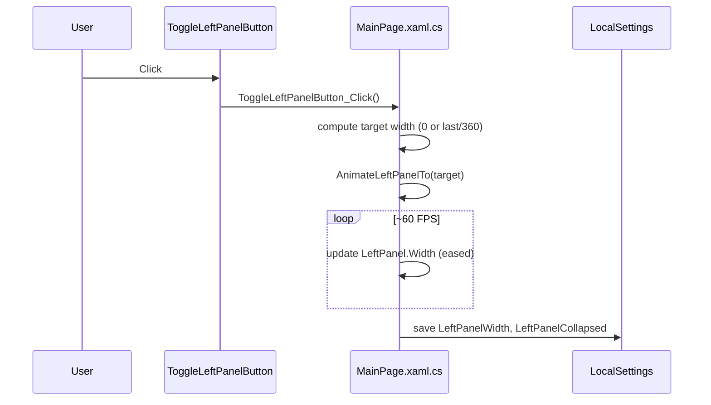

# UnoApp4 – Functional and Technical Specification

This document specifies the UI/UX, behavior, and technical architecture for the updated Uno Platform app. It complements `TUTORIAL.md` by providing a single reference for requirements and system design.

##Technology
- Uno platform (for C# desktop)

## Goals
- The app must provide a seamless experience on how to trigger functionality around file and data transformation in the frame of using AI as execution assistant.
- Provide a master-detail workspace with a collapsible left panel and a chat panel on the right.
- Implement a far-left fixed sidebar (icons only) with a toggle to collapse/expand the left panel.
- Allow resizing between the left panel and the right panel.
- Add a file-upload dialog accessible from the left panel: drag-and-drop/select file, action buttons, and a text preview.
- Ensure compatibility across macOS (Skia) and Windows Desktop.
- App is for macOS, windows and linux desktop
- we will develop on macOS

## specific context
- implemenet the csnake python https://github.com/tonybaloney/CSnakes to take care of data while csharp will make the orchestrator and UI
-  App must be multi language starting by french and english, default is french

## Screens and Layout


### Global Frame
- Top `NavigationBar` shows the current page title.
- Main content split into four columns:
  1) Fixed far-left sidebar (56px) – icons only, contains the toggle button.
  2) Left content panel (card: "Espace de travail"). Collapsible and resizable.
  3) Thin resizer (splitter handle).
  4) Right content panel (card: "Chat").

### ASCII Diagram
```
+-----------------------------------------------------------------------------------+
| NavigationBar                                                                     |
+-----------------------------------------------------------------------------------+
| 56px |   Left Panel (card)       | || |                 Right Panel (card)       |
|      |  [Ajouter un fichier]     | || |   [Chat header]                           |
|      |  [Rechercher un fichier]  | || |   [Empty state / messages]                |
|      |  [Créer un document]      | || |   [Input + Send]                          |
|      |                           | || |                                           |
|      |                           | || |                                           |
+-----------------------------------------------------------------------------------+
```
Legend: `||` denotes the vertical splitter/handle (4px wide).

### Upload Dialog (ContentDialog)
```
+----------------------------------------------------------------------------+
|  Charger le contenu d'un fichier                             [x Close]     |
+----------------------------------------------------------------------------+
|  +----------------------------+   [Convertir en text brut] [Résumé] [Reset] |
|  |   Select or drag & drop    |                                        ... |
|  |   (Drop Zone)              |                                            |
|  +----------------------------+                                            |
|                                                                            |
|  [Sauvegarder]                                                              |
|                                                                            |
|  Preview      [toggle]  Text brut / Résumé                                  |
|  +---------------------------------------------------------------------+   |
|  |  pas de donnée / file text                                          |   |
|  |  ...                                                                |   |
|  +---------------------------------------------------------------------+   |
+----------------------------------------------------------------------------+
```

## UX and Behavior
- Sidebar toggle: clicking the far-left icon collapses/expands the left panel.
- Resizing: user can drag the splitter to change the width of the left panel; min width enforced.
- Left panel buttons:
  - Ajouter un fichier: opens the upload dialog.
  - Rechercher un fichier: placeholder (future work).
  - Créer un document: placeholder (future work).
- Upload dialog:
  - Drag-drop or click the drop zone to select a file.
  - Preview shows text content if readable; otherwise displays a hint.
  - Convertir en text brut: placeholder (future converter hook: PDF/DOCX → text).
  - Faire un résumé: placeholder, becomes enabled after a file is loaded.
  - Reset clears preview and disables summarize.
  - Sauvegarder closes the dialog (placeholder to wire saving).

## Technical Design

### Key Files
- `UnoApp4/Presentation/MainPage.xaml`
  - Four-column layout.
  - Named elements: `LeftPanel` (Border), `LeftPanelColumn` (ColumnDefinition), `UploadDialog` (ContentDialog), and dialog content controls (`PreviewText`, `PreviewToggle`, `BtnSummarize`).
- `UnoApp4/Presentation/MainPage.xaml.cs`
  - Collapse/expand logic and animation helper.
  - Splitter drag handler.
  - Upload dialog handlers and preview logic.
- `UnoApp4/Presentation/Shell.xaml` and `App.xaml.cs`
  - App hosting, navigation, and initial route configuration.

### Animation Strategy (Cross-Platform)
- Avoid Storyboard dependency for left panel animation due to platform inconsistency.
- Use a `DispatcherTimer` (~60 FPS) quadratic ease-in/out to animate `LeftPanel.Width`.
- Idempotent toggle: decide based on `LeftPanel.Width` instead of flipping a flag.
- Persist `LeftPanel` width and collapsed state via `ApplicationData.Current.LocalSettings`.

Pseudo-code:
```csharp
void AnimateLeftPanelTo(double target, TimeSpan dur=250ms) {
    var start = LeftPanel.Width;
    var delta = target - start;
    if (|delta| < 0.5) { LeftPanel.Width = target; persist(); return; }
    DispatcherTimer tick ~16ms: t = elapsed/dur;
      if (t >= 1) { LeftPanel.Width = target; persist(); stop; }
      ease = t<0.5 ? 2*t*t : -1 + (4-2*t)*t;
      LeftPanel.Width = start + delta*ease;
}
```

### Upload Dialog Implementation
- Display: `ContentDialog UploadDialog` placed under the main `Grid` of `MainPage`.
- Attachment: `UploadDialog.XamlRoot = this.XamlRoot;` before `ShowAsync()`.
- Drag & Drop: listen to `DragOver` and `Drop` on the inner `Border` with `AllowDrop="True"`.
- Select file: `FileOpenPicker` on `DropZone_Tapped` (Uno handles window binding in recent SDKs).
- Preview: `FileIO.ReadTextAsync(file)` → `PreviewText.Text`.
- Actions: `Reset`, `Convertir en text brut` (placeholder), `Sauvegarder` (placeholder close).

### State and Persistence
- Persisted: `LeftPanelCollapsed` (bool), `LeftPanelWidth` (double) in `ApplicationData.Current.LocalSettings`.
- Restored in `MainPage` constructor.

### Navigation
- Routes configured in `App.xaml.cs` using Uno Extensions Navigation.
- `MainViewModel` is the default nested route after authentication.

## Accessibility and Theming
- Buttons have text or icons with tooltips where needed.
- Colors and borders use theme resources (`LayerFillColorDefaultBrush`, `ControlStrokeColorDefaultBrush`).
- Dialog scroll content supports small screens.

## Non-Functional Requirements
- Cross-platform: Works on macOS/Skia and Windows Desktop.
- Performance: Lightweight timer animation; no heavy composition effects.
- Maintainability: Clear XAML naming and code-behind handlers; replaceable with VM commands later.

## Open Items / Future Work
- Implement real conversion for PDF/DOCX → text.
- Implement summarization and saving logic.
- Persist per-device splitter position and collapsed state separately.
- Replace placeholder icons with brand icons if required.

## Build & Run Commands
```bash
# Restore and build (why: ensures NuGet restore and XAML code-behind generation)
DOTNET_CLI_TELEMETRY_OPTOUT=1 dotnet build UnoApp4.sln -c Debug
```

## Change Log (Summary)
- Added four-column layout with sidebar, left card, splitter, right card.
- Implemented timer-based easing for left panel animation.
- Added `ContentDialog` for file upload with drag-and-drop and preview.
- Wired up dialog and actions; added persistence for panel state.

## Implementation Status (Current)
### ✅ Completed Features
- 4-column grid layout: Fixed sidebar (56px) | Left panel | Splitter | Right panel
- Navigation bar with "Chat" title
- Left panel "Espace de travail" with three buttons:
  - "Ajouter un fichier" (click handler ready)
  - "Rechercher un fichier" (placeholder)
  - "Créer un document" (placeholder)
- Right panel "Chat" with header, empty state, and input field
- Smooth collapse/expand animation using DispatcherTimer
- State persistence via ApplicationData.Current.LocalSettings
- Cross-platform compatibility (Border instead of GridSplitter)
- Enter key support for chat input

### ✅ Issues Resolved
- Button visibility: Enhanced with proper theme resources and accent colors
- Collapse behavior: Panel now collapses completely (width=0, visibility=collapsed)
- Color scheme: Improved styling with visible backgrounds and proper foregrounds

## Engineering Synthesis: Complete Panel Collapse Pattern

### Problem Analysis
**Challenge**: Implementing a collapsible panel that completely disappears from the layout, not just hides content.

**Common Mistakes**:
1. Only setting `Visibility.Collapsed` without adjusting column width
2. Only setting column width without hiding visual elements
3. Not handling the splitter element during collapse
4. Poor button visibility in dark themes

### Solution Pattern: Dual-Control Architecture

#### Core Principle
Control **both layout space AND visual presence** simultaneously:

```csharp
// WRONG: Only hides content, maintains layout space
LeftPanel.Visibility = Visibility.Collapsed;

// CORRECT: Removes both content AND layout space
LeftPanelColumn.Width = new GridLength(0);           // Remove space
LeftPanel.Visibility = Visibility.Collapsed;         // Hide content
SplitterColumn.Width = new GridLength(0);            // Remove splitter space
Splitter.Visibility = Visibility.Collapsed;          // Hide splitter
```

#### Implementation Strategy

**1. XAML Structure Requirements**:
```xml
<Grid.ColumnDefinitions>
  <ColumnDefinition Width="56" />                    <!-- Fixed: Always visible -->
  <ColumnDefinition x:Name="LeftPanelColumn" />      <!-- Variable: 0 or 360px -->
  <ColumnDefinition x:Name="SplitterColumn" />       <!-- Variable: 0 or 4px -->
  <ColumnDefinition Width="*" />                     <!-- Flexible: Fills remaining -->
</Grid.ColumnDefinitions>
```

**2. Animation Logic Pattern**:
```csharp
private void AnimateLeftPanelTo(double targetWidth)
{
    // Immediate mode for small changes
    if (Math.Abs(targetWidth - currentWidth) < 0.5)
    {
        SetPanelState(targetWidth);
        return;
    }
    
    // Animated mode for smooth transitions
    StartAnimation(targetWidth);
}

private void SetPanelState(double width)
{
    bool isCollapsed = width <= 0.5;
    
    // Layout control
    LeftPanelColumn.Width = new GridLength(width);
    SplitterColumn.Width = new GridLength(isCollapsed ? 0 : 4);
    
    // Visual control
    LeftPanel.Visibility = isCollapsed ? Visibility.Collapsed : Visibility.Visible;
    Splitter.Visibility = isCollapsed ? Visibility.Collapsed : Visibility.Visible;
}
```

**3. Progressive Hiding During Animation**:
```csharp
// Prevent visual glitches by hiding early
if (currentAnimationWidth <= 10)
{
    LeftPanel.Visibility = Visibility.Collapsed;
    Splitter.Visibility = Visibility.Collapsed;
    SplitterColumn.Width = new GridLength(0);
}
```

### Button Visibility Solution

**Problem**: Transparent buttons invisible in dark themes
**Solution**: Use theme-aware resources with accent colors

```xml
<Button Background="{ThemeResource SubtleFillColorSecondaryBrush}"
        BorderBrush="{ThemeResource AccentFillColorDefaultBrush}"
        BorderThickness="1">
  <FontIcon Foreground="{ThemeResource AccentFillColorDefaultBrush}" />
</Button>
```

### Cross-Platform Considerations

**Uno Platform Specifics**:
- Use `Border` instead of `GridSplitter` for compatibility
- Leverage `DispatcherTimer` for consistent 60 FPS animation
- Apply proper nullability handling for C# nullable context

**Performance Optimizations**:
- Early animation termination (delta < 0.5px)
- Quadratic easing for natural feel
- State persistence via `ApplicationData.Current.LocalSettings`

### Engineering Memory Template

When implementing collapsible panels in Uno Platform:

1. **Always control both width AND visibility**
2. **Name all collapsible columns for programmatic access**
3. **Handle associated elements (splitters, borders)**
4. **Use theme resources for proper contrast**
5. **Implement progressive hiding during animation**
6. **Persist state for user experience continuity**

This pattern ensures complete layout collapse while maintaining smooth animations and cross-platform compatibility.

### 🔄 Next Priority Items
- Implement file upload dialog functionality
- Add actual chat message handling
- Implement search functionality for file management
- Add document creation capabilities

## Mermaid Diagrams

### Layout Structure
```mermaid
graph TD
  A[Page: MainPage] --> B[Grid: Root]
  B --> C[Row 0: NavigationBar]
  B --> D[Row 1: Main Grid]
  D --> D1[Col 0: Sidebar 56px]
  D --> D2[Col 1: LeftPanel (Border card)]
  D --> D3[Col 2: Splitter 4px]
  D --> D4[Col 3: RightPanel (Chat card)]

  D2 --> D2a[Espace de travail header]
  D2 --> D2b[Actions: Ajouter | Rechercher]
  D2 --> D2c[Action: Créer un document]

  D4 --> D4a[Chat header]
  D4 --> D4b[Messages / Empty]
  D4 --> D4c[Input + Send]

  B --> E[ContentDialog: UploadDialog]
  E --> E1[Drop Zone]
  E --> E2[Buttons: Convertir | Résumé | Reset]
  E --> E3[Sauvegarder]
  E --> E4[Preview area]
```

### Toggle + Animation + Persistence Flow


### Upload Dialog Flow
```mermaid
sequenceDiagram
  participant U as User
  participant BtnUp as Ajouter un fichier
  participant CD as UploadDialog
  participant MP as MainPage.xaml.cs

  U->>BtnUp: Click
  BtnUp->>MP: BtnUpload_Click()
  MP->>CD: XamlRoot = Page.XamlRoot; ShowAsync()
  alt Drag and drop
    U->>CD: Drop file
    CD->>MP: DropZone_Drop()
  else Tap select
    U->>CD: Tap drop zone
    CD->>MP: DropZone_Tapped() -> FileOpenPicker
  end
  MP->>MP: LoadFilePreviewAsync(file) -> PreviewText
  U->>CD: Reset/Convert/Sauvegarder
  CD->>MP: BtnReset_Click / BtnToText_Click / BtnSave_Click
