# CAI Design 1 Chat - Technical Specification

## 🚨 CRITICAL DEVELOPMENT BEST PRACTICES FOR AI AGENTS

### Frontend-Backend Coordination Rules
**MANDATORY**: Follow these practices to prevent build errors and maintain code quality:

1. **Incremental UI Changes**: Make small, testable changes rather than large layout overhauls
2. **Build After Each Major Change**: Run `dotnet build` after every significant XAML modification
3. **Code-Behind Dependency Check**: Before removing UI elements, search for references in `.cs` files
4. **Element Removal Protocol**: 
   - Search for element name in code-behind: `grep -r "ElementName" *.cs`
   - Remove or update all references before removing XAML element
   - Build and test immediately after removal

### Recommended Development Workflow
```bash
# 1. Make UI change
# 2. Check for code-behind references
grep -r "UIElementName" CAI_design_1_chat/Presentation/*.cs
# 3. Update code-behind if needed
# 4. Build immediately
dotnet build CAI_design_1_chat.sln
# 5. Test functionality
# 6. Proceed to next change
```

### Common Error Patterns to Avoid
- ❌ Removing multiple UI elements simultaneously without checking dependencies
- ❌ Making extensive layout changes without intermediate testing
- ❌ Forgetting event handler references when removing buttons
- ❌ Not building after XAML changes before proceeding

### Validation Points
- ✅ Build after each UI section modification
- ✅ Test navigation and basic functionality frequently
- ✅ Verify all event handlers exist for UI elements
- ✅ Check for orphaned code references

---

## Overview
A modern, cross-platform chat application built with Uno Platform, featuring comprehensive AI integration, advanced file processing capabilities, and a sophisticated SQLite-based data management system.

## Technology Stack
- **.NET 9.0**: Latest framework with performance improvements
- **Uno Platform 5.4+**: Cross-platform UI framework targeting macOS, Windows, and Linux
- **WinUI 3**: Modern Windows UI foundation
- **SQLite**: Local database with Microsoft.Data.Sqlite 9.0.9
- **Material Design**: Primary design system using Uno.Toolkit.UI.Material
- **iText7**: PDF text extraction library (version 8.0.2)

## Design System Guidelines

### Material Design Implementation
**CRITICAL**: This application uses **Material Design exclusively** - no Fluent Design elements.

- **Theme Provider**: `Uno.Toolkit.UI.Material.MaterialToolkitTheme`
- **Resource Naming**: All theme resources use `Material*` prefix
- **Color Palette**: Custom color overrides in `Styles/ColorPaletteOverride.xaml`
- **Typography**: Roboto font family (Material Design standard)
- **Component Library**: Uno Toolkit Material components only

### Material Design Resources Used
```xml
<!-- Primary Colors -->
{ThemeResource MaterialPrimaryBrush}
{ThemeResource MaterialOnPrimaryBrush}
{ThemeResource MaterialPrimaryContainerBrush}

<!-- Surface Colors -->
{ThemeResource MaterialSurfaceBrush}
{ThemeResource MaterialOnSurfaceBrush}
{ThemeResource MaterialSurfaceVariantBrush}
{ThemeResource MaterialOnSurfaceVariantBrush}

<!-- Outline Colors -->
{ThemeResource MaterialOutlineVariantBrush}
{ThemeResource MaterialBackgroundBrush}
```

## Layout Update Requirements (Phase 11)

### Navigation Bar Enhancement
- **Horizontal Tab Navigation**: Replace "Chat" header with tabbed navigation containing "Chat" and "Macro" tabs
- **Global AI Settings**: Move AI Settings button to top-right navigation bar (persistent across all pages)
- **AI Model Indicator**: Display current AI provider and model (e.g., "OpenAI - GPT-4") next to AI Settings button
- **Error State**: Show "No AI supplier/model selected" in red when unconfigured

### Page Layout System
- **Right Panel System**: All non-modal pages use consistent right panel layout like Chat page
- **Overlay Navigation**: Replace file upload modal with full-cover overlay system
- **Back Navigation**: Add "Back" button at top-left of overlays (not "Back to Chat")

### File Upload Page Redesign
- **Compact Upload**: Simplify to label + icon + browse button (remove drag & drop visual complexity)
- **Left Panel Layout**: Move Processing Actions and Summary Instructions to left panel below upload section
- **Content Preview**: Use remaining space for file content preview
- **Macro Tab**: Empty container for future action/task boxes

### Material Design Compliance
- Use Material Design tabs, buttons, and navigation components
- Maintain consistent elevation, shadows, and color scheme
- Preserve Material Design typography and iconography

## Architecture


## Goals & Vision
- Provide seamless AI-powered file processing and chat experience
- Modern, professional UI with Material Design principles
- Cross-platform compatibility (macOS, Windows, Linux)
- Intelligent file content extraction and summarization
- Multi-language support (French default, English)
- Extensible architecture for future AI provider integration

## Phase 12: FileUploadPage UI/UX Redesign (Completed)

**Objective**: Complete redesign of FileUploadPage with modern Material Design, improved layout, and enhanced user experience.

**Status**: ✅ Completed

### Key Features Implemented:
1. **Modern Material Design Interface**
   - Clean, card-based layout with proper spacing
   - Consistent color scheme and typography
   - Professional button styling with hover effects

2. **Three-Column Layout**
   - Left Panel: File upload controls and actions
   - Center Panel: Content preview with toggle (Raw/Summary)
   - Right Panel: Custom instructions and settings

3. **Enhanced File Processing Workflow**
   - Browse and select files (PDF, TXT, MD, DOCX)
   - Extract text with visual feedback
   - Generate AI summaries with custom instructions
   - Save processed files to database

4. **Smart UI Controls**
   - Toggle between raw text and summary views
   - Search and save custom instruction templates
   - Real-time button state management
   - Loading overlays with progress indication

### Technical Implementation:
- **XAML Layout**: Grid-based responsive design
- **Material Design**: Consistent theming and styling
- **State Management**: Proper enable/disable logic
- **Error Handling**: User-friendly error dialogs
- **Database Integration**: Seamless file data persistence

---

## Phase 13: FileUpload Overlay Integration (Completed)

**Objective**: Transform FileUploadPage into an overlay within MainPage to preserve chat state and improve UX consistency.

**Status**: ✅ Completed

### Architecture Innovation:


### Key UX Improvements:
1. **Contextual Overlay Design**
   - Covers only the active content area (chat panel)
   - Preserves sidebar and left panel visibility
   - Maintains navigation context with back button

2. **Smart State Preservation**
   - Chat state remains intact when accessing file upload
   - No page navigation overhead
   - Seamless transition between chat and file processing

3. **Responsive Layout Integration**
   - Overlay adapts to chat area dimensions
   - Follows left panel collapse/expand behavior
   - Proper text wrapping prevents horizontal overflow

### Technical Achievements:

#### Cross-Platform File Picker
```csharp
// Platform-specific initialization
#if WINDOWS
try {
    var window = Microsoft.UI.Xaml.Window.Current;
    if (window != null) {
        var hwnd = WinRT.Interop.WindowNative.GetWindowHandle(window);
        WinRT.Interop.InitializeWithWindow.Initialize(picker, hwnd);
    }
} catch {
    // Graceful fallback for initialization failures
}
#endif
```

#### Overlay Positioning Strategy
- **Container**: Positioned within chat Border (`Grid.Column="3"`)
- **Coverage**: Uses `Grid.RowSpan="3"` to cover entire chat area
- **Layering**: `Canvas.ZIndex="1000"` ensures proper stacking
- **Background**: Solid theme brush prevents transparency issues

#### Smart UI Enhancements
1. **File Selection Feedback**
   - Dynamic file info panel with name and size
   - Visual confirmation of successful file loading
   - Proper state reset on overlay close

2. **Auto-Summary Switching**
   - Automatically switches to summary view after generation
   - Updates toggle state programmatically
   - Improves user workflow efficiency

3. **Text Wrapping Solution**
   - Disabled horizontal scrolling in preview
   - Proper TextWrapping configuration
   - Prevents content overflow outside app boundaries

### Development Lessons:

#### Uno Platform Compatibility
- Use `#if WINDOWS` for platform-specific code
- Avoid complex RelativeSource bindings
- Prefer direct property settings over complex XAML bindings

#### Overlay Design Patterns
- Anchor overlays to content containers, not main layout grids
- Use solid backgrounds to prevent visual interference
- Implement proper state management for overlay lifecycle

#### Cross-Platform File Operations
- Windows requires window handle initialization
- macOS and Linux work natively without handles
- Always provide graceful fallbacks for platform differences

### Command-Line Tools Used:
```bash
# Build verification and testing
dotnet build CAI_design_1_chat.sln

# Service method discovery during debugging
grep -r "SaveFileDataAsync" CAI_design_1_chat/Services/

# Git operations for file restoration
git checkout HEAD -- CAI_design_1_chat/Presentation/MainPage.xaml
```

---

## Phase 14: Chat Enhancement with Database Migration (Completed)

**Objective**: Enhance chat functionality with simplified session management, JSON context storage, and direct prompt text storage.

**Status**: ✅ Completed

### Database Architecture Evolution:


### Key Architectural Changes:

#### 1. **Single Active Session Management**
- Added `is_active BOOLEAN DEFAULT TRUE` to `session` table
- Implemented database trigger to ensure only one active session
- Simplified session lifecycle for single-user application

#### 2. **Enhanced Chat Messages Structure**
```sql
-- Before (v1.0)
prompt_instruction_id INTEGER,
file_context_id INTEGER,

-- After (v2.0)  
prompt_text TEXT,                    -- Direct prompt storage
active_context_file_list TEXT,       -- JSON: "[1,2,3]"
```

#### 3. **Context Management Simplification**
- Removed `context_sessions` table entirely
- Direct relationship: `context_file_links.context_session_id → session.id`
- One context per session paradigm

#### 4. **JSON Context Storage Strategy**
- Store active file IDs as JSON arrays in chat messages
- Enables chat reproduction with exact context state
- Format: `"[1,2,3]"` for file IDs that were active during message

### UI Enhancements Implemented:

#### Clear Session Functionality
```xml
<Button x:Name="ClearSessionButton"
        ToolTipService.ToolTip="Clear chat history and file context"
        Click="ClearSessionButton_Click">
    <StackPanel Orientation="Horizontal" Spacing="4">
        <FontIcon Glyph="&#xE74D;" FontSize="12" />
        <TextBlock Text="Clear Session" FontSize="12" />
    </StackPanel>
</Button>
```

#### Context Menu Placeholder
```xml
<Button x:Name="ContextMenuButton"
        ToolTipService.ToolTip="Context options"
        Click="ContextMenuButton_Click">
    <FontIcon Glyph="&#xE109;" FontSize="16" />
</Button>
```

### Migration Process Lessons:

#### Database Migration Strategy
1. **Backup existing data**: `CREATE TABLE chat_messages_backup AS SELECT * FROM chat_messages`
2. **Create new structure**: Updated table with new columns
3. **Data transformation**: Convert FKs to text/JSON format
4. **Atomic replacement**: Drop old, rename new
5. **Index recreation**: Restore performance indexes

#### Cross-Platform Compatibility
- Used `Microsoft.Data.Sqlite` for database operations
- Added proper using directives for UI components
- Handled `Windows.UI.Text.FontStyle` and `Color.FromArgb` correctly

### Command-Line Tools Used:
```bash
# Database schema inspection
sqlite3 "path/to/cai_chat.db" ".schema session"
sqlite3 "path/to/cai_chat.db" ".schema chat_messages"

# Database migration execution
sqlite3 "path/to/cai_chat.db" "ALTER TABLE session ADD COLUMN is_active BOOLEAN DEFAULT TRUE;"

# Migration testing
sqlite3 "path/to/cai_chat.db" "INSERT INTO session (session_name, user) VALUES ('Test Session', 'user');"
sqlite3 "path/to/cai_chat.db" "SELECT id, session_name, is_active FROM session ORDER BY id;"

# Build verification
dotnet build CAI_design_1_chat.sln

# Database file location
find /Users/*/Library/Application\ Support/CAI_design_1_chat -name "*.db"
```

### Technical Achievements:
- **Zero-downtime migration**: Existing data preserved and transformed
- **Single active session**: Database trigger ensures consistency
- **JSON context storage**: Flexible file context tracking
- **Chat reproduction**: Complete prompt and context history
- **UI integration**: Clear session and context menu buttons
- **Cross-platform compatibility**: Proper namespace usage for Uno Platform

## Screens and Layout


## Core Features Implemented

### 1. **Enhanced File Processing System**
- **Full-Page Interface**: Professional workspace with three-panel layout (33%-50%-33%)
- **Multi-Format Support**: TXT, PDF, DOCX, Markdown files with extensible architecture
- **Drag & Drop**: Visual feedback with hover states and seamless file selection
- **AI-Powered Processing**: Text extraction and intelligent summarization
- **Live Preview**: Real-time editable content with raw/summary toggle
- **Database Integration**: Persistent storage with comprehensive metadata tracking

### 2. **Modern Chat Interface**
- **Master-Detail Layout**: Collapsible sidebar with chat panel
- **Material Design**: Consistent theming with dark mode support
- **Navigation**: Smooth transitions between chat and file processing
- **AI Integration**: Multiple provider support with dynamic model selection

### 3. **Robust Database Management**
- **SQLite Schema**: Comprehensive database with triggers and constraints
- **File Metadata**: Complete tracking of processing status and content
- **Session Management**: Chat history and context persistence
- **Processing Jobs**: Status monitoring and error handling

## UI Architecture

### Main Layout Structure
```
+-----------------------------------------------------------------------------------+
| Navigation Header - [← Back to Chat] File Processing              [⚙️ AI Settings] |
+-----------------------------------------------------------------------------------+
| 56px |   Workspace Panel        | || |                 Chat Panel              |
|      |  [Ajouter un fichier] ←──┼─┼┼─┼─→ FileUploadPage (Full Screen)            |
|      |  [Rechercher un fichier] | || |   [Chat Messages]                       |
|      |  [Créer un document]     | || |   [Message Input + Send]                |
|      |  [AI Settings]           | || |                                         |
+-----------------------------------------------------------------------------------+
```

### FileUploadPage Layout (Redesigned - Phase 12)
```
+-----------------------------------------------------------------------------------+
| [← Back to Chat] File Processing                                                  |
+-----------------------------------------------------------------------------------+
|   Left Panel Layout   |        Live Preview Editor        |     Empty Panel      |
|  ┌─────────────────┐  |  ┌─────────────────────────────┐  |  ┌─────────────────┐ |
|  │ Upload File     │  |  │ Raw Text / Summary Toggle   │  |  │                 │ |
|  │ [Browse Files]  │  |  │ ToggleSwitch: OFF=Raw ON=Sum│  |  │                 │ |
|  │                 │  |  │                             │  |  │                 │ |
|  │ File Info:      │  |  │ Editable TextBox            │  |  │                 │ |
|  │ 📄 Name         │  |  │ - Raw: Extracted content    │  |  │                 │ |
|  │    Size         │  |  │ - Summary: AI summary       │  |  │                 │ |
|  │ ═══════════════ │  |  │ - Empty: "Click Generate"   │  |  │                 │ |
|  │ Extract Text    │  |  │                             │  |  │                 │ |
|  │ Generate Summary│  |  │                             │  |  │                 │ |
|  │ Save to DB      │  |  │                             │  |  │                 │ |
|  │ Reset           │  |  │                             │  |  │                 │ |
|  │ ═══════════════ │  |  │                             │  |  │                 │ |
|  │ Summary Instruc │  |  │                             │  |  │                 │ |
|  │ [Text Input]    │  |  │                             │  |  │                 │ |
|  │ [🔍] [💾]       │  |  │                             │  |  │                 │ |
|  │ [Status Panel]  │  |  │                             │  |  │                 │ |
|  └─────────────────┘  |  └─────────────────────────────┘  |  └─────────────────┘ |
+-----------------------------------------------------------------------------------+
```

## File Upload UX Design Principles

### Layout Architecture
- **Three-Panel Design**: 33% - 50% - 33% column distribution
- **Material Design Cards**: Each panel uses Material surface styling
- **Consistent Spacing**: 24px margins, 16px internal padding
- **Rounded Corners**: 12px border radius for main containers, 8px for buttons

### Enhanced Processing Actions Panel
**NEW FEATURE**: Prompt Instruction System for AI Summarization

```
Processing Actions Panel (Right Side):
┌─────────────────────────────────────┐
│ Extract Text                        │
│ Generate Summary                    │
│ Save to Database                    │
│ Reset                              │
├─────────────────────────────────────┤ ← Divider
│ Summary Instructions                │
│ ┌─────────────────────────────────┐ │
│ │ [Free text instruction box]     │ │
│ │ Multi-line TextBox              │ │
│ │ Placeholder: "Enter custom      │ │
│ │ instructions for AI summary..." │ │
│ └─────────────────────────────────┘ │
│ [🔍 Search Instructions] [💾 Save]  │
│                                     │
│ Status Panel                        │
└─────────────────────────────────────┘
```

### Enhanced User Experience Flow with Prompt Instructions

```mermaid
flowchart TD
    A[User arrives at FileUploadPage] --> B[Empty state with drag zone]
    B --> C{File selected?}
    C -->|Drag & Drop| D[File info displayed]
    C -->|Browse button| D
    D --> E[Manual action required]
    E --> F{User clicks Extract Text?}
    F -->|Yes| G[Text extraction with loading]
    F -->|No| E
    G --> H[Raw text displayed]
    H --> I{Toggle to Summary?}
    I -->|Yes| J{Summary exists?}
    J -->|No| K["Click Generate Summary" message]
    J -->|Yes| L[Show existing summary]
    I -->|No| H
    
    K --> M{Custom instruction needed?}
    M -->|Search existing| N[Click 🔍 Search Instructions]
    M -->|Type custom| O[Type in instruction TextBox]
    M -->|Use default| P[Click Generate Summary]
    
    N --> Q[Prompt Search Modal opens]
    Q --> R[Search in title/description fields]
    R --> S[Filter by prompt_type dropdown]
    S --> T[Select prompt from table]
    T --> U[Preview shows instruction text]
    U --> V[Click Select button]
    V --> W[Modal closes, instruction populated]
    
    O --> X{Save button enabled?}
    X -->|Text modified| Y[Save button enabled]
    X -->|No changes| P
    
    Y --> Z[Click 💾 Save button]
    Z --> AA[Save Prompt Modal opens]
    AA --> BB[Fill required fields]
    BB --> CC[Click Save in modal]
    CC --> DD[New prompt saved to database]
    DD --> EE[Modal closes, instruction remains]
    
    W --> P
    EE --> P
    P --> FF[AI generates summary with custom instruction]
    FF --> L
    L --> GG[User can edit content]
    GG --> HH[Save to database]
```


### Material Design Implementation Details

#### Visual Hierarchy
- **Primary Actions**: Material Primary color (`MaterialPrimaryBrush`)
- **Secondary Actions**: Material Surface Variant (`MaterialSurfaceVariantBrush`)
- **Surfaces**: Material Surface with proper elevation (`MaterialSurfaceBrush`)
- **Borders**: Material Outline Variant for subtle separation

#### Interactive States
- **Drag Over**: Border changes to `MaterialPrimaryBrush` with 3px thickness
- **Default**: Border uses `MaterialOutlineVariantBrush` with 2px thickness
- **Loading States**: Progress indicators with Material Primary color
- **Disabled States**: Reduced opacity following Material guidelines

#### Typography Scale
- **Page Title**: `TitleTextBlockStyle` with SemiBold weight
- **Section Headers**: `SubtitleTextBlockStyle` with SemiBold weight
- **Body Text**: `BodyTextBlockStyle` with Regular weight
- **Captions**: `CaptionTextBlockStyle` for secondary information

#### Component Specifications

**Drop Zone**:
- Height: 200px
- Background: `MaterialSurfaceVariantBrush`
- Border: 2px `MaterialOutlineVariantBrush`, 3px `MaterialPrimaryBrush` on hover
- Corner Radius: 12px
- Icon: 48px FontIcon with folder glyph

**Action Buttons**:
- Primary: `MaterialPrimaryBrush` background, `MaterialOnPrimaryBrush` text
- Secondary: `MaterialSurfaceVariantBrush` background with outline
- Padding: 20px horizontal, 12px vertical
- Corner Radius: 8px
- Margin: 8px vertical spacing

**Content Preview**:
- Background: `MaterialSurfaceBrush`
- Border: 1px `MaterialOutlineVariantBrush`
- Corner Radius: 12px
- Min Height: 400px
- Scrollable with Material scrollbar styling

**Summary Instructions TextBox**:
- Background: `MaterialSurfaceVariantBrush`
- Border: 1px `MaterialOutlineVariantBrush`
- Corner Radius: 8px
- Min Height: 80px
- Placeholder: "Enter custom instructions for AI summary..."
- Font: `BodyTextBlockStyle`

**Instruction Action Buttons**:
- Search: `MaterialSurfaceVariantBrush` background with `🔍` icon
- Save: `MaterialPrimaryBrush` background when enabled, disabled when empty
- Width: 140px each, 8px margin between
- Corner Radius: 8px

## Prompt Instruction System

### Modal Dialog Designs

#### Prompt Search Modal
```
┌─────────────────────────────────────────────────────────────────────────┐
│ Select Prompt Instruction                                          [✕]  │
├─────────────────────────────────────────────────────────────────────────┤
│ Search (Title/Description): [________________________]                  │
│ Filter by Type: [All Types ▼] [summary|extraction|analysis|custom]     │
├─────────────────────────────────────────────────────────────────────────┤
│ Title                │ Type      │ Lang │ Description        │ Usage    │
├─────────────────────────────────────────────────────────────────────────┤
│ ● Résumé Standard    │ summary   │ fr   │ Prompt par défaut  │ 15 uses │
│ ● Document Analysis  │ analysis  │ en   │ Detailed analysis  │ 8 uses  │
│ ● Text Extraction    │ extraction│ fr   │ Extraction de...   │ 23 uses │
│ ● Custom Business    │ custom    │ fr   │ Business context   │ 3 uses  │
├─────────────────────────────────────────────────────────────────────────┤
│ Preview: [Selected instruction text preview...]                         │
├─────────────────────────────────────────────────────────────────────────┤
│                                          [Cancel] [Select] 🎯           │
└─────────────────────────────────────────────────────────────────────────┘
```

#### Save Prompt Modal
```
┌─────────────────────────────────────────────────────────────────────────┐
│ Save Prompt Instruction                                            [✕]  │
├─────────────────────────────────────────────────────────────────────────┤
│ Title*: [_________________________________________________]             │
│ Type*: [summary ▼] [summary|extraction|analysis|custom]               │
│ Language*: [fr ▼] [fr|en|es|...]                                      │
│ Description: [_______________________________________________]          │
│                                                                         │
│ Instruction*: ┌─────────────────────────────────────────────────────┐  │
│               │ [Current instruction text from main form]           │  │
│               │                                                     │  │
│               │                                                     │  │
│               └─────────────────────────────────────────────────────┘  │
│                                                                         │
│ Created by: [Current User/System]                                      │
│ □ Mark as System Prompt                                                │
├─────────────────────────────────────────────────────────────────────────┤
│                                          [Cancel] [Save] 💾             │
└─────────────────────────────────────────────────────────────────────────┘
```

### Database Integration

#### Search Query Implementation
```sql
-- Search in title AND description with prompt_type filter
SELECT * FROM prompt_instructions 
WHERE (title LIKE '%search_term%' OR description LIKE '%search_term%')
  AND (prompt_type = 'selected_type' OR 'selected_type' = 'all')
ORDER BY usage_count DESC, created_at DESC;
```

#### Save Implementation
```sql
-- Insert new prompt instruction
INSERT INTO prompt_instructions (
    prompt_type, language, instruction, title, description, 
    is_system, created_by, usage_count
) VALUES (?, ?, ?, ?, ?, ?, ?, 0);
```

#### Usage Tracking
```sql
-- Increment usage_count when prompt is selected
UPDATE prompt_instructions 
SET usage_count = usage_count + 1, updated_at = CURRENT_TIMESTAMP 
WHERE id = ?;
```

---

## FileUploadPage Redesign Implementation (Phase 12)

### Layout Transformation Completed
**Objective**: Redesign left panel to consolidate all file processing functionality in a vertical layout.

#### Changes Implemented:
1. **Upload Section Moved to Top**: Header and Browse button positioned at panel top
2. **File Information Simplified**: Removed AI model indicator, kept file name and size only
3. **Processing Actions Relocated**: Moved from right panel to left panel with tighter spacing
4. **Summary Instructions Integrated**: Positioned at bottom of left panel
5. **Processing Status Added**: Status panel appears below summary instructions when active
6. **Visual Dividers Enhanced**: Added visible 2px dividers between sections
7. **Right Panel Emptied**: Prepared for future functionality

#### Mermaid Workflow Diagram

```mermaid
flowchart TD
    A[User Opens FileUploadPage] --> B[Left Panel Layout]
    B --> C[Upload File Header]
    C --> D[Browse Files Button]
    D --> E{File Selected?}
    E -->|Yes| F[File Information Panel]
    E -->|No| D
    F --> G[📄 File Name Display]
    G --> H[File Size Display]
    H --> I[First Divider]
    I --> J[Processing Actions Section]
    J --> K[Extract Text Button]
    K --> L[Generate Summary Button]
    L --> M[Save to Database Button]
    M --> N[Reset Button]
    N --> O[Second Divider]
    O --> P[Summary Instructions]
    P --> Q[Text Input Area]
    Q --> R[🔍 Search & 💾 Save Buttons]
    R --> S{Processing Active?}
    S -->|Yes| T[Processing Status Panel]
    S -->|No| U[Ready State]
    T --> V[Progress Bar & Status Text]
    
    style A fill:#e1f5fe
    style F fill:#f3e5f5
    style J fill:#e8f5e8
    style P fill:#fff3e0
    style T fill:#ffebee
```


#### Technical Implementation Details
- **Button Styling**: Reduced padding from `20,12` to `16,8`, font size from 14 to 13
- **Spacing Optimization**: Processing buttons spacing reduced from 8px to 4px
- **Divider Enhancement**: Height increased to 2px with `MaterialOutlineBrush` for visibility
- **Layout Margins**: Tighter spacing throughout with 8px base spacing
- **AI Settings Removal**: Removed redundant AI Settings button from header

---

## Lessons Learned During AI Integration and Debugging

### Database Schema Alignment
- **Critical**: Ensure SQL INSERT statements match the actual database schema columns
- **Issue**: `processing_jobs` table had missing columns (`parameters`, `priority`, `retry_count`, `max_retries`) causing SQLite errors
- **Solution**: Align code with schema or update schema to match requirements
- **Command**: Always verify schema with `sqlite3 database.db ".schema table_name"` before writing SQL

### Foreign Key Constraint Management
- **Issue**: Attempting to create processing job records with invalid file IDs (0) when file save operations failed
- **Solution**: Check for valid IDs before creating dependent records and handle exceptions gracefully
- **Pattern**: Use `if (fileData.Id > 0)` checks before foreign key operations

### File Type Support Consistency
- **Issue**: `.md` files were not supported in `ProcessFileAsync` despite being handled in UI
- **Root Cause**: Missing case statement in file type switch logic
- **Solution**: Ensure all supported file types are handled in both UI and service layers
- **Pattern**: Group similar file types (`.txt` and `.md`) in same case statements

### Summary Generation Workflow Issues
- **Issue**: Generated AI summaries were not being saved to database - UI showed one summary, database contained another
- **Root Cause**: Automatic basic summary generation during file processing conflicted with manual AI summary generation
- **Solution**: Remove automatic summary generation, track `FileData` objects, use update operations instead of insert
- **Architecture**: Separate content extraction from summary generation for better user control

### AI Service Integration Patterns
- **Best Practice**: Use consistent AI service initialization across different components
- **Debug Strategy**: Comprehensive logging for AI provider, model, prompt, and response details
- **Fallback Mechanism**: Always provide basic summary when AI services are unavailable
- **Error Handling**: Wrap AI calls in try-catch blocks with user-friendly error messages

### Data Consistency and State Management
- **Issue**: UI state not synchronized with database state
- **Solution**: Track `_currentFileData` object throughout the workflow
- **Pattern**: Update existing records instead of creating duplicates
- **Best Practice**: Use `UpdateFileDataAsync` for existing files, `SaveFileDataAsync` for new files

### Chat Context Management Best Practices
- **Hybrid Approach**: Memory cache + Database persistence for optimal performance
- **Configurable Context Size**: User-adjustable context (1-20 messages) via AI Settings dialog
- **Smart Token Management**: Real-time token estimation with ~25 tokens per message calculation
- **Provider Compatibility**: OpenAI uses structured message arrays, Ollama uses formatted prompts
- **Memory Efficiency**: Cache trimming (15 messages max) prevents memory bloat
- **Session Isolation**: Context cleared on "Clear Session" for proper conversation boundaries
- **Settings Persistence**: Context size saved to ApplicationData.LocalSettings
- **Error Resilience**: Graceful fallbacks when context retrieval fails

---

## Architecture Diagrams

### File Processing Workflow


### Chat Context Management Architecture


### Context Service Performance Flow


### Configurable Context Size Architecture

```mermaid
graph TD
    A[User Opens AI Settings] --> B[Context Configuration Section]
    B --> C[Slider: 1-20 Messages]
    C --> D[Real-time Token Estimation]
    D --> E[~25 tokens × N messages]
    
    F[User Saves Settings] --> G[ApplicationData.LocalSettings]
    G --> H[ContextMessages: int]
    
    I[MainPage Initialization] --> J[UpdateContextServiceFromSettings]
    J --> K[ChatContextService.SetContextSize]
    K --> L[_contextMessages = N]
    
    M[AI Request] --> N[GetContextForAIAsync]
    N --> O[TakeLast(_contextMessages)]
    O --> P[Provider-Specific Format]
    P --> Q[OpenAI: ChatMessage[]]
    P --> R[Ollama: Formatted Prompt]
    
    S[Context Size Display] --> T[Chat Header: Context size: X tokens]
    T --> U[Real-time Updates]
    
    style B fill:#e1f5fe
    style K fill:#e8f5e8
    style T fill:#fff3e0
```

### AI Settings Dialog UX Flow


### Debugging Workflow


---

## Development Commands

```bash
# Build and run the application
dotnet build
dotnet run --project CAI_design_1_chat

# Database operations and debugging
sqlite3 database.db ".schema file_data"
sqlite3 database.db ".schema processing_jobs"
sqlite3 database.db "SELECT id, name, summary FROM file_data;"
sqlite3 database.db "SELECT * FROM processing_jobs WHERE status='failed';"

# Verify database schema alignment
sqlite3 database.db "PRAGMA table_info(processing_jobs);"

# Debug AI integration
# Check debug output in Visual Studio Output window or IDE console
# Look for these debug markers:
# - "=== AI SUMMARIZATION DEBUG ==="
# - "DEBUG: Selected AI Provider:"
# - "DEBUG: AI Response length:"
# - "=== AI SUMMARIZATION SUCCESS ==="
# - "=== AI SUMMARIZATION ERROR ==="

# Test file type support
# Verify these extensions work: .pdf, .txt, .md, .docx

# Common debugging scenarios
# 1. SQLite errors: Check column names in INSERT statements
# 2. Foreign key errors: Verify file_id exists before creating processing_jobs
# 3. Summary mismatch: Check if UpdateFileDataAsync is called vs SaveFileDataAsync
# 4. File type errors: Ensure all UI-supported types are in ProcessFileAsync switch
```

---

## Quick Restart Guide for Developers/AI Agents

### Prerequisites
- .NET 8.0 SDK
- Visual Studio 2022 or VS Code with C# extension
- Uno Platform workloads installed
- SQLite command line tools (for debugging)

### Setup Steps
1. Clone repository
2. Run `dotnet restore`
3. Build solution: `dotnet build`
4. Run application: `dotnet run --project CAI_design_1_chat`
5. Verify database creation in app data folder

### Key Architecture Points
- **UI Framework**: Uno Platform with Material Design
- **Database**: SQLite with manual SQL operations (no ORM)
- **AI Integration**: OpenAI and Ollama support with comprehensive debug logging
- **File Processing**: PDF (iText7), Text, Markdown support
- **State Management**: Track FileData objects throughout UI workflow

### Critical Debugging Patterns

#### 1. Database Schema Verification
```bash
# Always verify schema before writing SQL
sqlite3 database.db ".schema table_name"
# Check if columns exist before INSERT/UPDATE
sqlite3 database.db "PRAGMA table_info(table_name);"
```

#### 2. File Processing Workflow
- Extract text → Save to DB (no summary)
- Generate AI summary → Update existing record
- Never create duplicate records for same file

#### 3. AI Integration Debug Points
- Check provider configuration first
- Log prompt length and preview
- Log response length and preview
- Always provide fallback mechanism

### Common Tasks
- **Add new AI provider**: Implement `IAIService` interface
- **Add file type**: Update `ProcessFileAsync` switch statement AND UI file picker
- **Modify database**: Update schema.sql and corresponding service methods
- **Debug AI calls**: Check debug output for detailed logging
- **Fix summary issues**: Ensure `UpdateFileDataAsync` is used for existing files

### Troubleshooting Checklist
1. **SQLite errors**: Verify column names match schema
2. **Foreign key errors**: Check file_id > 0 before dependent operations
3. **File type errors**: Ensure UI and service layer support same types
4. **Summary mismatch**: Use update operations, not insert for existing files
5. **AI errors**: Check provider configuration and debug logs

### Smart UX Principles Applied

1. **Progressive Disclosure**: Users see file info before processing
2. **Manual Control**: Users decide when to extract text and generate summaries
3. **Visual Feedback**: Loading states and clear error messages
4. **Flexible Workflow**: Support for custom AI instructions
5. **Data Transparency**: Toggle between raw content and summary views
6. **Error Recovery**: Graceful handling of unsupported files and AI failures
7. **State Consistency**: UI always reflects actual database state
8. **Efficient Operations**: Update existing records instead of creating duplicates
9. **Consolidated Interface**: All file processing actions in single left panel
10. **Visual Hierarchy**: Clear section separation with enhanced dividers

### Modern Development Practices

1. **Comprehensive Logging**: Debug information for all critical operations
2. **Defensive Programming**: Validate data before database operations
3. **Separation of Concerns**: Clear distinction between extraction and summarization
4. **Error Boundaries**: Isolated error handling prevents cascade failures
5. **Resource Management**: Proper disposal of database connections and HTTP clients
6. **Schema Validation**: Runtime checks for database consistency
7. **Fallback Mechanisms**: Always provide alternative when primary systems fail
8. **Incremental UI Development**: Small, testable changes with frequent builds
9. **Code-Behind Synchronization**: Always verify element references before XAML changes
10. **Frontend-Backend Coordination**: Mandatory dependency checks prevent build errors
