# CAI Design 1 Chat - Technical Specification

## Overview
A modern, cross-platform chat application built with Uno Platform, featuring comprehensive AI integration, advanced file processing capabilities, and a sophisticated SQLite-based data management system.

## Technology Stack
- **.NET 9.0**: Latest framework with performance improvements
- **Uno Platform 5.4+**: Cross-platform UI framework targeting macOS, Windows, and Linux
- **WinUI 3**: Modern Windows UI foundation
- **SQLite**: Local database with Microsoft.Data.Sqlite 9.0.9
- **Material Design**: Primary design system using Uno.Toolkit.UI.Material
- **iText7**: PDF text extraction library (version 8.0.2)

## Design System Guidelines

### Material Design Implementation
**CRITICAL**: This application uses **Material Design exclusively** - no Fluent Design elements.

- **Theme Provider**: `Uno.Toolkit.UI.Material.MaterialToolkitTheme`
- **Resource Naming**: All theme resources use `Material*` prefix
- **Color Palette**: Custom color overrides in `Styles/ColorPaletteOverride.xaml`
- **Typography**: Roboto font family (Material Design standard)
- **Component Library**: Uno Toolkit Material components only

### Material Design Resources Used
```xml
<!-- Primary Colors -->
{ThemeResource MaterialPrimaryBrush}
{ThemeResource MaterialOnPrimaryBrush}
{ThemeResource MaterialPrimaryContainerBrush}

<!-- Surface Colors -->
{ThemeResource MaterialSurfaceBrush}
{ThemeResource MaterialOnSurfaceBrush}
{ThemeResource MaterialSurfaceVariantBrush}
{ThemeResource MaterialOnSurfaceVariantBrush}

<!-- Outline Colors -->
{ThemeResource MaterialOutlineVariantBrush}
{ThemeResource MaterialBackgroundBrush}
```

## Architecture


## Goals & Vision
- Provide seamless AI-powered file processing and chat experience
- Modern, professional UI with Material Design principles
- Cross-platform compatibility (macOS, Windows, Linux)
- Intelligent file content extraction and summarization
- Multi-language support (French default, English)
- Extensible architecture for future AI provider integration

## Screens and Layout


## Core Features Implemented

### 1. **Enhanced File Processing System**
- **Full-Page Interface**: Professional workspace with three-panel layout (33%-50%-33%)
- **Multi-Format Support**: TXT, PDF, DOCX, Markdown files with extensible architecture
- **Drag & Drop**: Visual feedback with hover states and seamless file selection
- **AI-Powered Processing**: Text extraction and intelligent summarization
- **Live Preview**: Real-time editable content with raw/summary toggle
- **Database Integration**: Persistent storage with comprehensive metadata tracking

### 2. **Modern Chat Interface**
- **Master-Detail Layout**: Collapsible sidebar with chat panel
- **Material Design**: Consistent theming with dark mode support
- **Navigation**: Smooth transitions between chat and file processing
- **AI Integration**: Multiple provider support with dynamic model selection

### 3. **Robust Database Management**
- **SQLite Schema**: Comprehensive database with triggers and constraints
- **File Metadata**: Complete tracking of processing status and content
- **Session Management**: Chat history and context persistence
- **Processing Jobs**: Status monitoring and error handling

## UI Architecture

### Main Layout Structure
```
+-----------------------------------------------------------------------------------+
| Navigation Header - [← Back to Chat] File Processing              [⚙️ AI Settings] |
+-----------------------------------------------------------------------------------+
| 56px |   Workspace Panel        | || |                 Chat Panel              |
|      |  [Ajouter un fichier] ←──┼─┼┼─┼─→ FileUploadPage (Full Screen)            |
|      |  [Rechercher un fichier] | || |   [Chat Messages]                       |
|      |  [Créer un document]     | || |   [Message Input + Send]                |
|      |  [AI Settings]           | || |                                         |
+-----------------------------------------------------------------------------------+
```

### FileUploadPage Layout (Full Screen)
```
+-----------------------------------------------------------------------------------+
| [← Back to Chat] File Processing                              [🤖 AI Settings]   |
+-----------------------------------------------------------------------------------+
|   File Upload Zone    |        Live Preview Editor        |  Processing Actions  |
|  ┌─────────────────┐  |  ┌─────────────────────────────┐  |  ┌─────────────────┐ |
|  │ 📁 Drag & Drop  │  |  │ Raw Text / Summary Toggle   │  |  │ Extract Text    │ |
|  │ Browse Files    │  |  │ ToggleSwitch: OFF=Raw ON=Sum│  |  │ Generate Summary│ |
|  │                 │  |  │                             │  |  │ Save to DB      │ |
|  │ File Info:      │  |  │ Editable TextBox            │  |  │ Reset           │ |
|  │ • Name          │  |  │ - Raw: Extracted content    │  |  │                 │ |
|  │ • Size          │  |  │ - Summary: AI summary       │  |  │ Status Panel    │ |
|  │ 🤖 AI Model     │  |  │ - Empty: "Click Generate"   │  |  │                 │ |
|  └─────────────────┘  |  └─────────────────────────────┘  |  └─────────────────┘ |
+-----------------------------------------------------------------------------------+
```

## File Upload UX Design Principles

### Layout Architecture
- **Three-Panel Design**: 33% - 50% - 33% column distribution
- **Material Design Cards**: Each panel uses Material surface styling
- **Consistent Spacing**: 24px margins, 16px internal padding
- **Rounded Corners**: 12px border radius for main containers, 8px for buttons

### Enhanced Processing Actions Panel
**NEW FEATURE**: Prompt Instruction System for AI Summarization

```
Processing Actions Panel (Right Side):
┌─────────────────────────────────────┐
│ Extract Text                        │
│ Generate Summary                    │
│ Save to Database                    │
│ Reset                              │
├─────────────────────────────────────┤ ← Divider
│ Summary Instructions                │
│ ┌─────────────────────────────────┐ │
│ │ [Free text instruction box]     │ │
│ │ Multi-line TextBox              │ │
│ │ Placeholder: "Enter custom      │ │
│ │ instructions for AI summary..." │ │
│ └─────────────────────────────────┘ │
│ [🔍 Search Instructions] [💾 Save]  │
│                                     │
│ Status Panel                        │
└─────────────────────────────────────┘
```

### Enhanced User Experience Flow with Prompt Instructions


### Material Design Implementation Details

#### Visual Hierarchy
- **Primary Actions**: Material Primary color (`MaterialPrimaryBrush`)
- **Secondary Actions**: Material Surface Variant (`MaterialSurfaceVariantBrush`)
- **Surfaces**: Material Surface with proper elevation (`MaterialSurfaceBrush`)
- **Borders**: Material Outline Variant for subtle separation

#### Interactive States
- **Drag Over**: Border changes to `MaterialPrimaryBrush` with 3px thickness
- **Default**: Border uses `MaterialOutlineVariantBrush` with 2px thickness
- **Loading States**: Progress indicators with Material Primary color
- **Disabled States**: Reduced opacity following Material guidelines

#### Typography Scale
- **Page Title**: `TitleTextBlockStyle` with SemiBold weight
- **Section Headers**: `SubtitleTextBlockStyle` with SemiBold weight
- **Body Text**: `BodyTextBlockStyle` with Regular weight
- **Captions**: `CaptionTextBlockStyle` for secondary information

#### Component Specifications

**Drop Zone**:
- Height: 200px
- Background: `MaterialSurfaceVariantBrush`
- Border: 2px `MaterialOutlineVariantBrush`, 3px `MaterialPrimaryBrush` on hover
- Corner Radius: 12px
- Icon: 48px FontIcon with folder glyph

**Action Buttons**:
- Primary: `MaterialPrimaryBrush` background, `MaterialOnPrimaryBrush` text
- Secondary: `MaterialSurfaceVariantBrush` background with outline
- Padding: 20px horizontal, 12px vertical
- Corner Radius: 8px
- Margin: 8px vertical spacing

**Content Preview**:
- Background: `MaterialSurfaceBrush`
- Border: 1px `MaterialOutlineVariantBrush`
- Corner Radius: 12px
- Min Height: 400px
- Scrollable with Material scrollbar styling

**Summary Instructions TextBox**:
- Background: `MaterialSurfaceVariantBrush`
- Border: 1px `MaterialOutlineVariantBrush`
- Corner Radius: 8px
- Min Height: 80px
- Placeholder: "Enter custom instructions for AI summary..."
- Font: `BodyTextBlockStyle`

**Instruction Action Buttons**:
- Search: `MaterialSurfaceVariantBrush` background with `🔍` icon
- Save: `MaterialPrimaryBrush` background when enabled, disabled when empty
- Width: 140px each, 8px margin between
- Corner Radius: 8px

## Prompt Instruction System

### Modal Dialog Designs

#### Prompt Search Modal
```
┌─────────────────────────────────────────────────────────────────────────┐
│ Select Prompt Instruction                                          [✕]  │
├─────────────────────────────────────────────────────────────────────────┤
│ Search (Title/Description): [________________________]                  │
│ Filter by Type: [All Types ▼] [summary|extraction|analysis|custom]     │
├─────────────────────────────────────────────────────────────────────────┤
│ Title                │ Type      │ Lang │ Description        │ Usage    │
├─────────────────────────────────────────────────────────────────────────┤
│ ● Résumé Standard    │ summary   │ fr   │ Prompt par défaut  │ 15 uses │
│ ● Document Analysis  │ analysis  │ en   │ Detailed analysis  │ 8 uses  │
│ ● Text Extraction    │ extraction│ fr   │ Extraction de...   │ 23 uses │
│ ● Custom Business    │ custom    │ fr   │ Business context   │ 3 uses  │
├─────────────────────────────────────────────────────────────────────────┤
│ Preview: [Selected instruction text preview...]                         │
├─────────────────────────────────────────────────────────────────────────┤
│                                          [Cancel] [Select] 🎯           │
└─────────────────────────────────────────────────────────────────────────┘
```

#### Save Prompt Modal
```
┌─────────────────────────────────────────────────────────────────────────┐
│ Save Prompt Instruction                                            [✕]  │
├─────────────────────────────────────────────────────────────────────────┤
│ Title*: [_________________________________________________]             │
│ Type*: [summary ▼] [summary|extraction|analysis|custom]               │
│ Language*: [fr ▼] [fr|en|es|...]                                      │
│ Description: [_______________________________________________]          │
│                                                                         │
│ Instruction*: ┌─────────────────────────────────────────────────────┐  │
│               │ [Current instruction text from main form]           │  │
│               │                                                     │  │
│               │                                                     │  │
│               └─────────────────────────────────────────────────────┘  │
│                                                                         │
│ Created by: [Current User/System]                                      │
│ □ Mark as System Prompt                                                │
├─────────────────────────────────────────────────────────────────────────┤
│                                          [Cancel] [Save] 💾             │
└─────────────────────────────────────────────────────────────────────────┘
```

### Database Integration

#### Search Query Implementation
```sql
-- Search in title AND description with prompt_type filter
SELECT * FROM prompt_instructions 
WHERE (title LIKE '%search_term%' OR description LIKE '%search_term%')
  AND (prompt_type = 'selected_type' OR 'selected_type' = 'all')
ORDER BY usage_count DESC, created_at DESC;
```

#### Save Implementation
```sql
-- Insert new prompt instruction
INSERT INTO prompt_instructions (
    prompt_type, language, instruction, title, description, 
    is_system, created_by, usage_count
) VALUES (?, ?, ?, ?, ?, ?, ?, 0);
```

#### Usage Tracking
```sql
-- Increment usage_count when prompt is selected
UPDATE prompt_instructions 
SET usage_count = usage_count + 1, updated_at = CURRENT_TIMESTAMP 
WHERE id = ?;
```

### Enhanced AI Summarization

**Default Instruction**: "You are an executive assistant. Make a summary of the file and keep the original language of the file."

**Custom Instruction Flow**:
1. User types custom instruction in TextBox
2. OR user searches and selects from database
3. Generate Summary button uses: `raw_text + custom_instruction`
4. AI provider processes with enhanced context
5. Result displayed in summary toggle view

## Implementation Details & Lessons Learned

### Critical SQLite Database Fix
**Problem**: Initial implementation split schema.sql by semicolons, breaking SQL triggers with `BEGIN...END` blocks.
**Solution**: Execute entire schema as single command to preserve transaction integrity.

```csharp
// Fixed approach:
using var sqlCommand = new SqliteCommand(schema, connection);
await sqlCommand.ExecuteNonQueryAsync();
```

### File Processing Architecture
- **FileProcessingService**: Handles multi-format text extraction
- **DatabaseService**: SQLite management with comprehensive schema
- **FileUploadPage**: Full-screen professional interface replacing modal dialog

### Navigation Pattern
```csharp
// MainPage navigation to FileUploadPage
private void BtnAddFile_Click(object sender, RoutedEventArgs e)
{
    Frame.Navigate(typeof(FileUploadPage));
}

// FileUploadPage back navigation
private void BackButton_Click(object sender, RoutedEventArgs e)
{
    Frame.GoBack();
}
```

### Material Design Integration
- Consistent theming with `MaterialPrimaryBrush`, `MaterialSurfaceBrush`
- Three-panel layout with proper spacing and rounded corners
- Visual feedback for drag-and-drop operations

### Database Schema Highlights
```sql
-- File processing with context management
CREATE TABLE file_data (
    id INTEGER PRIMARY KEY AUTOINCREMENT,
    name TEXT NOT NULL,
    content TEXT,
    summary TEXT,
    processing_status TEXT DEFAULT 'pending',
    -- Context management fields
    is_in_context BOOLEAN DEFAULT FALSE,
    use_summary_in_context BOOLEAN DEFAULT FALSE
);

-- Automatic timestamp triggers
CREATE TRIGGER update_file_data_timestamp 
    AFTER UPDATE ON file_data
    BEGIN
        UPDATE file_data SET updated_at = CURRENT_TIMESTAMP WHERE id = NEW.id;
    END;
```

### Database Location
**Development/Debug Path**:
- **macOS**: `~/Library/Application Support/CAI_design_1_chat/cai_chat.db`
- **Windows**: `%LOCALAPPDATA%\CAI_design_1_chat\cai_chat.db`
- **Linux**: `~/.local/share/CAI_design_1_chat/cai_chat.db`

**Access Pattern**:
```csharp
var appDataPath = Environment.GetFolderPath(Environment.SpecialFolder.LocalApplicationData);
var appFolder = Path.Combine(appDataPath, "CAI_design_1_chat");
_databasePath = Path.Combine(appFolder, "cai_chat.db");
```

## Development Commands & Workflow

### Essential Commands
```bash
# Build the project
dotnet build

# Run the application
dotnet run --project CAI_design_1_chat --framework net9.0-desktop

# Clean build artifacts
dotnet clean

# Restore packages
dotnet restore
```

### Project Structure
```
CAI_design_1_chat/
├── Database/
│   └── schema.sql              # SQLite database schema
├── Models/
│   ├── FileData.cs            # File metadata model
│   ├── AIModel.cs             # AI provider configuration
│   └── AppConfig.cs           # Application settings
├── Services/
│   ├── DatabaseService.cs     # SQLite management
│   └── FileProcessingService.cs # File content extraction
├── Presentation/
│   ├── MainPage.xaml          # Main chat interface
│   ├── FileUploadPage.xaml    # Full-screen file processing
│   └── App.xaml               # Application resources
└── CAI_design_1_chat.csproj   # Project configuration
```

### Key Dependencies
- **Microsoft.Data.Sqlite**: 9.0.9 - SQLite database access
- **Uno.WinUI**: 5.4+ - Cross-platform UI framework
- **Uno.Toolkit.WinUI**: UI components and resources

### Performance & UX Optimizations
- Async/await patterns for all IO operations
- Drag-and-drop visual feedback with hover states
- Material Design theming for consistent appearance
- Three-panel layout optimized for file processing workflow
- Database triggers for automatic timestamp management

### Debugging Notes
- SQLite database location: `~/Library/Application Support/CAI_design_1_chat/cai_chat.db`
- Console output shows database initialization success
- File picker requires proper window handle initialization
- Navigation warning resolved by implementing proper routing

### Next Development Priorities
1. **AI Integration**: Implement real text extraction for PDF/DOCX
2. **Summarization**: Connect to AI providers for content summarization
3. **Error Handling**: Enhanced user feedback and error recovery
4. **Testing**: Unit tests for services and UI components
5. **Localization**: French/English language support

## UX and Behavior
- Sidebar toggle: clicking the far-left icon collapses/expands the left panel.
- Resizing: user can drag the splitter to change the width of the left panel; min width enforced.
- Left panel buttons:
  - Ajouter un fichier: opens the upload dialog.
  - Rechercher un fichier: placeholder (future work).
  - Créer un document: placeholder (future work).
- Upload dialog:
  - Drag-drop or click the drop zone to select a file.
  - Preview shows text content if readable; otherwise displays a hint.
  - Convertir en text brut: placeholder (future converter hook: PDF/DOCX → text).
  - Faire un résumé: placeholder, becomes enabled after a file is loaded.
  - Reset clears preview and disables summarize.
  - Sauvegarder closes the dialog (placeholder to wire saving).

## Technical Design

### Key Files
- `UnoApp4/Presentation/MainPage.xaml`
  - Four-column layout.
  - Named elements: `LeftPanel` (Border), `LeftPanelColumn` (ColumnDefinition), `UploadDialog` (ContentDialog), and dialog content controls (`PreviewText`, `PreviewToggle`, `BtnSummarize`).
- `UnoApp4/Presentation/MainPage.xaml.cs`
  - Collapse/expand logic and animation helper.
  - Splitter drag handler.
  - Upload dialog handlers and preview logic.
- `UnoApp4/Presentation/Shell.xaml` and `App.xaml.cs`
  - App hosting, navigation, and initial route configuration.

### Animation Strategy (Cross-Platform)
- Avoid Storyboard dependency for left panel animation due to platform inconsistency.
- Use a `DispatcherTimer` (~60 FPS) quadratic ease-in/out to animate `LeftPanel.Width`.
- Idempotent toggle: decide based on `LeftPanel.Width` instead of flipping a flag.
- Persist `LeftPanel` width and collapsed state via `ApplicationData.Current.LocalSettings`.

Pseudo-code:
```csharp
void AnimateLeftPanelTo(double target, TimeSpan dur=250ms) {
    var start = LeftPanel.Width;
    var delta = target - start;
    if (|delta| < 0.5) { LeftPanel.Width = target; persist(); return; }
    DispatcherTimer tick ~16ms: t = elapsed/dur;
      if (t >= 1) { LeftPanel.Width = target; persist(); stop; }
      ease = t<0.5 ? 2*t*t : -1 + (4-2*t)*t;
      LeftPanel.Width = start + delta*ease;
}
```

### Upload Dialog Implementation
- Display: `ContentDialog UploadDialog` placed under the main `Grid` of `MainPage`.
- Attachment: `UploadDialog.XamlRoot = this.XamlRoot;` before `ShowAsync()`.
- Drag & Drop: listen to `DragOver` and `Drop` on the inner `Border` with `AllowDrop="True"`.
- Select file: `FileOpenPicker` on `DropZone_Tapped` (Uno handles window binding in recent SDKs).
- Preview: `FileIO.ReadTextAsync(file)` → `PreviewText.Text`.
- Actions: `Reset`, `Convertir en text brut` (placeholder), `Sauvegarder` (placeholder close).

### State and Persistence
- Persisted: `LeftPanelCollapsed` (bool), `LeftPanelWidth` (double) in `ApplicationData.Current.LocalSettings`.
- Restored in `MainPage` constructor.

### Navigation
- Routes configured in `App.xaml.cs` using Uno Extensions Navigation.
- `MainViewModel` is the default nested route after authentication.

## Accessibility and Theming
- Buttons have text or icons with tooltips where needed.
- Colors and borders use theme resources (`LayerFillColorDefaultBrush`, `ControlStrokeColorDefaultBrush`).
- Dialog scroll content supports small screens.

## Non-Functional Requirements
- Cross-platform: Works on macOS/Skia and Windows Desktop.
- Performance: Lightweight timer animation; no heavy composition effects.
- Maintainability: Clear XAML naming and code-behind handlers; replaceable with VM commands later.

## Open Items / Future Work
- Implement real conversion for PDF/DOCX → text.
- Implement summarization and saving logic.
- Persist per-device splitter position and collapsed state separately.
- Replace placeholder icons with brand icons if required.

## Build & Run Commands
```bash
# Restore and build (why: ensures NuGet restore and XAML code-behind generation)
DOTNET_CLI_TELEMETRY_OPTOUT=1 dotnet build UnoApp4.sln -c Debug
```

## Change Log (Summary)
- Added four-column layout with sidebar, left card, splitter, right card.
- Implemented timer-based easing for left panel animation.
- Added `ContentDialog` for file upload with drag-and-drop and preview.
- Wired up dialog and actions; added persistence for panel state.

## Implementation Status (Current)
### ✅ Completed Features
- 4-column grid layout: Fixed sidebar (56px) | Left panel | Splitter | Right panel
- Navigation bar with "Chat" title
- Left panel "Espace de travail" with three buttons:
  - "Ajouter un fichier" (click handler ready)
  - "Rechercher un fichier" (placeholder)
  - "Créer un document" (placeholder)
- Right panel "Chat" with header, empty state, and input field
- Smooth collapse/expand animation using DispatcherTimer
- State persistence via ApplicationData.Current.LocalSettings
- Cross-platform compatibility (Border instead of GridSplitter)
- Enter key support for chat input

### ✅ Issues Resolved
- Button visibility: Enhanced with proper theme resources and accent colors
- Collapse behavior: Panel now collapses completely (width=0, visibility=collapsed)
- Color scheme: Improved styling with visible backgrounds and proper foregrounds

## Engineering Synthesis: Complete Panel Collapse Pattern

### Problem Analysis
**Challenge**: Implementing a collapsible panel that completely disappears from the layout, not just hides content.

**Common Mistakes**:
1. Only setting `Visibility.Collapsed` without adjusting column width
2. Only setting column width without hiding visual elements
3. Not handling the splitter element during collapse
4. Poor button visibility in dark themes

### Solution Pattern: Dual-Control Architecture

#### Core Principle
Control **both layout space AND visual presence** simultaneously:

```csharp
// WRONG: Only hides content, maintains layout space
LeftPanel.Visibility = Visibility.Collapsed;

// CORRECT: Removes both content AND layout space
LeftPanelColumn.Width = new GridLength(0);           // Remove space
LeftPanel.Visibility = Visibility.Collapsed;         // Hide content
SplitterColumn.Width = new GridLength(0);            // Remove splitter space
Splitter.Visibility = Visibility.Collapsed;          // Hide splitter
```

#### Implementation Strategy

**1. XAML Structure Requirements**:
```xml
<Grid.ColumnDefinitions>
  <ColumnDefinition Width="56" />                    <!-- Fixed: Always visible -->
  <ColumnDefinition x:Name="LeftPanelColumn" />      <!-- Variable: 0 or 360px -->
  <ColumnDefinition x:Name="SplitterColumn" />       <!-- Variable: 0 or 4px -->
  <ColumnDefinition Width="*" />                     <!-- Flexible: Fills remaining -->
</Grid.ColumnDefinitions>
```

**2. Animation Logic Pattern**:
```csharp
private void AnimateLeftPanelTo(double targetWidth)
{
    // Immediate mode for small changes
    if (Math.Abs(targetWidth - currentWidth) < 0.5)
    {
        SetPanelState(targetWidth);
        return;
    }
    
    // Animated mode for smooth transitions
    StartAnimation(targetWidth);
}

private void SetPanelState(double width)
{
    bool isCollapsed = width <= 0.5;
    
    // Layout control
    LeftPanelColumn.Width = new GridLength(width);
    SplitterColumn.Width = new GridLength(isCollapsed ? 0 : 4);
    
    // Visual control
    LeftPanel.Visibility = isCollapsed ? Visibility.Collapsed : Visibility.Visible;
    Splitter.Visibility = isCollapsed ? Visibility.Collapsed : Visibility.Visible;
}
```

**3. Progressive Hiding During Animation**:
```csharp
// Prevent visual glitches by hiding early
if (currentAnimationWidth <= 10)
{
    LeftPanel.Visibility = Visibility.Collapsed;
    Splitter.Visibility = Visibility.Collapsed;
    SplitterColumn.Width = new GridLength(0);
}
```

### Button Visibility Solution

**Problem**: Transparent buttons invisible in dark themes
**Solution**: Use theme-aware resources with accent colors

```xml
<Button Background="{ThemeResource SubtleFillColorSecondaryBrush}"
        BorderBrush="{ThemeResource AccentFillColorDefaultBrush}"
        BorderThickness="1">
  <FontIcon Foreground="{ThemeResource AccentFillColorDefaultBrush}" />
</Button>
```

### Cross-Platform Considerations

**Uno Platform Specifics**:
- Use `Border` instead of `GridSplitter` for compatibility
- Leverage `DispatcherTimer` for consistent 60 FPS animation
- Apply proper nullability handling for C# nullable context

**Performance Optimizations**:
- Early animation termination (delta < 0.5px)
- Quadratic easing for natural feel
- State persistence via `ApplicationData.Current.LocalSettings`

### Engineering Memory Template

When implementing collapsible panels in Uno Platform:

1. **Always control both width AND visibility**
2. **Name all collapsible columns for programmatic access**
3. **Handle associated elements (splitters, borders)**
4. **Use theme resources for proper contrast**
5. **Implement progressive hiding during animation**
6. **Persist state for user experience continuity**

This pattern ensures complete layout collapse while maintaining smooth animations and cross-platform compatibility.

## CAI Design 1 Chat - Technical Specification

## Overview
A modern, cross-platform chat application built with Uno Platform, featuring comprehensive AI integration, advanced file processing capabilities, and a sophisticated SQLite-based data management system.

## Architecture


## Core Features

### 1. **Enhanced File Processing System**
- **Full-Page Interface**: Professional workspace with three-panel layout
- **Multi-Format Support**: TXT, PDF, DOCX, Markdown files
- **Drag & Drop**: Visual feedback and seamless file selection
- **AI-Powered Processing**: Text extraction and intelligent summarization
- **Live Preview**: Real-time editable content with raw/summary toggle
- **Database Integration**: Persistent storage with metadata tracking

### 2. **Modern Chat Interface**
- Material Design theming with dark mode support
- Collapsible sidebar with workspace management
- Real-time message rendering
- AI provider integration with multiple model support

### 3. **Robust Database Management**
- SQLite with comprehensive schema including triggers
- File metadata and content storage
- Session and context management
- Processing job tracking with status monitoring

## Technical Stack
- **.NET 9.0**: Latest framework with performance improvements
- **Uno Platform 5.4+**: Cross-platform UI framework
- **WinUI 3**: Modern Windows UI with Material Design
- **SQLite**: Local database with Microsoft.Data.Sqlite 9.0.9
- **Material Design**: Consistent theming and modern UX patterns

### AI Provider Integration
- **Ollama**: Local AI provider with auto-detect model support
- **OpenAI**: Cloud AI provider with API key support
- **Anthropic**: Cloud AI provider with API key support
- **Google Gemini**: Cloud AI provider with API key support
- **Mistral**: Cloud AI provider with API key support

### Chat Interface
- **Conversation Format**: Display both user messages and AI responses
- **Streaming Display**: Word-by-word streaming visualization
- **Copy Functionality**: Copy button for each AI response
- **Message Persistence**: Save chat history to local JSON file

### Technical Requirements

#### AI Provider Integration
- **HTTP Client**: Use HttpClient for API communications
- **Streaming Support**: Handle Server-Sent Events (SSE) for real-time responses
- **Error Handling**: Connection failures, API errors, rate limits
- **Model Selection**: Dynamic model discovery for Ollama, predefined for cloud providers

#### Data Persistence
- **Local Storage**: JSON file format for chat history
- **Session Management**: Maintain conversation context
- **Future Database**: Prepare structure for later database integration

## ✅ Completed Features (Latest Update)

### Ollama UI Enhancements & Modern UX Patterns
- **Enhanced Refresh Button**: Increased width from 100px to 120px to properly display "🔄 Refresh" text
- **Modal Loading Dialog**: Replaced inline loading text with proper modal dialog showing:
  - ProgressRing spinner with "Waking up model..." message
  - Blocks user interaction during API calls
  - Proper success/error feedback dialogs
- **Real API Integration**: 
  - Refresh button calls actual Ollama `/api/tags` endpoint
  - Test button sends real prompt to `/api/generate` endpoint
  - Proper timeout handling (10s for refresh, 30s for test)
- **Enhanced Error Handling**: Connection failures show informative dialogs with troubleshooting hints
- **Input Validation**: Test button validates model selection before proceeding

### Modern UX Patterns Implemented
1. **Progressive Disclosure**: Loading states reveal information progressively
2. **Immediate Feedback**: Visual confirmation for all user actions
3. **Error Prevention**: Input validation prevents invalid operations
4. **Graceful Degradation**: Fallback behaviors for connection failures
5. **Modal Workflows**: Non-blocking background operations with clear visual feedback
6. **Contextual Help**: Error messages include actionable guidance

### 🔄 Next Priority Items
- Implement file processing and context management system (Phase 1)
- Add Context Panel with file containers (Phase 2)
- Enhance file upload dialog with editable preview (Phase 3)
- Integrate file context with chat system (Phase 4)
- Add search functionality for file management (Phase 5)

## Mermaid Diagrams

### Layout Structure
```mermaid
graph TD
  A[Page: MainPage] --> B[Grid: Root]
  B --> C[Row 0: NavigationBar]
  B --> D[Row 1: Main Grid]
  D --> D1[Col 0: Sidebar 56px]
  D --> D2[Col 1: LeftPanel (Border card)]
  D --> D3[Col 2: Splitter 4px]
  D --> D4[Col 3: RightPanel (Chat card)]

  D2 --> D2a[Espace de travail header]
  D2 --> D2b[Actions: Ajouter | Rechercher]
  D2 --> D2c[Action: Créer un document]

  D4 --> D4a[Chat header]
  D4 --> D4b[Messages / Empty]
  D4 --> D4c[Input + Send]

  B --> E[ContentDialog: UploadDialog]
  E --> E1[Drop Zone]
  E --> E2[Buttons: Convertir | Résumé | Reset]
  E --> E3[Sauvegarder]
  E --> E4[Preview area]
```

### Toggle + Animation + Persistence Flow


### Upload Dialog Flow
```mermaid
sequenceDiagram
  participant U as User
  participant BtnUp as Ajouter un fichier
  participant CD as UploadDialog
  participant MP as MainPage.xaml.cs

  U->>BtnUp: Click
  BtnUp->>MP: BtnUpload_Click()
  MP->>CD: XamlRoot = Page.XamlRoot; ShowAsync()
  alt Drag and drop
    U->>CD: Drop file
    CD->>MP: DropZone_Drop()
  else Tap select
    U->>CD: Tap drop zone
    CD->>MP: DropZone_Tapped() -> FileOpenPicker
  end
  MP->>MP: LoadFilePreviewAsync(file) -> PreviewText
  U->>CD: Reset/Convert/Sauvegarder
  CD->>MP: BtnReset_Click / BtnToText_Click / BtnSave_Click
```

### AI Settings Dialog Flow

```mermaid
sequenceDiagram
  participant U as User
  participant S as Settings Menu
  participant ASD as AISettingsDialog
  participant O as Ollama API

  U->>S: Click "AI Settings"
  S->>ASD: ShowAsync()
  
  alt Refresh Models
    U->>ASD: Click "🔄 Refresh"
    ASD->>ASD: Show loading state "⏳"
    ASD->>O: GET /api/tags
    O->>ASD: Return models JSON
    ASD->>ASD: Update ComboBox items
    ASD->>ASD: Show success dialog
  end
  
  alt Test Connection
    U->>ASD: Select model & Click "Test"
    ASD->>ASD: Validate model selection
    ASD->>ASD: Show modal loading dialog
    ASD->>O: POST /api/generate {"prompt": "Say hi"}
    O->>ASD: Return response
    ASD->>ASD: Hide loading, show success dialog
  end
```


### Modern UX Pattern Flow


---

## File Processing and Context Management System

### Enhanced File Upload Dialog with Editable Preview

The file upload dialog now supports comprehensive file processing with AI-powered extraction and summarization capabilities.

#### Dialog Components
- **File Drop Zone**: Drag-and-drop or click to select files (text, markdown, PDF, DOCX)
- **Action Buttons**: 
  - `Convertir en text brut`: Extract raw text from files
  - `Faire un résumé`: Generate AI summary with customizable prompts
  - `Reset`: Clear current content and start over
- **Editable Preview**: User can modify extracted/summarized content before saving
- **Toggle View**: Switch between "Text brut" and "Résumé" modes
- **Save Function**: Store processed content to database

#### AI Processing Pipeline


#### Default AI Prompt
**System Prompt**: "You are an executive assistant. Make a summary of the file and keep the original language of the file."

**Customization**: Users can modify prompts or select from database templates for different summary types.

### Context Panel System

A new collapsible panel provides intelligent file context management for chat conversations.

#### Layout Architecture
```
┌─ Sidebar ─┬─ Espace de travail ─┬─ Contexte ─┬─ Chat ─┐
│    56px   │    (collapsible)    │ (new panel)│        │
│           │                     │             │        │
│ [📁] [🗂️] │  [File Management]  │ File Cards  │ Messages│
│           │                     │             │        │
└───────────┴─────────────────────┴─────────────┴────────┘
```

#### File Context Cards
Each file in the context panel displays:
- **File Name**: Truncated with tooltip for full name
- **File Size**: Character/byte count
- **Summary Status**: Availability and size of AI-generated summary
- **Context Toggle**: Checkbox to use full file or summary in chat context
- **Action Buttons**:
  - ✏️ **Edit**: Modify file content or summary
  - ⚙️ **Settings**: Configure processing options
  - 🗑️ **Remove**: Clear from context (not database)

#### Context Management Features
- **Include/Exclude**: Toggle files in/out of chat context
- **Summary Mode**: Choose between full content or AI summary for context
- **Temporary Exclusion**: Exclude files without removing from database
- **Order Management**: Arrange files by importance/relevance

### Database Schema for File Processing

```sql
-- Enhanced file storage with context management
CREATE TABLE file_data (
    id INTEGER PRIMARY KEY AUTOINCREMENT,
    name TEXT NOT NULL,
    content TEXT,                    -- Original or edited content
    summary TEXT,                    -- AI-generated summary
    owner TEXT,
    date_created TIMESTAMPTZ DEFAULT CURRENT_TIMESTAMP,
    file_type TEXT,                  -- 'pdf', 'markdown', 'text', 'docx'
    file_size INTEGER,
    processing_status TEXT DEFAULT 'pending',
    -- Context management
    is_in_context BOOLEAN DEFAULT FALSE,
    use_summary_in_context BOOLEAN DEFAULT FALSE,
    context_order INTEGER DEFAULT 0,
    is_excluded_temporarily BOOLEAN DEFAULT FALSE
);

-- Prompt templates for AI processing
CREATE TABLE prompt_instructions (
    id INTEGER PRIMARY KEY AUTOINCREMENT,
    prompt_type TEXT NOT NULL,       -- 'summary', 'extraction', 'analysis'
    language TEXT NOT NULL,          -- 'fr', 'en', 'es'
    instruction TEXT NOT NULL,
    title TEXT,                      -- Display name
    description TEXT,
    is_system BOOLEAN DEFAULT FALSE,
    created_by TEXT,
    created_at TIMESTAMPTZ DEFAULT CURRENT_TIMESTAMP,
    usage_count INTEGER DEFAULT 0
);

-- Processing job tracking
CREATE TABLE processing_jobs (
    id INTEGER PRIMARY KEY AUTOINCREMENT,
    file_id INTEGER REFERENCES file_data(id),
    job_type TEXT NOT NULL,          -- 'extraction', 'summary'
    status TEXT DEFAULT 'queued',
    ai_provider TEXT,
    ai_model TEXT,
    prompt_used TEXT,
    result TEXT,
    error_message TEXT,
    started_at TIMESTAMPTZ,
    completed_at TIMESTAMPTZ,
    created_at TIMESTAMPTZ DEFAULT CURRENT_TIMESTAMP
);
```

### Chat Integration with File Context

#### Context-Aware Messaging
When files are active in the Context Panel, the chat system automatically includes relevant file content in AI prompts:

```
System Context:
[File: document1.pdf - Summary: 245 characters]
[File: report.md - Full content: 1203 characters]

User Message: [user input]
```

#### Context Indicators
- Chat interface shows active file count
- Context panel highlights files being used
- Messages indicate which files influenced responses

### Technical Implementation

#### New Service Interfaces
```csharp
public interface IFileProcessingService
{
    Task<string> ExtractTextAsync(Stream fileStream, string fileType);
    Task<string> GenerateSummaryAsync(string content, string customPrompt = null);
    Task<FileData> ProcessFileAsync(Stream fileStream, string fileName, string fileType);
}

public interface IContextService
{
    Task<List<FileData>> GetActiveContextFilesAsync();
    Task AddFileToContextAsync(int fileId, bool useSummary = false);
    Task RemoveFileFromContextAsync(int fileId);
    Task<string> BuildContextPromptAsync();
    Task ToggleFileContextModeAsync(int fileId, bool useSummary);
}

public interface IFileEditService
{
    Task UpdateFileContentAsync(int fileId, string newContent);
    Task UpdateFileSummaryAsync(int fileId, string newSummary);
    Task RegenerateSummaryAsync(int fileId, string customPrompt = null);
}
```

#### File Processing Libraries
- **PDF**: `PdfPig` or `iTextSharp` for PDF text extraction
- **DOCX**: `DocumentFormat.OpenXml` for Word document processing
- **Database**: `Microsoft.Data.Sqlite` for local storage
- **UI**: Enhanced XAML controls for file cards and editable previews

### User Experience Flow

#### File Upload and Processing
1. User drags/selects file in upload dialog
2. System extracts text content automatically
3. User can generate AI summary with custom or template prompts
4. User edits extracted/summarized content if needed
5. Content saved to database with metadata
6. File automatically added to Context Panel

#### Context Management
1. User sees all processed files in Context Panel
2. Toggle files in/out of chat context as needed
3. Choose between full content or summary for each file
4. Reorder files by importance
5. Edit or regenerate summaries as needed

#### Chat with Context
1. Active context files automatically included in AI prompts
2. Chat responses consider file content and context
3. User can see which files are influencing responses
4. Context can be modified mid-conversation

---

## Chat Interface Flow Process

### Chat Message Flow Architecture

The chat interface implements a modern conversation-style UI with real AI integration and comprehensive error handling.

#### Core Chat Flow Process


#### Error Handling Flow


#### Message Bubble Creation Flow


### Key Implementation Features

#### 1. Real-time UI Updates
- **Typing Indicators**: ProgressRing with "AI is thinking..." text
- **Auto-scrolling**: Automatic scroll to bottom on new messages
- **Dynamic State**: Empty state shows/hides based on message count

#### 2. Provider Integration
- **Ollama**: Full HTTP API integration with `/api/generate` endpoint
- **Other Providers**: Placeholder implementations ready for extension
- **Settings Integration**: Reads provider configuration from local storage

#### 3. Copy Functionality
- **Always Visible**: Copy button always shown on AI messages (not hover-only)
- **Clipboard Integration**: Uses Windows.ApplicationModel.DataTransfer
- **Visual Feedback**: Themed button styling with proper contrast

#### 4. Error Handling
- **Network Errors**: Specific messages for connection failures
- **API Errors**: Detailed error information from provider responses
- **Timeout Handling**: 60-second timeout for AI responses
- **User Guidance**: Actionable error messages with troubleshooting hints

#### 5. Performance Optimizations
- **Async Operations**: All AI calls are fully asynchronous
- **Memory Management**: Proper disposal of HTTP clients and UI elements
- **Resource Efficiency**: Typing indicators removed from UI tree when done

### Future Enhancements

#### Auto-scroll Improvements


#### Collapsible Thinking Process


---

## Enhanced Auto-Scroll Implementation

### Smart Auto-Scroll Architecture

The enhanced auto-scroll system provides intelligent scrolling behavior that respects user intent while ensuring optimal chat experience.

#### Auto-Scroll State Management Flow


#### Copy Button Visibility Fix Flow


### Advanced Thinking Process Implementation

#### Pattern Recognition System

The thinking process parser supports multiple AI model output formats with flexible pattern matching.

#### Thinking Pattern Detection Flow


#### Collapsible UI Component Architecture


### Implementation Patterns and Best Practices

#### 1. Scroll State Tracking Pattern

```csharp
// State variables for intelligent scrolling
private bool _isUserScrolling = false;
private bool _shouldAutoScroll = true;
private const double SCROLL_THRESHOLD = 50.0;

// Event-driven state updates
private void UpdateAutoScrollState()
{
    var distanceFromBottom = ChatScrollViewer.ScrollableHeight - ChatScrollViewer.VerticalOffset;
    _shouldAutoScroll = distanceFromBottom <= SCROLL_THRESHOLD;
    UpdateScrollIndicator();
}
```

#### 2. Padding-Aware Scroll Implementation

```csharp
// Ensures UI elements are fully visible
private void ScrollToBottom()
{
    if (_shouldAutoScroll || _isUserScrolling == false)
    {
        var extraPadding = 40; // Copy button height + margin + safety buffer
        var targetOffset = Math.Max(0, ChatScrollViewer.ScrollableHeight + extraPadding);
        ChatScrollViewer.ChangeView(null, targetOffset, null, true);
    }
}
```

#### 3. Regex Pattern Flexibility

```csharp
// Multiple pattern support for different AI models
var thinkingPatterns = new[]
{
    (@"<thinking>(.*?)</thinking>", RegexOptions.Singleline | RegexOptions.IgnoreCase),
    (@"\*\*Thinking:\*\*(.*?)(?=\*\*Response:\*\*|\*\*Answer:\*\*|$)", RegexOptions.Singleline | RegexOptions.IgnoreCase),
    (@"# Thinking\s*(.*?)(?=# Response|# Answer|$)", RegexOptions.Singleline | RegexOptions.IgnoreCase)
};
```

#### 4. Theme-Integrated UI Components

```csharp
// Consistent theming across light/dark modes
var thinkingBorder = new Border
{
    Background = (Brush)Application.Current.Resources["LayerFillColorDefaultBrush"],
    BorderBrush = (Brush)Application.Current.Resources["ControlStrokeColorSecondaryBrush"],
    // ... other properties
};
```

### Performance Considerations

#### 1. Efficient Event Handling
- Threshold-based scroll detection reduces unnecessary calculations
- Event-driven updates only when state changes
- Minimal UI updates for better performance

#### 2. Memory Management
- Dynamic UI creation only when thinking sections are present
- Proper event handler cleanup prevents memory leaks
- Theme resource reuse for memory efficiency

#### 3. Cross-Platform Compatibility
- DirectManipulation events gracefully handled (Uno Platform limitations)
- ViewChanged events provide sufficient scroll detection
- FontIcon with Unicode ensures icon compatibility

### Testing and Validation

#### Auto-Scroll Test Cases
1. **Manual Scroll Up** → Scroll indicator appears
2. **Scroll Indicator Click** → Smooth scroll to bottom with padding
3. **Message While Scrolled Up** → No auto-scroll, maintains position
4. **Message While at Bottom** → Auto-scroll with proper padding
5. **Copy Button Visibility** → Always fully visible after scroll

#### Thinking Section Test Cases
1. **XML Format** → `<thinking>...</thinking>` detection
2. **Markdown Format** → `**Thinking:**` section parsing
3. **Section Headers** → `# Thinking` format support
4. **Collapsed State** → Default collapsed behavior
5. **Toggle Functionality** → Expand/collapse with chevron animation
6. **Mixed Content** → Thinking + response combination handling

### Error Handling and Edge Cases

#### 1. Scroll Boundary Conditions
- Negative scroll values handled with `Math.Max(0, targetOffset)`
- ScrollableHeight changes managed dynamically
- Rapid scroll events debounced appropriately

#### 2. Regex Pattern Failures
- Graceful fallback when no thinking patterns match
- Empty thinking content handled properly
- Malformed thinking sections don't break message display

#### 3. UI State Consistency
- Chevron icon state synchronized with content visibility
- Theme changes don't break collapsible sections
- Dynamic content updates maintain proper layout

---

## OpenAI Integration Specification

### Official OpenAI Package Integration

**Package Details:**
- **Name**: `OpenAI` (Official .NET package)
- **Version**: 2.4.0
- **NuGet**: https://www.nuget.org/packages/OpenAI
- **GitHub**: https://github.com/openai/openai-dotnet
- **Documentation**: https://platform.openai.com/docs/libraries/dotnet

### Migration from Custom Implementation

**Previous Implementation Issues:**
- Custom HTTP client with manual JSON parsing (~370 lines)
- Configuration key mismatches between dialog and service
- Complex error handling and retry logic
- Nullable reference type warnings
- Manual streaming response parsing

**Official Package Benefits:**
- Reduced codebase by 50% (~180 lines)
- Built-in streaming with `CompleteChatStreamingAsync`
- Automatic retry logic with exponential backoff
- Thread-safe `ChatClient` designed for DI containers
- Strongly typed requests and responses
- Support for all OpenAI features (tools, structured outputs, function calling)
- Robust error handling with proper exception types

### Configuration Implementation

**Key Alignment Fix:**
```csharp
// AISettingsDialog saves with these keys:
"OpenAIKey", "OpenAIModel", "OpenAIOrg"

// OpenAIService now loads with matching keys:
_apiKey = settings.TryGetValue("OpenAIKey", out var apiKey) ? apiKey?.ToString() : null;
_model = settings.TryGetValue("OpenAIModel", out var model) ? model?.ToString() : "gpt-4";
_organizationId = settings.TryGetValue("OpenAIOrg", out var org) ? org?.ToString() : null;
```

**Service Architecture:**
```csharp
public class OpenAIService : IAIService
{
    private ChatClient? _chatClient;
    private string? _apiKey;
    private string? _model;
    private string? _organizationId;

    public bool IsConfigured => !string.IsNullOrEmpty(_apiKey) && !string.IsNullOrEmpty(_model);

    private void InitializeChatClient()
    {
        if (!string.IsNullOrEmpty(_apiKey))
        {
            var client = new OpenAIClient(_apiKey);
            _chatClient = client.GetChatClient(_model ?? "gpt-4");
        }
    }
}
```

### Streaming Implementation

**Official Package Streaming:**
```csharp
public async Task<string> SendMessageStreamAsync(string message, Action<string> onTokenReceived, 
    List<ChatMessage>? conversationHistory = null, CancellationToken cancellationToken = default)
{
    var messages = BuildChatMessages(message, conversationHistory ?? new List<ChatMessage>());
    var completionUpdates = _chatClient.CompleteChatStreamingAsync(messages, cancellationToken: cancellationToken);

    var fullResponse = new StringBuilder();
    await foreach (var completionUpdate in completionUpdates)
    {
        if (completionUpdate.ContentUpdate.Count > 0)
        {
            var token = completionUpdate.ContentUpdate[0].Text;
            if (!string.IsNullOrEmpty(token))
            {
                fullResponse.Append(token);
                onTokenReceived?.Invoke(token);
            }
        }
    }
    return fullResponse.ToString();
}
```

### Error Handling

**Built-in Exception Types:**
- Network connectivity issues handled automatically
- API rate limiting with built-in retry logic
- Invalid API key detection with clear error messages
- Model availability validation
- Request timeout handling

**Custom Error Wrapping:**
```csharp
catch (Exception ex)
{
    throw new AIServiceException(ProviderName, $"OpenAI API error: {ex.Message}", "API_ERROR", ex);
}
```

### Configuration Reload Pattern

**Dynamic Configuration Updates:**
```csharp
// In MainPage.xaml.cs after AI Settings dialog
if (result == ContentDialogResult.Primary)
{
    dialog.SaveSettings();
    _openAIService.ReloadConfiguration(); // Reload without restart
}

// In OpenAIService
public void ReloadConfiguration()
{
    LoadConfiguration();
}
```

### API Validation

**Connection Testing:**
```bash
curl -X POST "https://api.openai.com/v1/chat/completions" \
  -H "Content-Type: application/json" \
  -H "Authorization: Bearer YOUR_API_KEY" \
  -d '{
    "model": "gpt-4",
    "messages": [{"role": "user", "content": "Hello"}],
    "max_tokens": 50
  }'
```

### Known Issues and Fixes

**Visual Bug: Persistent "AI is thinking" Indicator**
- **Problem**: Typing indicator remains visible after OpenAI streaming completes
- **Root Cause**: Different code path for OpenAI vs Ollama indicator cleanup
- **Status**: Identified, fix pending
- **Impact**: Visual glitch only, functionality works correctly

### Performance Optimizations

**Official Client Advantages:**
- HTTP connection pooling and reuse
- Automatic request/response compression
- Memory-efficient streaming with `IAsyncEnumerable`
- Built-in timeout and cancellation support
- Optimized JSON serialization/deserialization

### Security Considerations

**API Key Management:**
- Stored securely in `ApplicationData.Current.LocalSettings`
- Never logged or exposed in debug output
- Bearer token authentication handled by official client
- Organization ID support for team accounts

### Future Enhancements

**Supported OpenAI Features:**
- Function calling and tools
- Structured outputs with JSON schema
- Vision capabilities (image inputs)
- Audio transcription and generation
- Embeddings and fine-tuned models
- Batch processing for large workloads

### Build Integration

**Package Installation:**
```bash
dotnet add package OpenAI --version 2.4.0
```

**Build Commands:**
```bash
dotnet build CAI_design_1_chat.sln -c Debug
dotnet run --project CAI_design_1_chat/CAI_design_1_chat.csproj --framework net9.0-desktop
```

---

## Dynamic Model Refresh Feature Specification

### Overview

The AI Settings Dialog currently has static, hardcoded model lists for each provider. Users need the ability to dynamically refresh and discover available models from each AI provider's API, ensuring they have access to the latest models without requiring app updates.

### Current Limitations

**Static Model Lists:**
- **OpenAI**: Only 4 hardcoded models (gpt-4, gpt-4-turbo, gpt-3.5-turbo, gpt-3.5-turbo-16k)
- **Anthropic**: Only 4 hardcoded models (claude-3-opus, claude-3-sonnet, claude-3-haiku, claude-2.1)
- **Gemini**: Only 4 hardcoded models (gemini-pro, gemini-pro-vision, gemini-1.5-pro, gemini-1.5-flash)
- **Mistral**: Only 4 hardcoded models (mistral-large-latest, mistral-medium-latest, etc.)
- **Ollama**: Has refresh functionality but limited to local installation

**User Impact:**
- Missing access to newer models (GPT-4o, Claude-3.5-Sonnet, etc.)
- No visibility into available models for their API tier
- Manual app updates required for new model support

### Feature Requirements

#### 1. Universal Refresh Button Pattern

**UI Design:**
- Add "🔄 Refresh Models" button next to each provider's model ComboBox
- Consistent styling with existing Ollama refresh button
- Loading state with progress indicator during API calls
- Success/error feedback dialogs

#### 2. API Integration Requirements

**OpenAI Models API:**
```bash
GET https://api.openai.com/v1/models
Authorization: Bearer {api_key}
```

**Anthropic Models Discovery:**
- Use documented model list from Anthropic API documentation
- Implement version checking for model availability

**Google Gemini Models API:**
```bash
GET https://generativelanguage.googleapis.com/v1/models
Authorization: Bearer {api_key}
```

**Mistral Models API:**
```bash
GET https://api.mistral.ai/v1/models
Authorization: Bearer {api_key}
```

#### 3. Model Filtering and Validation

**OpenAI Model Filtering:**
```csharp
// Filter for chat completion models only
var chatModels = models.Where(m => 
    m.id.StartsWith("gpt-") && 
    !m.id.Contains("instruct") && 
    !m.id.Contains("embedding")
).OrderByDescending(m => m.created);
```

**Model Categories:**
- **Chat Models**: Primary focus for conversation
- **Instruct Models**: Optional, for specific use cases
- **Embedding Models**: Exclude from chat model list
- **Deprecated Models**: Mark with warning or exclude

#### 4. Error Handling and Fallbacks

**Network Error Handling:**
- Connection timeout (10 seconds)
- Invalid API key detection
- Rate limiting graceful handling
- Offline mode fallback to cached models

**Fallback Strategy:**
```csharp
try 
{
    var apiModels = await FetchModelsFromAPI();
    UpdateComboBoxWithModels(apiModels);
    CacheModels(apiModels); // Cache for offline use
}
catch (ApiException ex)
{
    ShowErrorDialog($"Failed to fetch models: {ex.Message}");
    LoadCachedModels(); // Fallback to last successful fetch
}
```

#### 5. Caching and Performance

**Model Caching Strategy:**
- Cache fetched models in local storage
- 24-hour cache expiration
- Provider-specific cache keys
- Background refresh on app startup

**Cache Implementation:**
```csharp
var cacheKey = $"{providerName}_models_cache";
var cacheExpiry = $"{providerName}_models_cache_expiry";
var cachedModels = localSettings.Values[cacheKey] as string;
var expiryTime = localSettings.Values[cacheExpiry] as DateTime?;
```

### Implementation Architecture

#### 1. Provider Interface Extension

```csharp
public interface IModelProvider
{
    Task<List<AIModel>> FetchAvailableModelsAsync(string apiKey);
    List<AIModel> GetCachedModels();
    void CacheModels(List<AIModel> models);
}

public class AIModel
{
    public string Id { get; set; }
    public string DisplayName { get; set; }
    public string Description { get; set; }
    public DateTime Created { get; set; }
    public bool IsDeprecated { get; set; }
    public string[] Capabilities { get; set; } // ["chat", "completion", "vision"]
}
```

#### 2. UI Event Handlers

```csharp
private async void RefreshOpenAIModels_Click(object sender, RoutedEventArgs e)
{
    var apiKey = OpenAIKeyBox.Password;
    if (string.IsNullOrEmpty(apiKey))
    {
        ShowErrorDialog("Please enter your OpenAI API key first.");
        return;
    }

    ShowLoadingDialog("Fetching OpenAI models...");
    try
    {
        var models = await _openAIProvider.FetchAvailableModelsAsync(apiKey);
        UpdateOpenAIModelComboBox(models);
        ShowSuccessDialog($"Found {models.Count} OpenAI models");
    }
    catch (Exception ex)
    {
        ShowErrorDialog($"Failed to fetch models: {ex.Message}");
    }
    finally
    {
        HideLoadingDialog();
    }
}
```

#### 3. Model Display and Selection

**Enhanced ComboBox Items:**
```xml
<ComboBox x:Name="OpenAIModelBox" DisplayMemberPath="DisplayName">
  <ComboBox.ItemTemplate>
    <DataTemplate>
      <StackPanel Orientation="Horizontal">
        <TextBlock Text="{Binding DisplayName}" FontWeight="Medium"/>
        <TextBlock Text="{Binding Description}" 
                   Foreground="{ThemeResource TextFillColorSecondaryBrush}"
                   FontSize="11" Margin="8,0,0,0"/>
        <Border Background="Orange" CornerRadius="2" Padding="4,1" 
                Visibility="{Binding IsDeprecated, Converter={StaticResource BoolToVisibilityConverter}}">
          <TextBlock Text="DEPRECATED" FontSize="9" Foreground="White"/>
        </Border>
      </StackPanel>
    </DataTemplate>
  </ComboBox.ItemTemplate>
</ComboBox>
```

### Security Considerations

#### 1. API Key Validation
- Validate API keys before making model requests
- Secure storage of API keys (no logging/caching)
- Rate limiting to prevent API abuse

#### 2. Model Verification
- Validate model IDs against known patterns
- Sanitize model names for display
- Prevent injection attacks through model names

### User Experience Enhancements

#### 1. Smart Defaults
- Auto-select recommended models (GPT-4 for OpenAI, Claude-3.5-Sonnet for Anthropic)
- Remember user's last selected model per provider
- Highlight new models since last refresh

#### 2. Model Information
- Show model capabilities (chat, vision, function calling)
- Display context window limits
- Show pricing tier information where available

#### 3. Batch Operations
- "Refresh All Providers" button for bulk updates
- Background refresh on app startup
- Automatic refresh when API keys are updated

### Implementation Priority

**Phase 1: Core Infrastructure**
1. Create IModelProvider interface and base implementations
2. Add caching layer for model data
3. Implement error handling and fallback mechanisms

**Phase 2: Provider-Specific Implementation**
1. OpenAI models API integration (highest priority)
2. Anthropic models discovery
3. Gemini models API integration
4. Mistral models API integration

**Phase 3: UX Enhancements**
1. Enhanced model display with descriptions
2. Smart defaults and recommendations
3. Batch refresh operations
4. Background refresh capabilities

### Testing Strategy

**API Integration Tests:**
- Mock API responses for each provider
- Test error conditions (invalid keys, network failures)
- Validate model filtering and sorting logic

**UI Tests:**
- Refresh button functionality
- Loading states and progress indicators
- ComboBox updates with new models
- Error dialog display and handling

**Performance Tests:**
- API call timeout handling
- Large model list rendering performance
- Cache hit/miss scenarios

---

## Implementation Status: COMPLETED ✅

### Phase 1: Core Infrastructure - COMPLETED
- ✅ **IModelProvider Interface** - `/Services/IModelProvider.cs`
  - Defines consistent API for all providers
  - Methods: FetchModelsFromApiAsync, GetCachedModels, IsCacheValid, GetDefaultModels
- ✅ **AIModel Data Class** - `/Models/AIModel.cs`
  - Universal model structure with capabilities, descriptions, metadata
  - Properties: Id, DisplayName, Description, CreatedAt, IsDeprecated, Capabilities, ProviderName
- ✅ **Caching Layer** - Implemented in OpenAIModelProvider
  - 24-hour expiration with ApplicationData.Current.LocalSettings
  - JSON serialization with cache validation
- ✅ **Error Handling** - Comprehensive fallback mechanisms
  - API key validation, network error handling, graceful fallbacks

### Phase 2: Provider Implementation - PARTIALLY COMPLETED
- ✅ **OpenAI Integration** - `/Services/OpenAIModelProvider.cs`
  - Full API integration with https://api.openai.com/v1/models
  - Smart filtering for chat completion models only
  - Model name formatting and capability detection
  - Caching with 24-hour expiration
- 🔄 **Other Providers** - UI placeholders ready for implementation
  - Anthropic, Gemini, Mistral refresh buttons added
  - Event handlers with API key validation
  - "Coming soon" messaging for future implementation

### Phase 3: UX Implementation - COMPLETED
- ✅ **Enhanced UI** - `/Presentation/Dialogs/AISettingsDialog.xaml`
  - Consistent refresh button layout for all providers
  - Loading dialogs with ProgressRing
  - Success/error feedback with clear messaging
- ✅ **User Experience** - Comprehensive feedback system
  - Loading states during API calls
  - Success confirmation with model count
  - Error messages with actionable advice

### Key Implementation Lessons Learned

**1. Interface-First Architecture Pattern:**
```csharp
// Define abstraction before implementation
public interface IModelProvider
{
    Task<List<AIModel>> FetchModelsFromApiAsync();
    List<AIModel> GetCachedModels();
    bool IsCacheValid();
    List<AIModel> GetDefaultModels();
}
```
**Benefits:** Enables parallel development, reduces coupling, improves testability

**2. Incremental UI Implementation:**
```xml
<!-- Add placeholders for all providers early -->
<Button x:Name="ProviderRefreshButton" 
        Content="🔄 Refresh" 
        Click="RefreshProviderModels" />
```
**Benefits:** Consistent user experience, easier to extend later

**3. Robust Caching Strategy:**
```csharp
// Cache with expiration and fallback
private bool IsCacheValid()
{
    var cacheKey = $"{ProviderName}_cached_models";
    if (!ApplicationData.Current.LocalSettings.Values.ContainsKey(cacheKey))
        return false;
        
    var cacheData = JsonSerializer.Deserialize<CacheData>(cachedJson);
    return DateTime.UtcNow < cacheData.ExpiresAt;
}
```
**Benefits:** Reduces API calls, handles offline scenarios, improves performance

**4. User-Centric Error Handling:**
```csharp
// Clear, actionable error messages
await ShowErrorDialog("Failed to fetch models. Using cached models. Check your API key and internet connection.");
```
**Benefits:** Reduces user confusion, provides clear next steps

### Project Restart Efficiency Guidelines

**Quick Start Checklist:**
1. **Build Verification:** `dotnet build CAI_design_1_chat.sln -c Debug`
2. **Run Application:** `dotnet run --project CAI_design_1_chat/CAI_design_1_chat.csproj --framework net9.0-desktop`
3. **Test OpenAI Integration:** Add API key → Click refresh → Verify model list updates
4. **Extend to New Provider:** Implement IModelProvider → Update event handler → Test

**Architecture Patterns to Reuse:**
- Interface-first design for extensibility
- Local storage caching with expiration
- Loading states with ProgressRing dialogs
- Consistent button layouts across providers
- API key validation before network calls

**Performance Optimizations Applied:**
- 24-hour cache expiration to minimize API calls
- Smart model filtering to reduce UI clutter
- Async/await patterns for non-blocking operations
- Fire-and-forget loading dialogs for immediate feedback

**Time Investment ROI:**
- **5 hours total implementation** for complete dynamic model refresh system
- **Eliminates manual model list updates** saving ~30 minutes per new model release
- **Future-proofs application** for new AI model releases
- **Provides foundation** for extending to all AI providers with minimal additional effort
