# CAI Design 1 Chat - Technical Specification

## 🚨 CRITICAL DEVELOPMENT BEST PRACTICES FOR AI AGENTS

### Frontend-Backend Coordination Rules
**MANDATORY**: Follow these practices to prevent build errors and maintain code quality:

1. **Incremental UI Changes**: Make small, testable changes rather than large layout overhauls
2. **Build After Each Major Change**: Run `dotnet build` after every significant XAML modification
3. **Code-Behind Dependency Check**: Before removing UI elements, search for references in `.cs` files
4. **Element Removal Protocol**: 
   - Search for element name in code-behind: `grep -r "ElementName" *.cs`
   - Remove or update all references before removing XAML element
   - Build and test immediately after removal

### Recommended Development Workflow
```bash
# 1. Make UI change
# 2. Check for code-behind references
grep -r "UIElementName" CAI_design_1_chat/Presentation/*.cs
# 3. Update code-behind if needed
# 4. Build immediately
dotnet build CAI_design_1_chat.sln
# 5. Test functionality
# 6. Proceed to next change
```

### Common Error Patterns to Avoid
- ❌ Removing multiple UI elements simultaneously without checking dependencies
- ❌ Making extensive layout changes without intermediate testing
- ❌ Forgetting event handler references when removing buttons
- ❌ Not building after XAML changes before proceeding

### Validation Points
- ✅ Build after each UI section modification
- ✅ Test navigation and basic functionality frequently
- ✅ Verify all event handlers exist for UI elements
- ✅ Check for orphaned code references

---

## Overview
A modern, cross-platform chat application built with Uno Platform, featuring comprehensive AI integration, advanced file processing capabilities, and a sophisticated SQLite-based data management system.

## Technology Stack
- **.NET 9.0**: Latest framework with performance improvements
- **Uno Platform 5.4+**: Cross-platform UI framework targeting macOS, Windows, and Linux
- **WinUI 3**: Modern Windows UI foundation
- **SQLite**: Local database with Microsoft.Data.Sqlite 9.0.9
- **Material Design**: Primary design system using Uno.Toolkit.UI.Material
- **iText7**: PDF text extraction library (version 8.0.2)

## Design System Guidelines

### Material Design Implementation
**CRITICAL**: This application uses **Material Design exclusively** - no Fluent Design elements.

- **Theme Provider**: `Uno.Toolkit.UI.Material.MaterialToolkitTheme`
- **Resource Naming**: All theme resources use `Material*` prefix
- **Color Palette**: Custom color overrides in `Styles/ColorPaletteOverride.xaml`
- **Typography**: Roboto font family (Material Design standard)
- **Component Library**: Uno Toolkit Material components only

### Material Design Resources Used
```xml
<!-- Primary Colors -->
{ThemeResource MaterialPrimaryBrush}
{ThemeResource MaterialOnPrimaryBrush}
{ThemeResource MaterialPrimaryContainerBrush}

<!-- Surface Colors -->
{ThemeResource MaterialSurfaceBrush}
{ThemeResource MaterialOnSurfaceBrush}
{ThemeResource MaterialSurfaceVariantBrush}
{ThemeResource MaterialOnSurfaceVariantBrush}

<!-- Outline Colors -->
{ThemeResource MaterialOutlineVariantBrush}
{ThemeResource MaterialBackgroundBrush}
```

## Layout Update Requirements (Phase 11)

### Navigation Bar Enhancement
- **Horizontal Tab Navigation**: Replace "Chat" header with tabbed navigation containing "Chat" and "Macro" tabs
- **Global AI Settings**: Move AI Settings button to top-right navigation bar (persistent across all pages)
- **AI Model Indicator**: Display current AI provider and model (e.g., "OpenAI - GPT-4") next to AI Settings button
- **Error State**: Show "No AI supplier/model selected" in red when unconfigured

### Page Layout System
- **Right Panel System**: All non-modal pages use consistent right panel layout like Chat page
- **Overlay Navigation**: Replace file upload modal with full-cover overlay system
- **Back Navigation**: Add "Back" button at top-left of overlays (not "Back to Chat")

### File Upload Page Redesign
- **Compact Upload**: Simplify to label + icon + browse button (remove drag & drop visual complexity)
- **Left Panel Layout**: Move Processing Actions and Summary Instructions to left panel below upload section
- **Content Preview**: Use remaining space for file content preview
- **Macro Tab**: Empty container for future action/task boxes

### Material Design Compliance
- Use Material Design tabs, buttons, and navigation components
- Maintain consistent elevation, shadows, and color scheme
- Preserve Material Design typography and iconography

## Architecture


## Goals & Vision
- Provide seamless AI-powered file processing and chat experience
- Modern, professional UI with Material Design principles
- Cross-platform compatibility (macOS, Windows, Linux)
- Intelligent file content extraction and summarization
- Multi-language support (French default, English)
- Extensible architecture for future AI provider integration

## Phase 12: FileUploadPage UI/UX Redesign (Completed)

**Objective**: Complete redesign of FileUploadPage with modern Material Design, improved layout, and enhanced user experience.

**Status**: ✅ Completed

### Key Features Implemented:
1. **Modern Material Design Interface**
   - Clean, card-based layout with proper spacing
   - Consistent color scheme and typography
   - Professional button styling with hover effects

2. **Three-Column Layout**
   - Left Panel: File upload controls and actions
   - Center Panel: Content preview with toggle (Raw/Summary)
   - Right Panel: Custom instructions and settings

3. **Enhanced File Processing Workflow**
   - Browse and select files (PDF, TXT, MD, DOCX)
   - Extract text with visual feedback
   - Generate AI summaries with custom instructions
   - Save processed files to database

4. **Smart UI Controls**
   - Toggle between raw text and summary views
   - Search and save custom instruction templates
   - Real-time button state management
   - Loading overlays with progress indication

### Technical Implementation:
- **XAML Layout**: Grid-based responsive design
- **Material Design**: Consistent theming and styling
- **State Management**: Proper enable/disable logic
- **Error Handling**: User-friendly error dialogs
- **Database Integration**: Seamless file data persistence

---

## Phase 13: FileUpload Overlay Integration (Completed)

**Objective**: Transform FileUploadPage into an overlay within MainPage to preserve chat state and improve UX consistency.

**Status**: ✅ Completed

### Architecture Innovation:


### Key UX Improvements:
1. **Contextual Overlay Design**
   - Covers only the active content area (chat panel)
   - Preserves sidebar and left panel visibility
   - Maintains navigation context with back button

2. **Smart State Preservation**
   - Chat state remains intact when accessing file upload
   - No page navigation overhead
   - Seamless transition between chat and file processing

3. **Responsive Layout Integration**
   - Overlay adapts to chat area dimensions
   - Follows left panel collapse/expand behavior
   - Proper text wrapping prevents horizontal overflow

### Technical Achievements:

#### Cross-Platform File Picker
```csharp
// Platform-specific initialization
#if WINDOWS
try {
    var window = Microsoft.UI.Xaml.Window.Current;
    if (window != null) {
        var hwnd = WinRT.Interop.WindowNative.GetWindowHandle(window);
        WinRT.Interop.InitializeWithWindow.Initialize(picker, hwnd);
    }
} catch {
    // Graceful fallback for initialization failures
}
#endif
```

#### Overlay Positioning Strategy
- **Container**: Positioned within chat Border (`Grid.Column="3"`)
- **Coverage**: Uses `Grid.RowSpan="3"` to cover entire chat area
- **Layering**: `Canvas.ZIndex="1000"` ensures proper stacking
- **Background**: Solid theme brush prevents transparency issues

#### Smart UI Enhancements
1. **File Selection Feedback**
   - Dynamic file info panel with name and size
   - Visual confirmation of successful file loading
   - Proper state reset on overlay close

2. **Auto-Summary Switching**
   - Automatically switches to summary view after generation
   - Updates toggle state programmatically
   - Improves user workflow efficiency

3. **Text Wrapping Solution**
   - Disabled horizontal scrolling in preview
   - Proper TextWrapping configuration
   - Prevents content overflow outside app boundaries

### Development Lessons:

#### Uno Platform Compatibility
- Use `#if WINDOWS` for platform-specific code
- Avoid complex RelativeSource bindings
- Prefer direct property settings over complex XAML bindings

#### Overlay Design Patterns
- Anchor overlays to content containers, not main layout grids
- Use solid backgrounds to prevent visual interference
- Implement proper state management for overlay lifecycle

#### Cross-Platform File Operations
- Windows requires window handle initialization
- macOS and Linux work natively without handles
- Always provide graceful fallbacks for platform differences

### Command-Line Tools Used:
```bash
# Build verification and testing
dotnet build CAI_design_1_chat.sln

# Service method discovery during debugging
grep -r "SaveFileDataAsync" CAI_design_1_chat/Services/

# Git operations for file restoration
git checkout HEAD -- CAI_design_1_chat/Presentation/MainPage.xaml
```

---

## Phase 14: Chat Enhancement with Database Migration (Completed)

**Objective**: Enhance chat functionality with simplified session management, JSON context storage, and direct prompt text storage.

**Status**: ✅ Completed

### Database Architecture Evolution:


### Key Architectural Changes:

#### 1. **Single Active Session Management**
- Added `is_active BOOLEAN DEFAULT TRUE` to `session` table
- Implemented database trigger to ensure only one active session
- Simplified session lifecycle for single-user application

#### 2. **Enhanced Chat Messages Structure**
```sql
-- Before (v1.0)
prompt_instruction_id INTEGER,
file_context_id INTEGER,

-- After (v2.0)  
prompt_text TEXT,                    -- Direct prompt storage
active_context_file_list TEXT,       -- JSON: "[1,2,3]"
```

#### 3. **Context Management Simplification**
- Removed `context_sessions` table entirely
- Direct relationship: `context_file_links.context_session_id → session.id`
- One context per session paradigm

#### 4. **JSON Context Storage Strategy**
- Store active file IDs as JSON arrays in chat messages
- Enables chat reproduction with exact context state
- Format: `"[1,2,3]"` for file IDs that were active during message

### UI Enhancements Implemented:

#### Clear Session Functionality
```xml
<Button x:Name="ClearSessionButton"
        ToolTipService.ToolTip="Clear chat history and file context"
        Click="ClearSessionButton_Click">
    <StackPanel Orientation="Horizontal" Spacing="4">
        <FontIcon Glyph="&#xE74D;" FontSize="12" />
        <TextBlock Text="Clear Session" FontSize="12" />
    </StackPanel>
</Button>
```

#### Context Menu Placeholder
```xml
<Button x:Name="ContextMenuButton"
        ToolTipService.ToolTip="Context options"
        Click="ContextMenuButton_Click">
    <FontIcon Glyph="&#xE109;" FontSize="16" />
</Button>
```

### Migration Process Lessons:

#### Database Migration Strategy
1. **Backup existing data**: `CREATE TABLE chat_messages_backup AS SELECT * FROM chat_messages`
2. **Create new structure**: Updated table with new columns
3. **Data transformation**: Convert FKs to text/JSON format
4. **Atomic replacement**: Drop old, rename new
5. **Index recreation**: Restore performance indexes

#### Cross-Platform Compatibility
- Used `Microsoft.Data.Sqlite` for database operations
- Added proper using directives for UI components
- Handled `Windows.UI.Text.FontStyle` and `Color.FromArgb` correctly

### Command-Line Tools Used:
```bash
# Database schema inspection
sqlite3 "path/to/cai_chat.db" ".schema session"
sqlite3 "path/to/cai_chat.db" ".schema chat_messages"

# Database migration execution
sqlite3 "path/to/cai_chat.db" "ALTER TABLE session ADD COLUMN is_active BOOLEAN DEFAULT TRUE;"

# Migration testing
sqlite3 "path/to/cai_chat.db" "INSERT INTO session (session_name, user) VALUES ('Test Session', 'user');"
sqlite3 "path/to/cai_chat.db" "SELECT id, session_name, is_active FROM session ORDER BY id;"

# Build verification
dotnet build CAI_design_1_chat.sln

# Database file location
find /Users/*/Library/Application\ Support/CAI_design_1_chat -name "*.db"
```

### Technical Achievements:
- **Zero-downtime migration**: Existing data preserved and transformed
- **Single active session**: Database trigger ensures consistency
- **JSON context storage**: Flexible file context tracking
- **Chat reproduction**: Complete prompt and context history
- **UI integration**: Clear session and context menu buttons
- **Cross-platform compatibility**: Proper namespace usage for Uno Platform

## Screens and Layout


## Core Features Implemented

### 1. **Enhanced File Processing System**
- **Full-Page Interface**: Professional workspace with three-panel layout (33%-50%-33%)
- **Multi-Format Support**: TXT, PDF, DOCX, Markdown files with extensible architecture
- **Drag & Drop**: Visual feedback with hover states and seamless file selection
- **AI-Powered Processing**: Text extraction and intelligent summarization
- **Live Preview**: Real-time editable content with raw/summary toggle
- **Database Integration**: Persistent storage with comprehensive metadata tracking

### 2. **Modern Chat Interface**
- **Master-Detail Layout**: Collapsible sidebar with chat panel
- **Material Design**: Consistent theming with dark mode support
- **Navigation**: Smooth transitions between chat and file processing
- **AI Integration**: Multiple provider support with dynamic model selection

### 3. **Robust Database Management**
- **SQLite Schema**: Comprehensive database with triggers and constraints
- **File Metadata**: Complete tracking of processing status and content
- **Session Management**: Chat history and context persistence
- **Processing Jobs**: Status monitoring and error handling

## UI Architecture

### Main Layout Structure
```
+-----------------------------------------------------------------------------------+
| Navigation Header - [← Back to Chat] File Processing              [⚙️ AI Settings] |
+-----------------------------------------------------------------------------------+
| 56px |   Workspace Panel        | || |                 Chat Panel              |
|      |  [Ajouter un fichier] ←──┼─┼┼─┼─→ FileUploadPage (Full Screen)            |
|      |  [Rechercher un fichier] | || |   [Chat Messages]                       |
|      |  [Créer un document]     | || |   [Message Input + Send]                |
|      |  [AI Settings]           | || |                                         |
+-----------------------------------------------------------------------------------+
```

### FileUploadPage Layout (Redesigned - Phase 12)
```
+-----------------------------------------------------------------------------------+
| [← Back to Chat] File Processing                                                  |
+-----------------------------------------------------------------------------------+
|   Left Panel Layout   |        Live Preview Editor        |     Empty Panel      |
|  ┌─────────────────┐  |  ┌─────────────────────────────┐  |  ┌─────────────────┐ |
|  │ Upload File     │  |  │ Raw Text / Summary Toggle   │  |  │                 │ |
|  │ [Browse Files]  │  |  │ ToggleSwitch: OFF=Raw ON=Sum│  |  │                 │ |
|  │                 │  |  │                             │  |  │                 │ |
|  │ File Info:      │  |  │ Editable TextBox            │  |  │                 │ |
|  │ 📄 Name         │  |  │ - Raw: Extracted content    │  |  │                 │ |
|  │    Size         │  |  │ - Summary: AI summary       │  |  │                 │ |
|  │ ═══════════════ │  |  │ - Empty: "Click Generate"   │  |  │                 │ |
|  │ Extract Text    │  |  │                             │  |  │                 │ |
|  │ Generate Summary│  |  │                             │  |  │                 │ |
|  │ Save to DB      │  |  │                             │  |  │                 │ |
|  │ Reset           │  |  │                             │  |  │                 │ |
|  │ ═══════════════ │  |  │                             │  |  │                 │ |
|  │ Summary Instruc │  |  │                             │  |  │                 │ |
|  │ [Text Input]    │  |  │                             │  |  │                 │ |
|  │ [🔍] [💾]       │  |  │                             │  |  │                 │ |
|  │ [Status Panel]  │  |  │                             │  |  │                 │ |
|  └─────────────────┘  |  └─────────────────────────────┘  |  └─────────────────┘ |
+-----------------------------------------------------------------------------------+
```

## File Upload UX Design Principles

### Layout Architecture
- **Three-Panel Design**: 33% - 50% - 33% column distribution
- **Material Design Cards**: Each panel uses Material surface styling
- **Consistent Spacing**: 24px margins, 16px internal padding
- **Rounded Corners**: 12px border radius for main containers, 8px for buttons

### Enhanced Processing Actions Panel
**NEW FEATURE**: Prompt Instruction System for AI Summarization

```
Processing Actions Panel (Right Side):
┌─────────────────────────────────────┐
│ Extract Text                        │
│ Generate Summary                    │
│ Save to Database                    │
│ Reset                              │
├─────────────────────────────────────┤ ← Divider
│ Summary Instructions                │
│ ┌─────────────────────────────────┐ │
│ │ [Free text instruction box]     │ │
│ │ Multi-line TextBox              │ │
│ │ Placeholder: "Enter custom      │ │
│ │ instructions for AI summary..." │ │
│ └─────────────────────────────────┘ │
│ [🔍 Search Instructions] [💾 Save]  │
│                                     │
│ Status Panel                        │
└─────────────────────────────────────┘
```

### Enhanced User Experience Flow with Prompt Instructions


### Material Design Implementation Details

#### Visual Hierarchy
- **Primary Actions**: Material Primary color (`MaterialPrimaryBrush`)
- **Secondary Actions**: Material Surface Variant (`MaterialSurfaceVariantBrush`)
- **Surfaces**: Material Surface with proper elevation (`MaterialSurfaceBrush`)
- **Borders**: Material Outline Variant for subtle separation

#### Interactive States
- **Drag Over**: Border changes to `MaterialPrimaryBrush` with 3px thickness
- **Default**: Border uses `MaterialOutlineVariantBrush` with 2px thickness
- **Loading States**: Progress indicators with Material Primary color
- **Disabled States**: Reduced opacity following Material guidelines

#### Typography Scale
- **Page Title**: `TitleTextBlockStyle` with SemiBold weight
- **Section Headers**: `SubtitleTextBlockStyle` with SemiBold weight
- **Body Text**: `BodyTextBlockStyle` with Regular weight
- **Captions**: `CaptionTextBlockStyle` for secondary information

#### Component Specifications

**Drop Zone**:
- Height: 200px
- Background: `MaterialSurfaceVariantBrush`
- Border: 2px `MaterialOutlineVariantBrush`, 3px `MaterialPrimaryBrush` on hover
- Corner Radius: 12px
- Icon: 48px FontIcon with folder glyph

**Action Buttons**:
- Primary: `MaterialPrimaryBrush` background, `MaterialOnPrimaryBrush` text
- Secondary: `MaterialSurfaceVariantBrush` background with outline
- Padding: 20px horizontal, 12px vertical
- Corner Radius: 8px
- Margin: 8px vertical spacing

**Content Preview**:
- Background: `MaterialSurfaceBrush`
- Border: 1px `MaterialOutlineVariantBrush`
- Corner Radius: 12px
- Min Height: 400px
- Scrollable with Material scrollbar styling

**Summary Instructions TextBox**:
- Background: `MaterialSurfaceVariantBrush`
- Border: 1px `MaterialOutlineVariantBrush`
- Corner Radius: 8px
- Min Height: 80px
- Placeholder: "Enter custom instructions for AI summary..."
- Font: `BodyTextBlockStyle`

**Instruction Action Buttons**:
- Search: `MaterialSurfaceVariantBrush` background with `🔍` icon
- Save: `MaterialPrimaryBrush` background when enabled, disabled when empty
- Width: 140px each, 8px margin between
- Corner Radius: 8px

## Prompt Instruction System

### Modal Dialog Designs

#### Prompt Search Modal
```
┌─────────────────────────────────────────────────────────────────────────┐
│ Select Prompt Instruction                                          [✕]  │
├─────────────────────────────────────────────────────────────────────────┤
│ Search (Title/Description): [________________________]                  │
│ Filter by Type: [All Types ▼] [summary|extraction|analysis|custom]     │
├─────────────────────────────────────────────────────────────────────────┤
│ Title                │ Type      │ Lang │ Description        │ Usage    │
├─────────────────────────────────────────────────────────────────────────┤
│ ● Résumé Standard    │ summary   │ fr   │ Prompt par défaut  │ 15 uses │
│ ● Document Analysis  │ analysis  │ en   │ Detailed analysis  │ 8 uses  │
│ ● Text Extraction    │ extraction│ fr   │ Extraction de...   │ 23 uses │
│ ● Custom Business    │ custom    │ fr   │ Business context   │ 3 uses  │
├─────────────────────────────────────────────────────────────────────────┤
│ Preview: [Selected instruction text preview...]                         │
├─────────────────────────────────────────────────────────────────────────┤
│                                          [Cancel] [Select] 🎯           │
└─────────────────────────────────────────────────────────────────────────┘
```

#### Save Prompt Modal
```
┌─────────────────────────────────────────────────────────────────────────┐
│ Save Prompt Instruction                                            [✕]  │
├─────────────────────────────────────────────────────────────────────────┤
│ Title*: [_________________________________________________]             │
│ Type*: [summary ▼] [summary|extraction|analysis|custom]               │
│ Language*: [fr ▼] [fr|en|es|...]                                      │
│ Description: [_______________________________________________]          │
│                                                                         │
│ Instruction*: ┌─────────────────────────────────────────────────────┐  │
│               │ [Current instruction text from main form]           │  │
│               │                                                     │  │
│               │                                                     │  │
│               └─────────────────────────────────────────────────────┘  │
│                                                                         │
│ Created by: [Current User/System]                                      │
│ □ Mark as System Prompt                                                │
├─────────────────────────────────────────────────────────────────────────┤
│                                          [Cancel] [Save] 💾             │
└─────────────────────────────────────────────────────────────────────────┘
```

### Database Integration

#### Search Query Implementation
```sql
-- Search in title AND description with prompt_type filter
SELECT * FROM prompt_instructions 
WHERE (title LIKE '%search_term%' OR description LIKE '%search_term%')
  AND (prompt_type = 'selected_type' OR 'selected_type' = 'all')
ORDER BY usage_count DESC, created_at DESC;
```

#### Save Implementation
```sql
-- Insert new prompt instruction
INSERT INTO prompt_instructions (
    prompt_type, language, instruction, title, description, 
    is_system, created_by, usage_count
) VALUES (?, ?, ?, ?, ?, ?, ?, 0);
```

#### Usage Tracking
```sql
-- Increment usage_count when prompt is selected
UPDATE prompt_instructions 
SET usage_count = usage_count + 1, updated_at = CURRENT_TIMESTAMP 
WHERE id = ?;
```

---

## FileUploadPage Redesign Implementation (Phase 12)

### Layout Transformation Completed
**Objective**: Redesign left panel to consolidate all file processing functionality in a vertical layout.

#### Changes Implemented:
1. **Upload Section Moved to Top**: Header and Browse button positioned at panel top
2. **File Information Simplified**: Removed AI model indicator, kept file name and size only
3. **Processing Actions Relocated**: Moved from right panel to left panel with tighter spacing
4. **Summary Instructions Integrated**: Positioned at bottom of left panel
5. **Processing Status Added**: Status panel appears below summary instructions when active
6. **Visual Dividers Enhanced**: Added visible 2px dividers between sections
7. **Right Panel Emptied**: Prepared for future functionality

#### Mermaid Workflow Diagram

```mermaid
flowchart TD
    A[User Opens FileUploadPage] --> B[Left Panel Layout]
    B --> C[Upload File Header]
    C --> D[Browse Files Button]
    D --> E{File Selected?}
    E -->|Yes| F[File Information Panel]
    E -->|No| D
    F --> G[📄 File Name Display]
    G --> H[File Size Display]
    H --> I[First Divider]
    I --> J[Processing Actions Section]
    J --> K[Extract Text Button]
    K --> L[Generate Summary Button]
    L --> M[Save to Database Button]
    M --> N[Reset Button]
    N --> O[Second Divider]
    O --> P[Summary Instructions]
    P --> Q[Text Input Area]
    Q --> R[🔍 Search & 💾 Save Buttons]
    R --> S{Processing Active?}
    S -->|Yes| T[Processing Status Panel]
    S -->|No| U[Ready State]
    T --> V[Progress Bar & Status Text]
    
    style A fill:#e1f5fe
    style F fill:#f3e5f5
    style J fill:#e8f5e8
    style P fill:#fff3e0
    style T fill:#ffebee
```


#### Technical Implementation Details
- **Button Styling**: Reduced padding from `20,12` to `16,8`, font size from 14 to 13
- **Spacing Optimization**: Processing buttons spacing reduced from 8px to 4px
- **Divider Enhancement**: Height increased to 2px with `MaterialOutlineBrush` for visibility
- **Layout Margins**: Tighter spacing throughout with 8px base spacing
- **AI Settings Removal**: Removed redundant AI Settings button from header

---

## Lessons Learned During AI Integration and Debugging

### Database Schema Alignment
- **Critical**: Ensure SQL INSERT statements match the actual database schema columns
- **Issue**: `processing_jobs` table had missing columns (`parameters`, `priority`, `retry_count`, `max_retries`) causing SQLite errors
- **Solution**: Align code with schema or update schema to match requirements
- **Command**: Always verify schema with `sqlite3 database.db ".schema table_name"` before writing SQL

### Foreign Key Constraint Management
- **Issue**: Attempting to create processing job records with invalid file IDs (0) when file save operations failed
- **Solution**: Check for valid IDs before creating dependent records and handle exceptions gracefully
- **Pattern**: Use `if (fileData.Id > 0)` checks before foreign key operations

### File Type Support Consistency
- **Issue**: `.md` files were not supported in `ProcessFileAsync` despite being handled in UI
- **Root Cause**: Missing case statement in file type switch logic
- **Solution**: Ensure all supported file types are handled in both UI and service layers
- **Pattern**: Group similar file types (`.txt` and `.md`) in same case statements

### Summary Generation Workflow Issues
- **Issue**: Generated AI summaries were not being saved to database - UI showed one summary, database contained another
- **Root Cause**: Automatic basic summary generation during file processing conflicted with manual AI summary generation
- **Solution**: Remove automatic summary generation, track `FileData` objects, use update operations instead of insert
- **Architecture**: Separate content extraction from summary generation for better user control

### AI Service Integration Patterns
- **Best Practice**: Use consistent AI service initialization across different components
- **Debug Strategy**: Comprehensive logging for AI provider, model, prompt, and response details
- **Fallback Mechanism**: Always provide basic summary when AI services are unavailable
- **Error Handling**: Wrap AI calls in try-catch blocks with user-friendly error messages

### Data Consistency and State Management
- **Issue**: UI state not synchronized with database state
- **Solution**: Track `_currentFileData` object throughout the workflow
- **Pattern**: Update existing records instead of creating duplicates
- **Best Practice**: Use `UpdateFileDataAsync` for existing files, `SaveFileDataAsync` for new files

### Chat Context Management Best Practices
- **Hybrid Approach**: Memory cache + Database persistence for optimal performance
- **Configurable Context Size**: User-adjustable context (1-20 messages) via AI Settings dialog
- **Smart Token Management**: Real-time token estimation with ~25 tokens per message calculation
- **Provider Compatibility**: OpenAI uses structured message arrays, Ollama uses formatted prompts
- **Memory Efficiency**: Cache trimming (15 messages max) prevents memory bloat
- **Session Isolation**: Context cleared on "Clear Session" for proper conversation boundaries
- **Settings Persistence**: Context size saved to ApplicationData.LocalSettings
- **Error Resilience**: Graceful fallbacks when context retrieval fails

---

## Architecture Diagrams

### File Processing Workflow


### Chat Context Management Architecture


### Context Service Performance Flow


### Configurable Context Size Architecture

```mermaid
graph TD
    A[User Opens AI Settings] --> B[Context Configuration Section]
    B --> C[Slider: 1-20 Messages]
    C --> D[Real-time Token Estimation]
    D --> E[~25 tokens × N messages]
    
    F[User Saves Settings] --> G[ApplicationData.LocalSettings]
    G --> H[ContextMessages: int]
    
    I[MainPage Initialization] --> J[UpdateContextServiceFromSettings]
    J --> K[ChatContextService.SetContextSize]
    K --> L[_contextMessages = N]
    
    M[AI Request] --> N[GetContextForAIAsync]
    N --> O[TakeLast(_contextMessages)]
    O --> P[Provider-Specific Format]
    P --> Q[OpenAI: ChatMessage[]]
    P --> R[Ollama: Formatted Prompt]
    
    S[Context Size Display] --> T[Chat Header: Context size: X tokens]
    T --> U[Real-time Updates]
    
    style B fill:#e1f5fe
    style K fill:#e8f5e8
    style T fill:#fff3e0
```

### AI Settings Dialog UX Flow


## Phase 18: Advanced Context Handling System (Completed)

**Objective**: Complete context-aware AI integration with structured data, event-driven updates, and universal provider support.

**Status**: ✅ Completed

### Context Handling Panel Architecture

```mermaid
graph TD
    A[Context Button - Left Sidebar] --> B[Context Panel Opens]
    B --> C[Load Files from context_file_links]
    C --> D[Display File List with Actions]
    
    D --> E[Rename Action - Pen Icon]
    D --> F[Toggle Visibility - Eye Icon]
    D --> G[Delete Action - Trash Icon]
    D --> H[Use Summary Checkbox]
    D --> I[Refresh Button - 🔄 Icon]
    
    E --> J[In-place Edit display_name]
    F --> K[Update is_excluded in DB]
    G --> L[Remove from context_file_links]
    H --> M[Update use_summary in DB]
    I --> N[Manual Context Refresh]
    
    J --> O[Context Change Event]
    K --> O
    L --> O
    M --> O
    N --> O
    
    O --> P[ContextCacheService.InvalidateContextAsync]
    P --> Q[Event: ContextChanged]
    Q --> R[MainPage.OnContextChanged - Debounced]
    R --> S[UpdateContextSizeDisplayAsync]
    S --> T[UI Token Count Update]
    
    style A fill:#e1f5fe
    style O fill:#e8f5e8
    style Q fill:#fff3e0
    style T fill:#c8e6c9
```



### Enhanced AI Provider Context Integration


### Context Object JSON Structure & ContextData Architecture

The context system uses a structured `ContextData` class that provides consistent context across all AI providers:

```csharp
public class ContextData
{
    public string AssistantRole { get; set; } = "You must be a clear assistant...";
    public List<FileContext> Files { get; set; } = new();
    public List<ChatMessage> MessageHistory { get; set; } = new();
    public int TotalTokens { get; set; }
    public int FileCount => Files.Count(f => !f.IsExcluded);
    public int MessageCount => MessageHistory.Count;
    
    // Factory method for backward compatibility
    public static ContextData FromMessages(List<ChatMessage> messages)
    {
        return new ContextData { MessageHistory = messages };
    }
}

public class FileContext
{
    public string DisplayName { get; set; } = string.Empty;
    public string OriginalName { get; set; } = string.Empty;
    public string Content { get; set; } = string.Empty;
    public bool UseSummary { get; set; }
    public bool IsExcluded { get; set; }
    public int OrderIndex { get; set; }
    public int EstimatedTokens { get; set; }
}
```

**JSON Context Structure** (Generated by ContextObjectService):
```json
{
  "assistant_role": {
    "description": "you must be a clear assistant, if a specific role is better for you ask in the chat and check the answer in the chat history section below",
    "context_date": "2025-09-22T09:56:54+02:00"
  },
  "file_context": {
    "total_files": 2,
    "total_characters": 24370,
    "files": [
      {
        "order_index": 1,
        "display_name": "Project Requirements",
        "original_name": "requirements.pdf",
        "character_count": 15420,
        "use_summary": false,
        "is_excluded": false,
        "content": "Full file content here..."
      }
    ]
  },
  "message_history": {
    "total_messages": 4,
    "messages": [
      {
        "timestamp": "2025-09-22T09:45:00+02:00",
        "role": "user",
        "content": "Can you help me analyze the requirements?"
      }
    ]
  }
}
```

**Context Architecture Design Principles:**
1. **Structured Data**: `ContextData` class provides type safety and consistency
2. **Provider Agnostic**: Same context structure works for OpenAI, Ollama, and future providers
3. **Token Calculation**: Accurate token counting from complete context (files + messages)
4. **Event-Driven Updates**: Real-time context synchronization across UI components
5. **Dependency Injection**: Shared service instances ensure data consistency
6. **Performance Optimized**: Intelligent caching with 5-minute expiration and automatic refresh

### Context Handling Panel Specification

#### **Database Schema Requirements**

**New Column Addition:**
```sql
-- Add display_name column to context_file_links for custom file naming
ALTER TABLE context_file_links ADD COLUMN display_name TEXT;

-- Set default display_name to original filename for existing records
UPDATE context_file_links 
SET display_name = (
    SELECT name FROM file_data WHERE file_data.id = context_file_links.file_id
)
WHERE display_name IS NULL;
```

**Existing Schema Utilization:**
- `context_file_links.use_summary BOOLEAN` - Controls content vs summary usage
- `context_file_links.is_excluded BOOLEAN` - Controls file visibility in context
- `context_file_links.order_index INTEGER` - Controls file ordering in context
- `file_data.name TEXT` - Original filename for duplicate prevention

#### **UI/UX Specifications**

**Panel Location & Behavior:**
- **Position**: Left sidebar, below "Espace de travail" button
- **Behavior**: Smart sidebar interaction with three-state logic
- **Empty State**: Display "No context" message when no files present

**Enhanced Sidebar UX Logic:**
1. **Panel Collapsed + Button Click**: Expand panel and show button's content
2. **Panel Expanded + Different Content**: Switch to button's content (keep expanded)  
3. **Panel Expanded + Same Content**: Collapse panel (toggle behavior)

This provides intuitive toggle functionality matching modern application patterns (VS Code, Discord, Slack).

**Panel Layout:**
```
┌─────────────────────────────────────┐
│ Context                    [👁][🔄] │
├─────────────────────────────────────┤
│ ┌─────────────────────────────────┐ │
│ │ DT25.234.pdf            [🖊][👁][🗑] │
│ │ 19583 Caractères                │ │
│ │ ☐ Utiliser le sommaire          │ │
│ └─────────────────────────────────┘ │
│                                     │
│ ┌─────────────────────────────────┐ │
│ │ Meeting_Notes.txt       [🖊][👁][🗑] │
│ │ 2847 Caractères                 │ │
│ │ ☑ Utiliser le sommaire          │ │
│ └─────────────────────────────────┘ │
└─────────────────────────────────────┘
```

**Header Controls:**
- **Context Title**: Left-aligned panel title
- **Action Buttons**: Right-aligned button group with consistent styling
  - **View Context Button (👁)**: Opens JSON context viewer overlay
    - **Behavior**: Generates and displays current context JSON in read-only overlay
    - **Use Cases**: Debug context structure, verify file inclusion, inspect AI context
    - **Visual Feedback**: Loading state during JSON generation
  - **Refresh Button (🔄)**: Reloads context files from database
    - **Behavior**: Clears current file list and reloads from `context_file_links` table
    - **Use Cases**: Manual sync, external file changes, troubleshooting
    - **Visual Feedback**: Brief loading state during refresh

**Action Button Specifications:**
1. **Pen (🖊) - Rename**: In-place editing of display_name
   - Click → text becomes editable
   - Enter/Escape to confirm/cancel
   - Validation: prevent duplicate display_names per session
   
2. **Eye (👁) - Toggle Visibility**: Updates is_excluded property
   - Visual feedback: grayed out when excluded
   - Immediate context object rebuild
   
3. **Delete (🗑) - Remove**: Remove from context_file_links table
   - Confirmation dialog required
   - Immediate context object rebuild

4. **Checkbox - Use Summary**: Updates use_summary property
   - Controls whether full content or AI summary is used in context
   - Immediate context object rebuild

#### **Business Logic Requirements**

**Duplicate Prevention:**
- **Scope**: Per session only (same file can exist in different sessions)
- **Validation**: Prevent adding same `file_data.name` to same `context_session_id`
- **Display Names**: Must be unique within same session

**Context Loading Strategy:**
- **File Contents**: Load all file contents immediately when panel opens
- **Performance**: Cache context object until files/settings change
- **Memory Management**: Clear cache when session changes

**Integration Points:**
- **Independent Operation**: Context panel operates independently from "Espace de travail"
- **Database Driven**: All context files must exist in `file_data` table
- **Real-time Sync**: Changes immediately update `ChatContextService`

### Debugging Workflow


---

## Development Commands

```bash
# Build and run the application
dotnet build CAI_design_1_chat.sln
dotnet run --project CAI_design_1_chat --framework net9.0-desktop

# Database operations and debugging
sqlite3 database.db ".schema file_data"
sqlite3 database.db ".schema context_file_links"
sqlite3 database.db ".schema chat_messages"
sqlite3 database.db "SELECT id, name, summary FROM file_data;"
sqlite3 database.db "SELECT * FROM context_file_links WHERE context_session_id = 1;"

# Context handling debugging
sqlite3 database.db "SELECT session_id, role, content FROM chat_messages ORDER BY timestamp DESC LIMIT 5;"
sqlite3 database.db "SELECT cfl.*, fd.display_name FROM context_file_links cfl JOIN file_data fd ON cfl.file_id = fd.id;"

# Verify database schema alignment
sqlite3 database.db "PRAGMA table_info(context_file_links);"
sqlite3 database.db "PRAGMA table_info(file_data);"

# Debug AI integration and context handling
# Check debug output in console for these markers:
# - "Context JSON generated for session X: Y characters, ~Z tokens"
# - "Context parsed for session X: Files: Y, Messages: Z, Total tokens: ~W"
# - "Context size updated: X tokens for session Y (Files: Z, Messages: W)"
# - "Context invalidated: ChangeType (session X, file Y)"
# - "Context change detected: ChangeType for session X"
# - "Ollama request with enhanced context: Files: X, Messages: Y, Total tokens: ~Z"
# - "OpenAI streaming request with enhanced context: Files: X, Messages: Y, Total tokens: ~Z"

# Test context handling scenarios
# 1. Add files to context panel and verify token count updates
# 2. Exclude/include files and check real-time token changes
# 3. Delete files from context and verify immediate UI updates
# 4. Click refresh button and confirm context synchronization
# 5. Clear session and verify complete context reset
# 6. Switch between AI providers and test context consistency

# Common debugging scenarios
# 1. Context token count issues: Check ContextParserService vs ChatContextService usage
# 2. Event-driven updates: Verify ContextChanged event subscription and debouncing
# 3. Provider context integration: Ensure both OpenAI and Ollama receive structured context
# 4. Database migration: Check schema version and display_name location (file_data vs context_file_links)
# 5. Service dependency injection: Verify shared service instances across components
```

---

## Quick Restart Guide for Developers/AI Agents

### Prerequisites
- .NET 8.0 SDK
- Visual Studio 2022 or VS Code with C# extension
- Uno Platform workloads installed
- SQLite command line tools (for debugging)

### Setup Steps
1. Clone repository
2. Run `dotnet restore`
3. Build solution: `dotnet build`
4. Run application: `dotnet run --project CAI_design_1_chat`
5. Verify database creation in app data folder

### Key Architecture Points
- **UI Framework**: Uno Platform with Material Design
- **Database**: SQLite with manual SQL operations (no ORM)
- **AI Integration**: OpenAI and Ollama support with comprehensive debug logging
- **File Processing**: PDF (iText7), Text, Markdown support
- **State Management**: Track FileData objects throughout UI workflow

### Critical Debugging Patterns

#### 1. Database Schema Verification
```bash
# Always verify schema before writing SQL
sqlite3 database.db ".schema table_name"
# Check if columns exist before INSERT/UPDATE
sqlite3 database.db "PRAGMA table_info(table_name);"
```

#### 2. File Processing Workflow
- Extract text → Save to DB (no summary)
- Generate AI summary → Update existing record
- Never create duplicate records for same file

#### 3. AI Integration Debug Points
- Check provider configuration first
- Log prompt length and preview
- Log response length and preview
- Always provide fallback mechanism

### Common Tasks
- **Add new AI provider**: Implement `IAIService` interface
- **Add file type**: Update `ProcessFileAsync` switch statement AND UI file picker
- **Modify database**: Update schema.sql and corresponding service methods
- **Debug AI calls**: Check debug output for detailed logging
- **Fix summary issues**: Ensure `UpdateFileDataAsync` is used for existing files

### Troubleshooting Checklist
1. **SQLite errors**: Verify column names match schema
2. **Foreign key errors**: Check file_id > 0 before dependent operations
3. **File type errors**: Ensure UI and service layer support same types
4. **Summary mismatch**: Use update operations, not insert for existing files
5. **AI errors**: Check provider configuration and debug logs

### Smart UX Principles Applied

1. **Progressive Disclosure**: Users see file info before processing
2. **Manual Control**: Users decide when to extract text and generate summaries
3. **Visual Feedback**: Loading states and clear error messages
4. **Flexible Workflow**: Support for custom AI instructions
5. **Data Transparency**: Toggle between raw content and summary views
6. **Error Recovery**: Graceful handling of unsupported files and AI failures
7. **State Consistency**: UI always reflects actual database state
8. **Efficient Operations**: Update existing records instead of creating duplicates
9. **Consolidated Interface**: All file processing actions in single left panel
10. **Visual Hierarchy**: Clear section separation with enhanced dividers

### Modern Development Practices

1. **Comprehensive Logging**: Debug information for all critical operations
2. **Defensive Programming**: Validate data before database operations
3. **Separation of Concerns**: Clear distinction between extraction and summarization
4. **Error Boundaries**: Isolated error handling prevents cascade failures
5. **Resource Management**: Proper disposal of database connections and HTTP clients
6. **Schema Validation**: Runtime checks for database consistency
7. **Fallback Mechanisms**: Always provide alternative when primary systems fail
8. **Incremental UI Development**: Small, testable changes with frequent builds
9. **Code-Behind Synchronization**: Always verify element references before XAML changes
10. **Frontend-Backend Coordination**: Mandatory dependency checks prevent build errors

---

## Phase 18: Context Handling System - Comprehensive Lessons Learned

### Major Architectural Achievements

#### 1. **Enhanced AI Provider Interface (IAIService)**
**Problem Solved**: Inconsistent context handling between AI providers
**Solution**: Unified interface with structured ContextData objects

```csharp
public interface IAIService
{
    Task<string> SendMessageWithContextAsync(string message, ContextData context, CancellationToken cancellationToken = default);
    Task<string> SendMessageStreamWithContextAsync(string message, ContextData context, Action<string> onTokenReceived, CancellationToken cancellationToken = default);
    // Backward compatibility methods
    Task<string> SendMessageAsync(string message, List<ChatMessage>? conversationHistory = null, CancellationToken cancellationToken = default);
}
```

**Benefits:**
- **Universal Context**: Same ContextData works for OpenAI, Ollama, and future providers
- **Backward Compatibility**: Existing code continues to work with legacy methods
- **Type Safety**: Structured data prevents runtime errors
- **Extensibility**: Easy to add new providers with consistent interface

#### 2. **ContextData & ContextParserService Architecture**
**Innovation**: Structured context object with intelligent parsing from JSON

```csharp
public class ContextData
{
    public string AssistantRole { get; set; }
    public List<FileContext> Files { get; set; }
    public List<ChatMessage> MessageHistory { get; set; }
    public int TotalTokens { get; set; }
    public int FileCount => Files.Count(f => !f.IsExcluded);
    public int MessageCount => MessageHistory.Count;
}

public class ContextParserService
{
    public async Task<ContextData> GetContextDataAsync(int sessionId)
    {
        var jsonContext = await _contextCacheService.GetContextAsync(sessionId);
        return ParseJsonContext(jsonContext);
    }
}
```

**Key Features:**
- **JSON to Object Conversion**: Seamless transformation from cached JSON to structured data
- **Token Calculation**: Accurate total token count including files and messages
- **Error Handling**: Graceful fallback when JSON parsing fails
- **Performance**: Leverages existing ContextCacheService for optimal speed

#### 3. **Event-Driven Context Updates**
**Problem Solved**: Stale token counts when context changes
**Solution**: Event-driven architecture with debounced updates

```csharp
// Event infrastructure
public class ContextChangedEventArgs : EventArgs
{
    public int SessionId { get; set; }
    public string ChangeType { get; set; }
    public int? FileId { get; set; }
    public string? Details { get; set; }
}

// Event triggering in DatabaseService
await _contextCacheService.InvalidateContextAsync(sessionId, ContextChangeTypes.FileExcluded, fileId, "File excluded from context");

// Event handling in MainPage with debouncing
private void OnContextChanged(object? sender, ContextChangedEventArgs e)
{
    if (e.SessionId != _currentSessionId) return;
    
    _contextUpdateTimer?.Stop();
    _contextUpdateTimer.Start(); // 300ms debounce
}
```

**Benefits:**
- **Real-time Updates**: Token count updates immediately when context changes
- **Performance Optimized**: 300ms debouncing prevents excessive calculations
- **Event Types**: Detailed change tracking (FileExcluded, FileDeleted, ManualRefresh, etc.)
- **Session Isolation**: Only updates relevant to current session are processed

#### 4. **Universal AI Provider Context Integration**

**OpenAI Integration:**
```csharp
public async Task<string> SendMessageWithContextAsync(string message, ContextData context, CancellationToken cancellationToken = default)
{
    var messages = BuildChatMessagesWithContext(message, context);
    // Uses OpenAI's native ChatMessage format with system message
}

private string BuildSystemMessage(ContextData context)
{
    var systemMessage = new StringBuilder();
    systemMessage.AppendLine(context.AssistantRole);
    
    foreach (var file in context.Files.Where(f => !f.IsExcluded))
    {
        systemMessage.AppendLine($"File: {file.DisplayName}");
        systemMessage.AppendLine(file.Content);
    }
    return systemMessage.ToString();
}
```

**Ollama Integration:**
```csharp
public async Task<string> SendMessageWithContextAsync(string message, ContextData context, CancellationToken cancellationToken = default)
{
    var prompt = BuildOllamaPromptWithContext(message, context);
    // Uses Ollama's prompt-based format with structured context
}

private string BuildOllamaPromptWithContext(string userMessage, ContextData context)
{
    var prompt = new StringBuilder();
    prompt.AppendLine("SYSTEM CONTEXT:");
    prompt.AppendLine(context.AssistantRole);
    
    if (context.FileCount > 0)
    {
        prompt.AppendLine("CONTEXT FILES:");
        foreach (var file in context.Files.Where(f => !f.IsExcluded))
        {
            prompt.AppendLine($"=== File: {file.DisplayName} ===");
            prompt.AppendLine(file.Content);
        }
    }
    
    prompt.AppendLine("CURRENT QUESTION:");
    prompt.AppendLine($"Human: {userMessage}");
    return prompt.ToString();
}
```

#### 5. **Clear Session Enhancement with Context Integration**
**Problem Solved**: Clear Session didn't reset context panel or token counts
**Solution**: Comprehensive session clearing with confirmation dialog

```csharp
private async void ClearSessionButton_Click(object sender, RoutedEventArgs e)
{
    // Confirmation dialog
    var dialog = new ContentDialog()
    {
        Title = "Clear Session",
        Content = "Are you sure you want to clear the current session?\\n\\nThis will:\\n• Clear all chat messages\\n• Remove files from context panel\\n• Start a new session\\n\\nNote: Files will remain in the database and can be re-added later.",
        PrimaryButtonText = "Clear Session",
        CloseButtonText = "Cancel"
    };
    
    if (await dialog.ShowAsync() != ContentDialogResult.Primary) return;
    
    // Store old session for cleanup
    var oldSessionId = _currentSessionId;
    
    // Create new session
    _currentSessionId = await _databaseService.CreateNewSessionAsync();
    
    // Clear old session cache and trigger events
    await _contextCacheService.InvalidateContextAsync(oldSessionId, ContextChangeTypes.SessionCleared);
    
    // Clear and update Context Panel
    await ContextPanelControl.ClearAndUpdateSessionAsync(_currentSessionId);
    
    // Clear chat UI and refresh context display
    ChatMessagesPanel.Children.Clear();
    await UpdateContextSizeDisplayAsync();
}
```

### Critical Bug Fixes and Solutions

#### 1. **Context Token Count Display Bug**
**Problem**: UI showed only message tokens, not total context tokens
**Root Cause**: `UpdateContextSizeDisplayAsync()` used `ChatContextService.GetContextTokenCountAsync()` instead of complete context
**Solution**: 
```csharp
// Before (incorrect)
var tokenCount = await _chatContextService.GetContextTokenCountAsync(_currentSessionId);

// After (correct)
var contextData = await _contextParserService.GetContextDataAsync(_currentSessionId);
var totalTokens = contextData.TotalTokens;
```

#### 2. **Ollama Configuration Regression**
**Problem**: Ollama settings not persisting when switching providers
**Root Cause**: OllamaService loaded configuration once in constructor, never reloaded
**Solution**:
```csharp
private async Task<string> GetOllamaResponseAsync(string message)
{
    // Reload configuration to ensure latest settings
    _ollamaService.ReloadConfiguration();
    
    if (!_ollamaService.IsConfigured)
    {
        return "Ollama is not configured. Please:\\n1. Open AI Settings\\n2. Select Ollama provider\\n3. Click 'Refresh' to load available models\\n4. Select a model and save settings";
    }
    
    var contextData = await _contextParserService.GetContextDataAsync(_currentSessionId);
    return await _ollamaService.SendMessageWithContextAsync(message, contextData);
}
```

#### 3. **Context Panel State Synchronization**
**Problem**: Context panel didn't update when files were added/removed/modified
**Solution**: Event-driven updates with specific change types
```csharp
// In DatabaseService methods
await _contextCacheService.InvalidateContextAsync(sessionId, ContextChangeTypes.FileExcluded, fileId, "File visibility changed");
await _contextCacheService.InvalidateContextAsync(sessionId, ContextChangeTypes.FileDeleted, fileId, "File removed from context");
await _contextCacheService.InvalidateContextAsync(sessionId, ContextChangeTypes.ManualRefresh, null, "Manual context refresh");
```

### Performance Optimizations Achieved

#### 1. **Intelligent Context Caching**
- **5-minute cache expiration** with automatic refresh
- **Event-driven invalidation** ensures data consistency
- **Debounced UI updates** (300ms) prevent excessive calculations
- **Shared service instances** via dependency injection

#### 2. **Token Calculation Efficiency**
- **Cached token estimates** in ContextData objects
- **Incremental updates** only when context changes
- **Provider-agnostic calculation** works for all AI services

#### 3. **Memory Management**
- **Proper event unsubscription** prevents memory leaks
- **Disposable pattern** for services and connections
- **Cache size limits** prevent unbounded growth

### Development Workflow Improvements

#### 1. **Enhanced Debug Logging**
```bash
# Console output provides comprehensive debugging information:
Context JSON generated for session 180: 1,234 characters, ~309 tokens
Context parsed for session 180: Files: 2, Messages: 3, Total tokens: ~309
Context invalidated: FileExcluded (session 180, file 42)
Context change detected: FileExcluded for session 180
Context size updated: 856 tokens for session 180 (Files: 1, Messages: 3)
Ollama request with enhanced context: Files: 1, Messages: 3, Total tokens: ~856
```

#### 2. **Command-Line Testing Tools**
```bash
# Context debugging commands
sqlite3 database.db "SELECT cfl.*, fd.display_name FROM context_file_links cfl JOIN file_data fd ON cfl.file_id = fd.id WHERE cfl.context_session_id = 180;"

# Event tracking
# Watch console for: "Context invalidated: [ChangeType] (session X, file Y)"
# Watch console for: "Context change detected: [ChangeType] for session X"

# Token count verification
# Watch console for: "Context size updated: X tokens for session Y (Files: Z, Messages: W)"
```

### Architecture Patterns Established

#### 1. **Dependency Injection Pattern**
```csharp
// MainPage creates shared service instances
_databaseService = new DatabaseService();
_chatContextService = new ChatContextService(_databaseService);
_contextCacheService = new ContextCacheService(_databaseService, _chatContextService);
_contextParserService = new ContextParserService(_contextCacheService);

// Services share same instances for data consistency
ContextPanelControl.SetServices(_databaseService, _chatContextService);
```

#### 2. **Event-Driven Updates Pattern**
```csharp
// 1. Database operation triggers event
await _contextCacheService.InvalidateContextAsync(sessionId, changeType, fileId, details);

// 2. Event propagates to UI components
ContextChanged?.Invoke(this, new ContextChangedEventArgs(sessionId, changeType, fileId, details));

// 3. UI components update with debouncing
private void OnContextChanged(object? sender, ContextChangedEventArgs e)
{
    _contextUpdateTimer?.Stop();
    _contextUpdateTimer.Start(); // 300ms debounce
}
```

#### 3. **Provider Abstraction Pattern**
```csharp
// Same context data works for all providers
var contextData = await _contextParserService.GetContextDataAsync(_currentSessionId);

// Provider-specific formatting
await _openAIService.SendMessageWithContextAsync(message, contextData);  // System message + chat messages
await _ollamaService.SendMessageWithContextAsync(message, contextData);  // Formatted prompt with context
```

### Future-Proofing Achievements

#### 1. **Extensible AI Provider Support**
- New providers only need to implement `IAIService` interface
- `ContextData` structure works universally
- Provider-specific formatting handled in service implementations

#### 2. **Scalable Event System**
- Easy to add new event types for future features
- Debouncing pattern prevents performance issues
- Event filtering by session ID supports multi-session scenarios

#### 3. **Maintainable Architecture**
- Clear separation between data, services, and UI
- Comprehensive error handling and logging
- Consistent patterns across all components

### Command-Line Tools for Context Debugging

```bash
# Build and test context system
dotnet build CAI_design_1_chat.sln
dotnet run --project CAI_design_1_chat --framework net9.0-desktop

# Database context inspection
sqlite3 database.db "SELECT s.id, s.session_name, COUNT(cfl.id) as file_count FROM session s LEFT JOIN context_file_links cfl ON s.id = cfl.context_session_id GROUP BY s.id;"

# Context file analysis
sqlite3 database.db "SELECT cfl.context_session_id, fd.display_name, cfl.is_excluded, cfl.use_summary FROM context_file_links cfl JOIN file_data fd ON cfl.file_id = fd.id ORDER BY cfl.context_session_id, cfl.order_index;"

# Message history verification
sqlite3 database.db "SELECT session_id, role, LENGTH(content) as content_length, timestamp FROM chat_messages ORDER BY session_id, timestamp;"

# Token count debugging
# Expected console output:
# "Context size updated: X tokens for session Y (Files: Z, Messages: W)"
# "Context parsed for session Y: Files: Z, Messages: W, Total tokens: ~X"
```

This comprehensive context handling system represents a significant architectural achievement, providing:
- **Universal AI Provider Support** with consistent context across OpenAI, Ollama, and future providers
- **Real-time UI Updates** with event-driven architecture and intelligent debouncing
- **Accurate Token Calculation** from complete context including files and messages
- **Robust Error Handling** with graceful fallbacks and detailed logging
- **Performance Optimization** through intelligent caching and shared service instances
- **Developer-Friendly Debugging** with comprehensive console output and command-line tools

The system is now production-ready and provides a solid foundation for future enhancements while maintaining backward compatibility and clean architecture principles.
