# CAI Design 1 Chat - Technical Specification

## Overview
A modern, cross-platform chat application built with Uno Platform, featuring comprehensive AI integration, advanced file processing capabilities, and a sophisticated SQLite-based data management system.

## Technology Stack
- **.NET 9.0**: Latest framework with performance improvements
- **Uno Platform 5.4+**: Cross-platform UI framework targeting macOS, Windows, and Linux
- **WinUI 3**: Modern Windows UI foundation
- **SQLite**: Local database with Microsoft.Data.Sqlite 9.0.9
- **Material Design**: Primary design system using Uno.Toolkit.UI.Material
- **iText7**: PDF text extraction library (version 8.0.2)

## Design System Guidelines

### Material Design Implementation
**CRITICAL**: This application uses **Material Design exclusively** - no Fluent Design elements.

- **Theme Provider**: `Uno.Toolkit.UI.Material.MaterialToolkitTheme`
- **Resource Naming**: All theme resources use `Material*` prefix
- **Color Palette**: Custom color overrides in `Styles/ColorPaletteOverride.xaml`
- **Typography**: Roboto font family (Material Design standard)
- **Component Library**: Uno Toolkit Material components only

### Material Design Resources Used
```xml
<!-- Primary Colors -->
{ThemeResource MaterialPrimaryBrush}
{ThemeResource MaterialOnPrimaryBrush}
{ThemeResource MaterialPrimaryContainerBrush}

<!-- Surface Colors -->
{ThemeResource MaterialSurfaceBrush}
{ThemeResource MaterialOnSurfaceBrush}
{ThemeResource MaterialSurfaceVariantBrush}
{ThemeResource MaterialOnSurfaceVariantBrush}

<!-- Outline Colors -->
{ThemeResource MaterialOutlineVariantBrush}
{ThemeResource MaterialBackgroundBrush}
```

## Architecture


## Goals & Vision
- Provide seamless AI-powered file processing and chat experience
- Modern, professional UI with Material Design principles
- Cross-platform compatibility (macOS, Windows, Linux)
- Intelligent file content extraction and summarization
- Multi-language support (French default, English)
- Extensible architecture for future AI provider integration

## Screens and Layout


## Core Features Implemented

### 1. **Enhanced File Processing System**
- **Full-Page Interface**: Professional workspace with three-panel layout (33%-50%-33%)
- **Multi-Format Support**: TXT, PDF, DOCX, Markdown files with extensible architecture
- **Drag & Drop**: Visual feedback with hover states and seamless file selection
- **AI-Powered Processing**: Text extraction and intelligent summarization
- **Live Preview**: Real-time editable content with raw/summary toggle
- **Database Integration**: Persistent storage with comprehensive metadata tracking

### 2. **Modern Chat Interface**
- **Master-Detail Layout**: Collapsible sidebar with chat panel
- **Material Design**: Consistent theming with dark mode support
- **Navigation**: Smooth transitions between chat and file processing
- **AI Integration**: Multiple provider support with dynamic model selection

### 3. **Robust Database Management**
- **SQLite Schema**: Comprehensive database with triggers and constraints
- **File Metadata**: Complete tracking of processing status and content
- **Session Management**: Chat history and context persistence
- **Processing Jobs**: Status monitoring and error handling

## UI Architecture

### Main Layout Structure
```
+-----------------------------------------------------------------------------------+
| Navigation Header - [← Back to Chat] File Processing              [⚙️ AI Settings] |
+-----------------------------------------------------------------------------------+
| 56px |   Workspace Panel        | || |                 Chat Panel              |
|      |  [Ajouter un fichier] ←──┼─┼┼─┼─→ FileUploadPage (Full Screen)            |
|      |  [Rechercher un fichier] | || |   [Chat Messages]                       |
|      |  [Créer un document]     | || |   [Message Input + Send]                |
|      |  [AI Settings]           | || |                                         |
+-----------------------------------------------------------------------------------+
```

### FileUploadPage Layout (Full Screen)
```
+-----------------------------------------------------------------------------------+
| [← Back to Chat] File Processing                              [🤖 AI Settings]   |
+-----------------------------------------------------------------------------------+
|   File Upload Zone    |        Live Preview Editor        |  Processing Actions  |
|  ┌─────────────────┐  |  ┌─────────────────────────────┐  |  ┌─────────────────┐ |
|  │ 📁 Drag & Drop  │  |  │ Raw Text / Summary Toggle   │  |  │ Extract Text    │ |
|  │ Browse Files    │  |  │ ToggleSwitch: OFF=Raw ON=Sum│  |  │ Generate Summary│ |
|  │                 │  |  │                             │  |  │ Save to DB      │ |
|  │ File Info:      │  |  │ Editable TextBox            │  |  │ Reset           │ |
|  │ • Name          │  |  │ - Raw: Extracted content    │  |  │                 │ |
|  │ • Size          │  |  │ - Summary: AI summary       │  |  │ Status Panel    │ |
|  │ 🤖 AI Model     │  |  │ - Empty: "Click Generate"   │  |  │                 │ |
|  └─────────────────┘  |  └─────────────────────────────┘  |  └─────────────────┘ |
+-----------------------------------------------------------------------------------+
```

## File Upload UX Design Principles

### Layout Architecture
- **Three-Panel Design**: 33% - 50% - 33% column distribution
- **Material Design Cards**: Each panel uses Material surface styling
- **Consistent Spacing**: 24px margins, 16px internal padding
- **Rounded Corners**: 12px border radius for main containers, 8px for buttons

### Enhanced Processing Actions Panel
**NEW FEATURE**: Prompt Instruction System for AI Summarization

```
Processing Actions Panel (Right Side):
┌─────────────────────────────────────┐
│ Extract Text                        │
│ Generate Summary                    │
│ Save to Database                    │
│ Reset                              │
├─────────────────────────────────────┤ ← Divider
│ Summary Instructions                │
│ ┌─────────────────────────────────┐ │
│ │ [Free text instruction box]     │ │
│ │ Multi-line TextBox              │ │
│ │ Placeholder: "Enter custom      │ │
│ │ instructions for AI summary..." │ │
│ └─────────────────────────────────┘ │
│ [🔍 Search Instructions] [💾 Save]  │
│                                     │
│ Status Panel                        │
└─────────────────────────────────────┘
```

### Enhanced User Experience Flow with Prompt Instructions


### Material Design Implementation Details

#### Visual Hierarchy
- **Primary Actions**: Material Primary color (`MaterialPrimaryBrush`)
- **Secondary Actions**: Material Surface Variant (`MaterialSurfaceVariantBrush`)
- **Surfaces**: Material Surface with proper elevation (`MaterialSurfaceBrush`)
- **Borders**: Material Outline Variant for subtle separation

#### Interactive States
- **Drag Over**: Border changes to `MaterialPrimaryBrush` with 3px thickness
- **Default**: Border uses `MaterialOutlineVariantBrush` with 2px thickness
- **Loading States**: Progress indicators with Material Primary color
- **Disabled States**: Reduced opacity following Material guidelines

#### Typography Scale
- **Page Title**: `TitleTextBlockStyle` with SemiBold weight
- **Section Headers**: `SubtitleTextBlockStyle` with SemiBold weight
- **Body Text**: `BodyTextBlockStyle` with Regular weight
- **Captions**: `CaptionTextBlockStyle` for secondary information

#### Component Specifications

**Drop Zone**:
- Height: 200px
- Background: `MaterialSurfaceVariantBrush`
- Border: 2px `MaterialOutlineVariantBrush`, 3px `MaterialPrimaryBrush` on hover
- Corner Radius: 12px
- Icon: 48px FontIcon with folder glyph

**Action Buttons**:
- Primary: `MaterialPrimaryBrush` background, `MaterialOnPrimaryBrush` text
- Secondary: `MaterialSurfaceVariantBrush` background with outline
- Padding: 20px horizontal, 12px vertical
- Corner Radius: 8px
- Margin: 8px vertical spacing

**Content Preview**:
- Background: `MaterialSurfaceBrush`
- Border: 1px `MaterialOutlineVariantBrush`
- Corner Radius: 12px
- Min Height: 400px
- Scrollable with Material scrollbar styling

**Summary Instructions TextBox**:
- Background: `MaterialSurfaceVariantBrush`
- Border: 1px `MaterialOutlineVariantBrush`
- Corner Radius: 8px
- Min Height: 80px
- Placeholder: "Enter custom instructions for AI summary..."
- Font: `BodyTextBlockStyle`

**Instruction Action Buttons**:
- Search: `MaterialSurfaceVariantBrush` background with `🔍` icon
- Save: `MaterialPrimaryBrush` background when enabled, disabled when empty
- Width: 140px each, 8px margin between
- Corner Radius: 8px

## Prompt Instruction System

### Modal Dialog Designs

#### Prompt Search Modal
```
┌─────────────────────────────────────────────────────────────────────────┐
│ Select Prompt Instruction                                          [✕]  │
├─────────────────────────────────────────────────────────────────────────┤
│ Search (Title/Description): [________________________]                  │
│ Filter by Type: [All Types ▼] [summary|extraction|analysis|custom]     │
├─────────────────────────────────────────────────────────────────────────┤
│ Title                │ Type      │ Lang │ Description        │ Usage    │
├─────────────────────────────────────────────────────────────────────────┤
│ ● Résumé Standard    │ summary   │ fr   │ Prompt par défaut  │ 15 uses │
│ ● Document Analysis  │ analysis  │ en   │ Detailed analysis  │ 8 uses  │
│ ● Text Extraction    │ extraction│ fr   │ Extraction de...   │ 23 uses │
│ ● Custom Business    │ custom    │ fr   │ Business context   │ 3 uses  │
├─────────────────────────────────────────────────────────────────────────┤
│ Preview: [Selected instruction text preview...]                         │
├─────────────────────────────────────────────────────────────────────────┤
│                                          [Cancel] [Select] 🎯           │
└─────────────────────────────────────────────────────────────────────────┘
```

#### Save Prompt Modal
```
┌─────────────────────────────────────────────────────────────────────────┐
│ Save Prompt Instruction                                            [✕]  │
├─────────────────────────────────────────────────────────────────────────┤
│ Title*: [_________________________________________________]             │
│ Type*: [summary ▼] [summary|extraction|analysis|custom]               │
│ Language*: [fr ▼] [fr|en|es|...]                                      │
│ Description: [_______________________________________________]          │
│                                                                         │
│ Instruction*: ┌─────────────────────────────────────────────────────┐  │
│               │ [Current instruction text from main form]           │  │
│               │                                                     │  │
│               │                                                     │  │
│               └─────────────────────────────────────────────────────┘  │
│                                                                         │
│ Created by: [Current User/System]                                      │
│ □ Mark as System Prompt                                                │
├─────────────────────────────────────────────────────────────────────────┤
│                                          [Cancel] [Save] 💾             │
└─────────────────────────────────────────────────────────────────────────┘
```

### Database Integration

#### Search Query Implementation
```sql
-- Search in title AND description with prompt_type filter
SELECT * FROM prompt_instructions 
WHERE (title LIKE '%search_term%' OR description LIKE '%search_term%')
  AND (prompt_type = 'selected_type' OR 'selected_type' = 'all')
ORDER BY usage_count DESC, created_at DESC;
```

#### Save Implementation
```sql
-- Insert new prompt instruction
INSERT INTO prompt_instructions (
    prompt_type, language, instruction, title, description, 
    is_system, created_by, usage_count
) VALUES (?, ?, ?, ?, ?, ?, ?, 0);
```

#### Usage Tracking
```sql
-- Increment usage_count when prompt is selected
UPDATE prompt_instructions 
SET usage_count = usage_count + 1, updated_at = CURRENT_TIMESTAMP 
WHERE id = ?;
```

---

## Lessons Learned During AI Integration and Debugging

### Database Schema Alignment
- **Critical**: Ensure SQL INSERT statements match the actual database schema columns
- **Issue**: `processing_jobs` table had missing columns (`parameters`, `priority`, `retry_count`, `max_retries`) causing SQLite errors
- **Solution**: Align code with schema or update schema to match requirements
- **Command**: Always verify schema with `sqlite3 database.db ".schema table_name"` before writing SQL

### Foreign Key Constraint Management
- **Issue**: Attempting to create processing job records with invalid file IDs (0) when file save operations failed
- **Solution**: Check for valid IDs before creating dependent records and handle exceptions gracefully
- **Pattern**: Use `if (fileData.Id > 0)` checks before foreign key operations

### File Type Support Consistency
- **Issue**: `.md` files were not supported in `ProcessFileAsync` despite being handled in UI
- **Root Cause**: Missing case statement in file type switch logic
- **Solution**: Ensure all supported file types are handled in both UI and service layers
- **Pattern**: Group similar file types (`.txt` and `.md`) in same case statements

### Summary Generation Workflow Issues
- **Issue**: Generated AI summaries were not being saved to database - UI showed one summary, database contained another
- **Root Cause**: Automatic basic summary generation during file processing conflicted with manual AI summary generation
- **Solution**: Remove automatic summary generation, track `FileData` objects, use update operations instead of insert
- **Architecture**: Separate content extraction from summary generation for better user control

### AI Service Integration Patterns
- **Best Practice**: Use consistent AI service initialization across different components
- **Debug Strategy**: Comprehensive logging for AI provider, model, prompt, and response details
- **Fallback Mechanism**: Always provide basic summary when AI services are unavailable
- **Error Handling**: Wrap AI calls in try-catch blocks with user-friendly error messages

### Data Consistency and State Management
- **Issue**: UI state not synchronized with database state
- **Solution**: Track `_currentFileData` object throughout the workflow
- **Pattern**: Update existing records instead of creating duplicates
- **Best Practice**: Use `UpdateFileDataAsync` for existing files, `SaveFileDataAsync` for new files

---

## Architecture Diagrams

### File Processing Workflow

```mermaid
graph TD
    A[File Upload] --> B[File Type Check]
    B --> C{Supported Type?}
    C -->|Yes| D[Text Extraction]
    C -->|No| E[Error: Unsupported]
    
    D --> F[Save to Database]
    F --> G[Content Preview]
    G --> H[Custom Instructions]
    H --> I[AI Summary Generation]
    I --> J[Update Database Record]
    
    K[AI Settings] --> L[Provider Selection]
    L --> M[OpenAI/Ollama Config]
    M --> I
    
    N[Prompt Instructions] --> O[Search Existing]
    N --> P[Save New]
    O --> H
    P --> H
    
    Q[Debug Logging] --> R[AI Provider Details]
    Q --> S[Prompt/Response Info]
    Q --> T[Error Tracking]
```



### Debugging Workflow


---

## Development Commands

```bash
# Build and run the application
dotnet build
dotnet run --project CAI_design_1_chat

# Database operations and debugging
sqlite3 database.db ".schema file_data"
sqlite3 database.db ".schema processing_jobs"
sqlite3 database.db "SELECT id, name, summary FROM file_data;"
sqlite3 database.db "SELECT * FROM processing_jobs WHERE status='failed';"

# Verify database schema alignment
sqlite3 database.db "PRAGMA table_info(processing_jobs);"

# Debug AI integration
# Check debug output in Visual Studio Output window or IDE console
# Look for these debug markers:
# - "=== AI SUMMARIZATION DEBUG ==="
# - "DEBUG: Selected AI Provider:"
# - "DEBUG: AI Response length:"
# - "=== AI SUMMARIZATION SUCCESS ==="
# - "=== AI SUMMARIZATION ERROR ==="

# Test file type support
# Verify these extensions work: .pdf, .txt, .md, .docx

# Common debugging scenarios
# 1. SQLite errors: Check column names in INSERT statements
# 2. Foreign key errors: Verify file_id exists before creating processing_jobs
# 3. Summary mismatch: Check if UpdateFileDataAsync is called vs SaveFileDataAsync
# 4. File type errors: Ensure all UI-supported types are in ProcessFileAsync switch
```

---

## Quick Restart Guide for Developers/AI Agents

### Prerequisites
- .NET 8.0 SDK
- Visual Studio 2022 or VS Code with C# extension
- Uno Platform workloads installed
- SQLite command line tools (for debugging)

### Setup Steps
1. Clone repository
2. Run `dotnet restore`
3. Build solution: `dotnet build`
4. Run application: `dotnet run --project CAI_design_1_chat`
5. Verify database creation in app data folder

### Key Architecture Points
- **UI Framework**: Uno Platform with Material Design
- **Database**: SQLite with manual SQL operations (no ORM)
- **AI Integration**: OpenAI and Ollama support with comprehensive debug logging
- **File Processing**: PDF (iText7), Text, Markdown support
- **State Management**: Track FileData objects throughout UI workflow

### Critical Debugging Patterns

#### 1. Database Schema Verification
```bash
# Always verify schema before writing SQL
sqlite3 database.db ".schema table_name"
# Check if columns exist before INSERT/UPDATE
sqlite3 database.db "PRAGMA table_info(table_name);"
```

#### 2. File Processing Workflow
- Extract text → Save to DB (no summary)
- Generate AI summary → Update existing record
- Never create duplicate records for same file

#### 3. AI Integration Debug Points
- Check provider configuration first
- Log prompt length and preview
- Log response length and preview
- Always provide fallback mechanism

### Common Tasks
- **Add new AI provider**: Implement `IAIService` interface
- **Add file type**: Update `ProcessFileAsync` switch statement AND UI file picker
- **Modify database**: Update schema.sql and corresponding service methods
- **Debug AI calls**: Check debug output for detailed logging
- **Fix summary issues**: Ensure `UpdateFileDataAsync` is used for existing files

### Troubleshooting Checklist
1. **SQLite errors**: Verify column names match schema
2. **Foreign key errors**: Check file_id > 0 before dependent operations
3. **File type errors**: Ensure UI and service layer support same types
4. **Summary mismatch**: Use update operations, not insert for existing files
5. **AI errors**: Check provider configuration and debug logs

### Smart UX Principles Applied

1. **Progressive Disclosure**: Users see file info before processing
2. **Manual Control**: Users decide when to extract text and generate summaries
3. **Visual Feedback**: Loading states and clear error messages
4. **Flexible Workflow**: Support for custom AI instructions
5. **Data Transparency**: Toggle between raw content and summary views
6. **Error Recovery**: Graceful handling of unsupported files and AI failures
7. **State Consistency**: UI always reflects actual database state
8. **Efficient Operations**: Update existing records instead of creating duplicates

### Modern Development Practices

1. **Comprehensive Logging**: Debug information for all critical operations
2. **Defensive Programming**: Validate data before database operations
3. **Separation of Concerns**: Clear distinction between extraction and summarization
4. **Error Boundaries**: Isolated error handling prevents cascade failures
5. **Resource Management**: Proper disposal of database connections and HTTP clients
6. **Schema Validation**: Runtime checks for database consistency
7. **Fallback Mechanisms**: Always provide alternative when primary systems fail
